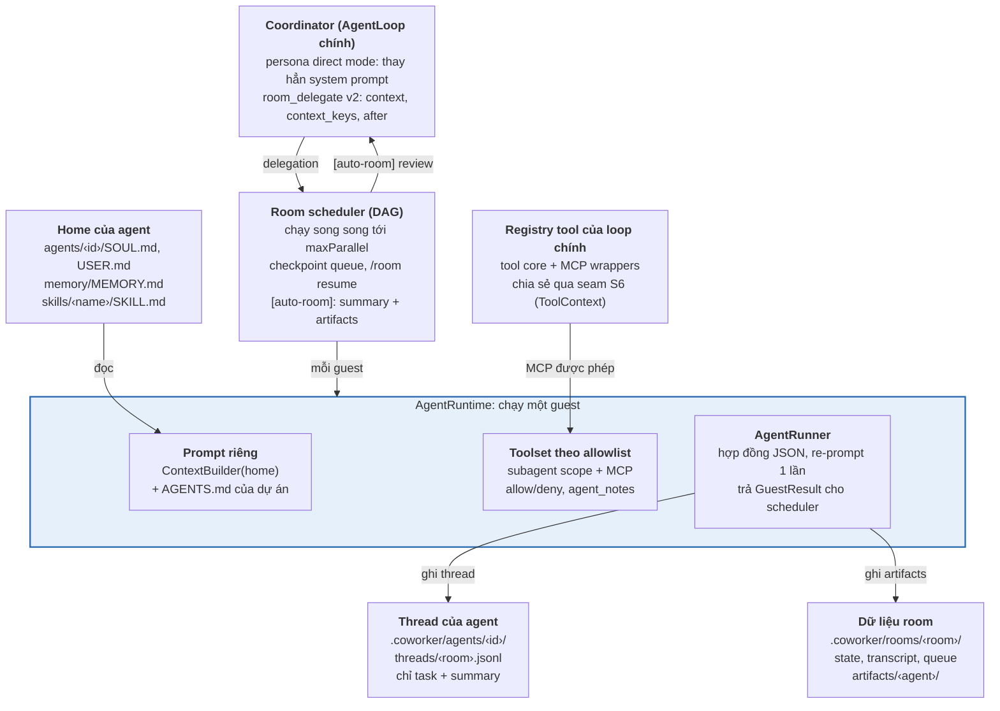
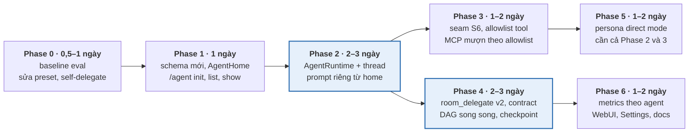

# Implementation plan: Coworker Agent Runtime (hướng A)

_Cập nhật: 05/10/2026 · Repo: `cuongpt083/nanobot`, nhánh `develop`_

## Tổng quan

Kế hoạch này biến teammate và persona trong `nanobot/coworker/` từ "một đoạn instructions" thành agent chuyên biệt thật: có identity, memory, tool và lịch sử riêng, được điều phối song song theo DAG. Toàn bộ nằm trong fork `cuongpt083/nanobot`, nhánh `develop`, với đúng một seam mới ở lõi (S6). Ước lượng 9–14 ngày công cho 7 phase.

### Vấn đề cần giải quyết

| # | Vấn đề hiện tại | Vị trí trong code | Phase xử lý |
| --- | --- | --- | --- |
| P1 | Teammate dùng system prompt subagent chung; `instructions` nằm trong user message | `scheduler._run_guest`, `templates/agent/subagent_system.md` | 2 |
| P2 | Teammate không nhớ gì giữa các lần delegate (`persist=False`, session `subagent:<task_id>`) | `agent/subagent.py::_run_admitted_subagent` | 2 |
| P3 | Teammate không có MCP, không có allowlist tool/skill theo agent | `ToolLoader(scope="subagent")`, `MCPToolWrapper._scopes` | 3 |
| P4 | Context bàn giao chỉ gồm tin nhắn user cuối + transcript room 24k ký tự | `scheduler._projection` | 4 |
| P5 | Guest chạy tuần tự; phụ thuộc dùng regex `WAIT_FOR`; queue mất khi restart | `scheduler._run_room`, `_rooms` | 4 |
| P6 | Coordinator review bản reply bị cắt cứng 6000 ký tự | `scheduler._summon_coordinator` | 4 |
| P7 | Persona chỉ append `## Persona` vào cuối system prompt của agent chính | `hook.transform_request`, `_append_system` | 5 |
| P8 | Xóa persona xoá luôn preset người dùng đã đổi sau đó; coordinator đội persona X vẫn delegate được cho X | `persona.set_persona_id`, `room/tools.py` | 0 |

### Mục tiêu đo được

1. Teammate trả lời theo identity riêng (`SOUL.md` trong home của nó) và dùng lại được kết quả của lần delegate trước trong cùng room.
2. Teammate gọi được MCP tool của agent chính theo allowlist, và bị chặn với tool ngoài allowlist.
3. Ba delegation độc lập hoàn thành trong thời gian xấp xỉ delegation chậm nhất, không phải tổng thời gian.
4. Điểm chất lượng trên bộ eval (Phase 0) tăng so với baseline; số lượt coordinator phải yêu cầu sửa giảm.
5. Cấu hình `coworker.json` cũ chạy không đổi hành vi; `tests/coworker` hiện có vẫn xanh.

### Ngoài phạm vi

- Tách Dream/history của session persona khỏi agent chính (cần sửa lõi, thuộc hướng B).
- Agent từ xa hoặc federated, routing kênh trực tiếp tới teammate (bindings kiểu OpenClaw).
- Thay đổi coding backend `pi`/`agy`; chúng tiếp tục đi qua `CodingRunner` như hiện nay.

## Nguyên tắc và kiến trúc đích

Mọi code mới nằm trong `nanobot/coworker/agents/` và các file coworker sẵn có; lõi chỉ thêm seam S6 hai dòng. Agent runtime mới gọi thẳng `AgentRunner` thay vì đi qua `SubagentManager.run_inline`, nên kiểm soát được system prompt, tool registry và lịch sử của từng agent.

### Nguyên tắc

1. **Merge-safe:** không sửa `agent/loop.py`, `agent/subagent.py`, `agent/context.py` ngoài S6. Mọi seam có guard trong `tests/coworker/test_seams.py`.
2. **Tương thích ngược:** agent không khai báo `home` chạy đúng đường cũ (legacy path). Mỗi phase sau được bật bằng cấu hình, không bật ngầm.
3. **Tái sử dụng trước khi viết mới:** `ContextBuilder` dựng prompt từ home; `drive.extract_last_json` và `format.validate_against_schema` kiểm hợp đồng đầu ra; `RoomStateStore`/`RoomTranscript` làm mẫu cho store mới.
4. **Không làm bẩn session chính:** lịch sử teammate lưu trong `.coworker/agents/`, không qua `SessionManager`, để WebUI không liệt kê và Dream không consolidate.
5. **Mặc định an toàn:** allowlist rỗng nghĩa là toolset subagent như cũ, không phải "toàn quyền"; teammate ghi file vào thư mục artifact riêng.

### Cấu trúc module mới

```text
nanobot/coworker/
  agents/
    __init__.py
    profile.py      # resolve AgentProfile từ RoomAgentConfig, đường dẫn home
    home.py         # scaffold/validate <workspace>/agents/<id>/
    prompt.py       # build_system_prompt(agent, project_root) qua ContextBuilder
    toolset.py      # build_tools(agent): subagent scope + MCP mượn + allow/deny
    thread.py       # AgentThreadStore: .coworker/agents/<id>/threads/<room>.jsonl
    contract.py     # GuestResult + parse/validate output JSON
    runtime.py      # AgentRuntime.run(...) gọi AgentRunner
    notes_tool.py   # tool agent_notes (scope subagent, chỉ khi có room actor)
  room/
    scheduler.py    # viết lại _run_room theo DAG, _run_guest dùng AgentRuntime
    queue_store.py  # checkpoint queue: .coworker/rooms/<room>.queue.json
    tools.py        # room_delegate v2 (context, context_keys, after, deliverable)
  persona.py        # direct mode
```

### Sơ đồ kiến trúc đích

Mỗi teammate chạy với prompt, tool và lịch sử của riêng nó.



Phần tô màu là code mới thay cho `run_inline`; chỗ duy nhất chạm lõi là mũi tên MCP đi qua seam S6.

## Phase 0 – Baseline và sửa lỗi (0,5–1 ngày)

Phase 0 tạo số liệu nền để chứng minh các phase sau có hiệu quả, và sửa ba lỗi nhỏ không cần kiến trúc mới. Nhánh: `feat/agent-runtime-p0`.

### Công việc

- [ ] **0.1 – Sửa xóa preset khi tắt persona.** Trong `persona.set_persona_id`, lưu preset mà persona đã gán vào `state["persona_preset"]`. Khi tắt persona, chỉ `pop` `SESSION_MODEL_PRESET_METADATA_KEY` nếu giá trị hiện tại vẫn bằng `persona_preset`.
- [ ] **0.2 – Chặn tự delegate khi đội persona.** Trong `RoomDelegateTool.execute`, nếu `by == "owner"` và `get_persona_id(session) == target` thì trả lỗi "bạn đang là @target". `directives.room_owner` loại persona đang bật khỏi roster.
- [ ] **0.3 – Đồng bộ tài liệu.** Sửa README đoạn Persona: "prepends" thành "appends" (hành vi hiện tại), ghi chú sẽ đổi ở Phase 5.
- [ ] **0.4 – Bộ eval baseline.** Tạo `tests/coworker/eval/` với 4–6 kịch bản và script `scripts/coworker_eval.py` (chi tiết ở phần Kiểm thử). Chạy trên code hiện tại, lưu kết quả vào `docs/coworker/plans/agent-runtime-baseline.json`.
- [ ] **0.5 – Đo thời gian và token theo guest.** Thêm `duration_s`, `tokens_in`, `tokens_out` vào `GuestOutcome` và ghi một dòng log có cấu trúc mỗi guest. Phase 6 sẽ đưa lên WebUI.

### Test

- `test_persona.py`: tắt persona sau khi user đổi model thì preset của user còn nguyên.
- `test_room.py`: coordinator đội persona `researcher` gọi `room_delegate(agent="researcher")` nhận lỗi; roster không chứa `researcher`.

### Tiêu chí xong

Hai test mới xanh, toàn bộ `tests/coworker` xanh, file baseline được commit.

## Phase 1 – Schema cấu hình và AgentHome (1 ngày)

Phase 1 mở rộng `RoomAgentConfig` bằng các trường tùy chọn và thêm lệnh scaffold thư mục home; chưa thay đổi cách chạy guest. Nhánh: `feat/agent-runtime-p1`.

### 1.1 – Schema (`coworker/config.py`)

```python
class NamePolicy(Base):
    allow: list[str] = Field(default_factory=list)   # glob (fnmatch); rỗng = mặc định cũ
    deny: list[str] = Field(default_factory=list)

class SkillPolicy(Base):
    inherit: list[str] = Field(default_factory=list) # skill từ <workspace>/skills hoặc builtin
    deny: list[str] = Field(default_factory=list)

class RoomAgentConfig(Base):
    ...                                             # id, name, emoji, bio, preset, backend, instructions giữ nguyên
    home: str | None = None                         # tương đối workspace, vd "agents/nutri-coach"
    tools: NamePolicy = Field(default_factory=NamePolicy)
    skills: SkillPolicy = Field(default_factory=SkillPolicy)
    memory: Literal["none", "thread", "thread+notes"] = "thread"
    thread_turns: int = Field(default=8, ge=0, le=50)
    max_iterations: int = Field(default=40, ge=1, le=500)
    output_contract: Literal["none", "default"] = "default"

class RoomConfig(Base):
    ...
    max_parallel: int = Field(default=3, ge=1, le=8)
    context_turns: int = Field(default=5, ge=1, le=20)
    min_context_chars: int = Field(default=80, ge=0)
```

`Base` nhận cả camelCase và snake_case, nên `coworker.json` viết `maxParallel`, `threadTurns`… như các khóa hiện có.

Validator bổ sung: `home` là đường dẫn tương đối, không chứa `..`; `backend` và `home` không được cùng có (agent coding vẫn đi qua `CodingRunner`).

### 1.2 – Validation trong `settings_api.py`

Thêm `_check_agents(cfg, workspace)`, gọi trong `update_coworker_settings` bên cạnh `_check_presets`. Hàm này kiểm `home` nằm trong workspace, cảnh báo (không chặn) khi thư mục chưa tồn tại, và báo lỗi nếu pattern trong `tools.allow` không khớp tool nào đã biết.

### 1.3 – Scaffold home (`agents/home.py` + lệnh `/agent`)

Cấu trúc chuẩn của một home:

```text
<workspace>/agents/<id>/
  SOUL.md            # vai trò, giọng, nguyên tắc nghề nghiệp; sinh từ bio + instructions
  USER.md            # tùy chọn; thiếu thì không nạp
  memory/MEMORY.md   # ghi chú bền vững (Phase 2, chế độ thread+notes)
  skills/<name>/SKILL.md
```

Lệnh mới đăng ký trong `commands.register`:

- `/agent list`: id, home có hay chưa, preset, số skill, số tool được phép.
- `/agent init <id>`: tạo home theo cấu trúc trên, sinh `SOUL.md` từ `bio` và `instructions`, ghi `home` vào `coworker.json` qua `update_coworker_settings`. Không ghi đè file đã có.
- `/agent show <id>`: in system prompt sẽ dùng (sau Phase 2) và danh sách tool cuối cùng (sau Phase 3), phục vụ debug.

### Test

- `test_agents_config.py`: cấu hình cũ parse ra đúng mặc định; `home="../x"` bị từ chối; `home` + `backend` bị từ chối.
- `test_agents_home.py`: `init` tạo đủ file, chạy lần hai không ghi đè.

### Tiêu chí xong

Cấu hình mới được Settings → Coworker lưu và đọc lại nguyên vẹn (khóa lạ vẫn được giữ); `/agent init` tạo home dùng được.

## Phase 2 – AgentRuntime và AgentThreadStore (2–3 ngày)

Phase 2 thay `svc.subagents.run_inline` trong `scheduler._run_guest` bằng `AgentRuntime.run`, cho mỗi agent có `home` một system prompt riêng và lịch sử bền vững theo room. Đây là phase tác động mạnh nhất tới chất lượng "chuyên gia". Nhánh: `feat/agent-runtime-p2`.

### 2.1 – Mở rộng `CoworkerServices` (`coworker/runtime.py`)

Thêm các trường lấy từ `ToolContext` trong `bind_services`: `timezone`, `tools_config`, `workspace_sandbox`. Thêm `main_tools: ToolRegistry | None = None` (được gán ở Phase 3). Không truy cập thuộc tính private của `SubagentManager`.

### 2.2 – Prompt (`agents/prompt.py`)

```python
def build_system_prompt(agent: RoomAgentConfig, *, project_root: Path, svc: CoworkerServices,
                        roster: list[RoomAgentConfig]) -> str:
    home = resolve_home(agent, svc.workspace)          # None → legacy
    if home is None:
        return legacy_prompt(agent, project_root, roster)  # subagent_system.md + room_guest(), như cũ
    disabled = denied_skill_names(agent, home)          # từ skills.deny
    builder = ContextBuilder(home, timezone=svc.timezone, disabled_skills=list(disabled))
    base = builder.build_system_prompt(workspace=project_root,
                                       include_memory=agent.memory == "thread+notes")
    parts = [base]
    if agent.skills.inherit:
        parts.append(inherited_skills_summary(svc.workspace, agent.skills.inherit))
    parts.append(directives.room_member(agent, roster))  # vai trò trong room + hợp đồng đầu ra
    return "\n\n---\n\n".join(p for p in parts if p)
```

`ContextBuilder(home)` đọc `SOUL.md`, `USER.md`, `memory/MEMORY.md` và `skills/` từ home, còn `AGENTS.md` đọc từ `project_root`, nên agent giữ identity riêng mà vẫn tuân quy ước của dự án. `inherited_skills_summary` dùng `SkillsLoader(svc.workspace).build_skills_summary(exclude=...)` với `exclude` là mọi skill ngoài danh sách `inherit`.

`directives.room_member` thay `room_guest` cho agent có home: không lặp lại `instructions` (đã nằm trong SOUL.md), chỉ nói vai trò trong room, quy tắc `room_state`, cách `room_delegate`, và hợp đồng đầu ra (Phase 4).

### 2.3 – Lịch sử agent (`agents/thread.py`)

```python
class AgentThreadStore:
    """.coworker/agents/<agent_id>/threads/<room_id>.jsonl — mỗi dòng một lần giao việc."""
    def recent(self, max_turns: int) -> list[dict[str, str]]: ...   # [{role:user}, {role:assistant}] * n
    def append_turn(self, *, task: str, reply: str, tools_used: list[str],
                    usage: dict[str, int], at: float) -> None: ...
    def clear(self) -> None: ...
```

Mỗi dòng lưu `task` (đã rút gọn về tối đa 4000 ký tự), `reply` (tóm tắt từ hợp đồng đầu ra nếu có, ngược lại cắt 4000 ký tự), tên tool đã dùng và usage. Không lưu tool output. Ghi theo kiểu atomic-append như `RoomTranscript`. `/room reset` xóa thêm thread của mọi agent trong room đó.

### 2.4 – Runtime (`agents/runtime.py`)

```python
@dataclass
class GuestResult:
    text: str                       # nội dung đăng ra chat
    contract: dict[str, Any] | None # JSON đã validate (Phase 4), None nếu tắt
    tools_used: list[str]
    usage: dict[str, int]
    stop_reason: str

class AgentRuntime:
    def __init__(self, svc: CoworkerServices, cfg: CoworkerConfig) -> None:
        self.svc, self.cfg, self.runner = svc, cfg, AgentRunner()

    async def run(self, agent, task_msg: str, *, room_id: str, session_key: str,
                  channel: str, chat_id: str, project_root: Path, runtime: LLMRuntime) -> GuestResult:
        thread = AgentThreadStore(self.svc.workspace, agent.id, room_id)
        history = thread.recent(agent.thread_turns) if agent.memory != "none" else []
        messages = [{"role": "system", "content": build_system_prompt(agent, project_root=project_root,
                                                                       svc=self.svc, roster=self.cfg.room.agents)},
                    *history, {"role": "user", "content": task_msg}]
        tools = build_tools(agent, self.svc)            # Phase 2: scope subagent; Phase 3: + allowlist/MCP
        token = bind_request_context(RequestContext(channel=channel, chat_id=chat_id,
                                                    session_key=session_key, runtime=runtime))
        try:
            result = await self.runner.run(AgentRunSpec(
                initial_messages=messages, tools=tools, runtime=runtime,
                max_iterations=agent.max_iterations,
                max_tool_result_chars=self.svc.max_tool_result_chars,
                session_key=f"coworker-agent:{agent.id}:{room_id}",
                workspace=project_root, hook=GuestHook(agent.id),
                max_iterations_message="Stopped at the iteration limit; report what is done.",
                finalize_on_max_iterations=True,
            ))
        finally:
            reset_request_context(token)
        guest = to_guest_result(result, agent)           # Phase 4 gắn parse hợp đồng
        if agent.memory != "none":
            thread.append_turn(task=task_msg, reply=guest.summary_for_thread(), ...)
        return guest
```

`GuestHook` kế thừa `AgentHook`, cập nhật `ActiveGuest` (iteration, tool cuối) để WebUI hiển thị, tương tự `_SubagentHook`. `max_tool_result_chars` lấy từ `tools_config` hoặc `AgentDefaults` nếu không có.

Lưu ý: agent không có `home` vẫn đi qua `AgentRuntime`, với `legacy_prompt` và `memory` coi như `none`, để chỉ còn một đường thực thi. Nếu muốn giảm rủi ro, giữ cờ `room.legacyGuestRunner: true` trong một bản phát hành để quay về `run_inline`.

### 2.5 – Ghi chú bền vững (`agents/notes_tool.py`)

Tool `agent_notes(action: "append" | "list", note?: str)`, `_scopes = {"subagent"}`, chỉ bật khi `current_room_actor` có giá trị và agent đó dùng `thread+notes`. `append` ghi một dòng có ngày vào `<home>/memory/MEMORY.md`, giới hạn 500 ký tự mỗi ghi chú và 32 KB mỗi file. Directive kèm theo: chỉ ghi bài học dùng lại được, không ghi dữ liệu cá nhân của khách hàng.

### 2.6 – Nối vào scheduler

Trong `_run_guest`, nhánh `agent.backend` giữ nguyên. Nhánh còn lại set `current_room_actor`, gọi `AgentRuntime.run` với `task_msg` gồm assignment và `_projection` (Phase 4 sẽ thay projection), rồi trả `GuestResult`. `_run_room` đọc `guest.text` thay cho chuỗi thô.

### Test

- `test_agents_prompt.py`: agent có home nhận SOUL.md của home chứ không phải của workspace; `AGENTS.md` lấy từ project root; skill ngoài `inherit` không xuất hiện; agent không có home cho ra prompt giống hệt hiện tại (snapshot test).
- `test_agents_thread.py`: lần delegate thứ hai thấy task và reply của lần một trong `messages`; `memory="none"` không ghi gì; `/room reset` xóa thread.
- `test_room.py` (cập nhật): dùng provider giả kiểm tra system prompt và model preset gửi đi đúng theo agent.

### Tiêu chí xong

Trong một room, teammate có home trả lời theo SOUL của nó và nhắc lại đúng kết quả của lần giao việc trước; các test room hiện có xanh mà không sửa kỳ vọng.

### Phase 2 notes (follow-up)

- No-home guests stay on `svc.subagents.run_inline`; `room.legacyGuestRunner` only forces that path for home agents.
- The legacy `run_inline` path still does not bind session workspace scope (left equivalent to pre-Phase-2).
- Home guests bind `workspace_scope_from_metadata` (stale scope falls back to the workspace) and compute sandbox for `project_root`; they never reuse `svc.workspace_sandbox`.
- Guest `AgentRunner` uses a no-op consolidator; long guest runs are not compacted yet.
- Home guests may see their own prior reply twice (thread history plus `_projection`); Phase 4 replaces the projection.

## Phase 3 – Seam S6 và allowlist tool/skill/MCP (1–2 ngày; 3b hoãn)

Phase 3 cho teammate dùng MCP tool của agent chính theo allowlist và áp allow/deny cho mọi tool. Đây là phase duy nhất chạm lõi. Nhánh: `feat/agent-runtime-p3`.

### 3.1 – Seam S6

```python
# nanobot/agent/tools/context.py — dataclass ToolContext
tool_registry: ToolRegistry | None = None

# nanobot/agent/loop.py — nơi dựng ToolContext trước ToolLoader().load(ctx, self.tools)
tool_registry=self.tools,
```

Trong `coworker/runtime.bind_services`: `main_tools=ctx.tool_registry`. Thêm guard `test_tool_context_exposes_main_registry` vào `test_seams.py`, kiểm rằng `ToolContext` có trường này và `AgentLoop` truyền đúng registry. Cập nhật bảng seam trong `docs/coworker/README.md`. Seam này generic ("tool thấy được registry cha"), có thể đề xuất upstream cùng S1/S3/S4.

### 3.2 – Xây toolset (`agents/toolset.py`)

```python
def build_tools(agent: RoomAgentConfig, svc: CoworkerServices, *, project_root: Path) -> ToolRegistry:
    reg = ToolRegistry()
    ToolLoader().load(subagent_tool_context(svc, project_root), reg, scope="subagent")
    if svc.main_tools is not None and agent.tools.allow:
        for name in svc.main_tools.tool_names:
            if name.startswith("mcp_") and matches(name, agent.tools.allow):
                reg.register(svc.main_tools.get(name))     # dùng chung wrapper, không mở kết nối mới
    return apply_policy(reg, agent.tools, always=ROOM_TOOLS | {"agent_notes"})
```

Quy tắc chính sách:

- `allow` rỗng: giữ toàn bộ toolset subagent như hiện nay, không có MCP.
- `allow` khác rỗng: chỉ giữ tool khớp pattern (fnmatch), cộng các tool luôn có (`room_state`, `room_delegate`, `agents_list`, `agent_notes`).
- `deny` áp sau cùng và thắng `allow`.
- `build_tools` chạy mỗi lần guest bắt đầu, nên wrapper MCP luôn là bản mới nhất sau khi loop chính reconnect.

`subagent_tool_context` dựng `ToolContext` giống `SubagentManager._build_tools` (cùng `exec`, `web`, `file`, `restrict_to_workspace`), nhưng dùng `ExecSessionManager` và `FileStates` riêng cho mỗi agent để các guest chạy song song không dùng chung trạng thái shell/file.

### 3.3 – Skill

`skills.deny` đổi thành `disabled_skills` cho `ContextBuilder(home)`; `skills.inherit` đã xử lý ở Phase 2. `/agent show <id>` in danh sách skill và tool cuối cùng.

### 3.4 – Directive cho coordinator

`directives.room_owner` in thêm vào roster một dòng "công cụ nổi bật" của mỗi agent (tối đa 5 tên MCP server hoặc skill), để coordinator giao việc cần CRM cho đúng agent có CRM.

### 3.5 – (3b, hoãn) MCP riêng theo agent

Thêm `mcp_servers: dict[str, MCPServerConfig]` vào `RoomAgentConfig`. `agents/mcp_pool.py` giữ một `connect_mcp_servers(servers, registry)` cho mỗi agent, mở lần đầu khi cần, đóng bằng `_close_mcp_connections` khi cấu hình đổi hoặc gateway tắt (đăng ký qua `spawn_background` + shutdown hook hiện có). Đã quyết định hoãn: hiện chưa cần cô lập MCP giữa các agent. Mở lại khi cần tách dữ liệu, ví dụ CRM edutech và CRM nutritech.

### Test

- `test_seams.py`: guard S6.
- `test_agents_toolset.py`: `allow=["read_file","mcp_crm_*"]` cho ra đúng `read_file`, MCP crm và các tool luôn có; `deny` thắng `allow`; `allow` rỗng giữ hành vi cũ; hai guest song song có `ExecSessionManager` khác nhau.
- Kiểm bằng provider giả rằng model gọi tool ngoài allowlist nhận lỗi "tool not found" chứ không thực thi.

### Tiêu chí xong

Một teammate gọi được MCP tool được phép trong một room thật; guard S6 xanh; merge thử với upstream mới nhất chỉ xung đột ở các dòng seam đã biết.

## Phase 4 – Bàn giao có cấu trúc và scheduler DAG (2–3 ngày)

Phase 4 ép coordinator giao việc kèm bối cảnh, bắt teammate trả kết quả theo hợp đồng JSON, và chạy các delegation độc lập song song. Nhánh: `feat/agent-runtime-p4`. Nên làm 4.1–4.3 trước (chất lượng), 4.4–4.5 sau (tốc độ, độ bền).

### 4.1 – `room_delegate` v2 (`room/tools.py`)

```json
{
  "agent": "nutri-coach",
  "task": "Thiết kế lộ trình 8 tuần cho nhân viên văn phòng ngồi nhiều",
  "context": "User đã chốt: không chẩn đoán, ngân sách thấp, giao qua Zalo mỗi sáng...",
  "context_keys": ["brief", "research"],
  "after": ["researcher"],
  "deliverable": "Bảng 8 tuần + 3 thói quen trọng tâm, lưu file markdown"
}
```

`context` bắt buộc và phải dài tối thiểu `room.minContextChars` (mặc định 80); thiếu thì tool trả lỗi giải thích cần viết gì. `after` chỉ nhận id đã có delegation trong lượt này hoặc đang chạy. `Delegation` thêm các trường tương ứng và một `id` ngắn. Giữ tương thích: nếu model gọi theo schema cũ (chỉ `agent`, `task`), tool trả lỗi yêu cầu `context` một lần.

### 4.2 – Projection mới (`scheduler._task_message`)

Task message gửi cho guest gồm, theo thứ tự ưu tiên (phần cuối bị cắt trước khi vượt 24k ký tự):

1. `## Assignment`: task, deliverable, người giao.
2. `## Context from coordinator`: trường `context`.
3. `## Shared state`: giá trị các `context_keys` đọc từ `RoomStateStore`.
4. `## Upstream results`: `summary` và `artifacts` của các agent trong `after`.
5. `## Recent user turns`: `room.contextTurns` lượt user gần nhất, mỗi lượt tối đa 1500 ký tự.
6. `## Room so far`: transcript room như hiện nay.

### 4.3 – Hợp đồng đầu ra (`agents/contract.py`)

```python
GUEST_OUTPUT_SCHEMA = {
  "type": "object", "required": ["summary", "confidence"],
  "properties": {
    "summary": {"type": "string", "maxLength": 1200},
    "artifacts": {"type": "array", "items": {"type": "string"}},
    "open_questions": {"type": "array", "items": {"type": "string"}},
    "confidence": {"enum": ["high", "medium", "low"]},
  },
}
```

Phần cuối system prompt (qua `room_member`) yêu cầu kết thúc reply bằng đúng một khối mã JSON có rào (`` ```json ``) theo schema, kèm ví dụ sinh bằng `drive.example_from_schema`. `to_guest_result` dùng `drive.extract_last_json` và `format.validate_against_schema`. Sai schema thì AgentRuntime gửi thêm đúng một lượt sửa trong cùng run (nối messages, nêu lỗi cụ thể). Vẫn sai thì chấp nhận với `contract=None`, `confidence="low"` và ghi chú trong chat.

Nội dung dài ghi ra artifact: mỗi agent ghi vào `.coworker/rooms/<room>/artifacts/<agent>/`. Directive nhắc "phần giao nộp dài thì ghi file và liệt kê trong artifacts".

`_summon_coordinator` đổi sang đưa `summary`, `artifacts`, `open_questions`, `confidence` của từng agent, thay cho reply cắt 6000 ký tự, kèm hướng dẫn "mở artifact bằng read_file trước khi duyệt". Agent có `confidence=low` hoặc `open_questions` khác rỗng được đưa lên đầu.

### 4.4 – Scheduler DAG song song (`room/scheduler.py`)

```python
async def _run_room(room: _Room) -> None:
    graph = DelegationGraph(room.take_pending())
    sem = asyncio.Semaphore(cfg.room.max_parallel)
    while not graph.finished():
        ready = graph.ready()                     # mọi d.after đã done hoặc failed
        if not ready:
            await note(f"⚠️ Phụ thuộc không giải được: {graph.blocked_summary()}")
            graph.fail_blocked(); break
        batch = ready[: budget_left(room)]
        outcomes = await asyncio.gather(*(_guarded(room, d, sem) for d in batch),
                                        return_exceptions=True)
        for d, out in zip(batch, outcomes):
            graph.complete(d, out)                # done | failed | timeout
        graph.add(room.take_pending())            # delegation mới do guest tạo
        save_queue(room, graph)                   # 4.5
```

`_guarded` set `current_room_actor` bên trong coroutine (mỗi task có bản copy context riêng), chờ semaphore, gọi `_run_guest`, bọc `asyncio.wait_for(guest_timeout_seconds)`. Mỗi guest tính một đơn vị vào `room.chained`. Thông báo "⏳ … đang làm" gửi theo lô để chat không bị spam. Delegation cùng agent trong cùng lô được xếp tuần tự (một agent chỉ có một lượt đang chạy), vì thread của agent ghi theo thứ tự.

`WAIT_FOR` vẫn được hiểu: chuyển thành `after=[target]` và đưa delegation trở lại đồ thị. Directive mới chỉ nói về `after`.

`room_snapshot` và `status._teammate_participants` đọc `active` dạng nhiều phần tử cùng lúc (đã là dict nên chỉ cần bỏ giả định một guest).

### 4.5 – Checkpoint queue (`room/queue_store.py`)

Ghi `.coworker/rooms/<room>.queue.json` (atomic, như `RoomStateStore`) mỗi khi đồ thị đổi: delegation chưa xong, kết quả đã có, `chained`, kênh giao. Khi gateway khởi động và coworker bind services, nếu file còn delegation dang dở thì đăng một ghi chú vào chat. Lệnh mới `/room resume` chạy tiếp, `/room reset` xóa file.

### Test

- `test_room_delegate_v2.py`: thiếu `context` bị từ chối; `after` trỏ id không tồn tại bị từ chối.
- `test_room_dag.py`: ba delegation độc lập với guest giả mất 1 giây mỗi cái hoàn thành dưới 1,5 giây; `B after A` chạy sau A và thấy summary của A; vòng A↔B báo lỗi rồi dừng; `maxParallel=1` giữ hành vi tuần tự; ngân sách `maxChainedTurns` vẫn chặn.
- `test_agents_contract.py`: JSON hợp lệ được parse; sai schema re-prompt đúng một lần; sai hai lần vẫn trả kết quả với `confidence=low`.
- `test_room_queue_store.py`: restart giữ được delegation dang dở; `/room resume` chạy tiếp.

### Tiêu chí xong

Trên bộ eval, thời gian hoàn thành kịch bản có ba nhánh độc lập giảm rõ so với baseline; lượt review của coordinator ngắn hơn và dựa trên artifact.

## Phase 5 – Persona direct mode (1–2 ngày)

Phase 5 đổi nghĩa persona từ "đội mũ X" thành "nói chuyện trực tiếp với agent X": session dùng system prompt, tool và ghi chú của X. Chỉ áp dụng cho agent có `home`; agent không có home giữ cách append hiện nay. Nhánh: `feat/agent-runtime-p5`.

### 5.1 – Thay system prompt (`hook.transform_request`)

Khi `resolve_persona` trả về agent X có home:

1. Dựng prompt của X bằng `agents.prompt.build_system_prompt(X, project_root=..., role="direct")`. Biến thể `direct` dùng directive `persona_direct(X)` thay cho `room_member` (nói chuyện với người dùng, không có hợp đồng JSON).
2. Tách khối `[Archived Context Summary]` khỏi system prompt cũ (nếu có) và nối vào cuối prompt của X, vì đó là tóm tắt lịch sử của chính session.
3. Thay `messages[0]` bằng prompt mới, rồi mới `_append_system` các section coworker (advisor, room, workflows…) như cũ.
4. Cache: prompt chỉ đổi khi đổi persona; đưa giá trị này vào cùng cơ chế freeze/optimizer hiện tại để không bust cache giữa các lượt.

Giới hạn được chấp nhận: lịch sử và Dream của session vẫn thuộc agent chính. Muốn tách hẳn phải sửa lõi (hướng B).

### 5.2 – Lọc tool theo X

Tính danh sách tool cuối bằng cùng `apply_policy` của Phase 3, nhưng trên `tools` của loop chính (scope core). Tool bị loại được thêm vào tập `hidden` có sẵn. Nếu X dùng `thread+notes`, hiện tool `agent_notes` và cho nó ghi vào home của X (nhận biết qua `get_persona_id(session)` khi không có room actor).

### 5.3 – Tương tác với room

- Persona X đang bật và room bật: X là coordinator; roster loại X (đã làm ở 0.2).
- `@X` khi persona là X: không arm room, chỉ là lời gọi tên.
- Đổi persona giữa chừng một room run: áp dụng từ lượt `[auto-room]` kế tiếp.

### 5.4 – API và WebUI

`CoworkerPersonaInfo` thêm `mode: "direct" | "overlay"` (direct khi có home). Popover persona hiển thị nhãn tương ứng và danh sách tool nổi bật của agent. Cảnh báo cache bust giữ nguyên. `session.coworker.persona` không đổi schema.

### Test

- `test_persona.py`: persona có home thay hẳn `SOUL.md` của workspace trong system prompt gửi đi; khối archived summary được giữ; tool ngoài allowlist bị ẩn; persona không có home giữ hành vi append (snapshot test).
- `test_status.py`: trường `mode` đúng cho từng trường hợp.

### Tiêu chí xong

Chuyển sang persona X rồi hỏi "bạn là ai, bạn dùng được công cụ gì" cho câu trả lời khớp SOUL và allowlist của X, không lẫn identity của agent chính.

## Phase 6 – Observability, WebUI và settings (1–2 ngày)

Phase 6 cho thấy từng agent đang làm gì, tốn bao nhiêu, chất lượng ra sao, và cho chỉnh cấu hình agent mới từ Settings. Nhánh: `feat/agent-runtime-p6`.

### 6.1 – Số liệu theo agent

Mỗi guest ghi một bản ghi vào `metrics_store` hiện có (bảng mới `agent_runs`): `agent_id`, `room_id`, thời gian, token vào/ra, số tool call, `stop_reason`, `confidence`, contract hợp lệ hay phải re-prompt, và coordinator có delegate sửa cho agent đó trong lượt review tiếp theo hay không. `coworker_metrics_payload` thêm phần tổng hợp theo agent cho 7 và 30 ngày.

### 6.2 – WebUI

| Vị trí | Thay đổi |
| --- | --- |
| Header – participants | Nhiều chip "working" cùng lúc; chip hiện iteration và tool cuối từ `GuestHook` |
| Inspector – room | Đồ thị delegation hiện tại (ai chờ ai), summary, artifacts, confidence của từng agent |
| Settings → Coworker → Team | Trường `home`, nút "Tạo home", tool allow/deny dạng multi-select lấy từ `main_tools.tool_names`, skill inherit, chế độ memory, `maxParallel` |
| Cache/metrics dashboard | Tab "Agents": bảng theo agent với số liệu 6.1 |

### 6.3 – Lệnh

`/agent show <id>` (prompt, tool, skill thực tế), `/agent thread <id>` (5 lượt gần nhất trong room hiện tại), `/agent notes <id>` (nội dung MEMORY.md của agent), `/agent forget <id>` (xóa thread của agent trong room).

### 6.4 – Tài liệu

Cập nhật `docs/coworker/README.md` (Rooms, Persona, bảng seam có S6, cấu hình mới) và thêm `docs/coworker/agents.md` hướng dẫn viết SOUL.md và skill cho agent chuyên biệt, kèm hai ví dụ (edutech, nutritech).

### Tiêu chí xong

Nhìn dashboard trả lời được: agent nào hay bị coordinator yêu cầu sửa, agent nào tốn token nhất, và đổi allowlist của một agent từ Settings có hiệu lực ở lần delegate tiếp theo mà không restart.

## Kiểm thử và bộ eval

Kiểm thử gồm ba tầng: unit test với provider giả chạy trong CI, integration test qua `test_loop_integration.py`, và bộ eval chạy tay với model thật trước và sau mỗi phase. Chỉ bộ eval trả lời được câu "có hiệu quả hơn không".

### Tầng 1 – Unit (CI)

Mọi test liệt kê trong các phase, dùng provider giả trả script cố định (theo mẫu `make_run_spec` trong `tests/agent/runner_helpers`). Thêm fixture `fake_agent_home(tmp_path, id, soul=..., skills=[...])` vào `tests/coworker/conftest.py`. Lệnh chạy giữ như README: `uv run --no-sync pytest tests/coworker -q`, `basedpyright`, `ruff check nanobot/`.

### Tầng 2 – Integration

Mở rộng `test_loop_integration.py` với một `AgentLoop` thật, provider giả và hai teammate có home: user gửi tin có `@a @b`, coordinator delegate song song, cả hai trả contract, lượt `[auto-room]` nhận summary, file thread và queue được tạo và dọn đúng.

### Tầng 3 – Eval với model thật

Thư mục `tests/coworker/eval/scenarios/<slug>.yaml`, script `scripts/coworker_eval.py` chạy từng kịch bản qua SDK (`docs/python-sdk.md`), xuất JSON kết quả. Không chạy trong CI.

| Kịch bản | Agent tham gia | Điều cần chứng minh |
| --- | --- | --- |
| Khóa học ngắn + kịch bản tư vấn phụ huynh (edutech) | researcher, curriculum, sales-writer | Song song researcher/curriculum; sales-writer `after` curriculum |
| Lộ trình 8 tuần + script chăm sóc khách (nutritech) | nutri-coach, sales-writer | Tuân thủ "không chẩn đoán" từ SOUL; dùng skill chuyên ngành |
| Cập nhật kịch bản tuần trước theo phản hồi | sales-writer | Thread: nhớ bản trước, không viết lại từ đầu |
| Tra CRM rồi soạn follow-up | sales-writer (MCP CRM) | Allowlist MCP hoạt động; agent khác không thấy CRM |
| Phân tích yêu cầu + thiết kế hệ thống (presale) | analyst, architect | Bàn giao qua artifact; coordinator review bằng read_file |
| Persona trực tiếp với nutri-coach | nutri-coach (direct) | Identity và tool đúng X, không lẫn agent chính |

Chỉ số ghi cho mỗi lần chạy:

- **Định tuyến:** tỷ lệ phần việc được giao đúng agent so với đáp án trong YAML.
- **Sửa lại:** số delegation sửa mà coordinator phát ra trong lượt review.
- **Chi phí:** tổng token, thời gian từ tin nhắn user tới báo cáo cuối.
- **Chất lượng:** điểm 1–5 theo rubric cố định trong YAML, chấm bởi advisor preset (prompt chấm không đổi giữa các lần), cộng chấm tay một mẫu nhỏ để kiểm độ tin cậy.
- **Tuân thủ:** vi phạm ràng buộc trong SOUL (ví dụ câu chẩn đoán bệnh) đếm bằng checklist.

Mỗi kịch bản chạy 3 lần vì kết quả LLM dao động; so sánh trung vị với baseline Phase 0.

## Rủi ro, rollout và Definition of Done

Tổng ước lượng 9–14 ngày công (chưa tính thời gian tinh chỉnh prompt; 3b đã hoãn). Thứ tự bắt buộc là 0 → 1 → 2; sau đó 3 và 4 có thể làm song song, 5 cần 2 và 3, 6 cần 4.

### Lộ trình

Phase 3 và 4 chạy song song ngay sau Phase 2.



Phase 2 và 4 được tô màu vì quyết định chất lượng; nếu phải cắt phạm vi, giữ hai phase này và lùi 5, 6.

### Rủi ro chính

| Rủi ro | Ảnh hưởng | Giảm thiểu |
| --- | --- | --- |
| Upstream đổi `AgentRunner`/`AgentRunSpec`, `ContextBuilder` hoặc `ToolLoader` | AgentRuntime hỏng sau khi merge | Test snapshot prompt và test runtime; thêm các API này vào danh sách theo dõi khi merge trong README |
| Wrapper MCP dùng chung không chịu được gọi đồng thời | Lỗi ngẫu nhiên khi nhiều guest gọi cùng server | Test tải 3 guest cùng gọi một MCP; nếu lỗi thì thêm lock theo server trong toolset, hoặc chuyển sang 3b |
| Chạy song song làm tăng chi phí và chạm rate limit của provider | Guest lỗi 429, hóa đơn tăng | `maxParallel` mặc định 3; retry có sẵn của runner; ghi chi phí theo agent ở Phase 6 |
| Model không tuân hợp đồng JSON | Review kém, re-prompt tốn token | Một lần re-prompt rồi chấp nhận `confidence=low`; có thể tắt bằng `outputContract: "none"` theo agent |
| Thread phình to hoặc chứa thông tin sai lỗi thời | Agent lặp lại kết luận cũ | Giới hạn `threadTurns`, chỉ lưu summary; `/agent forget`, `/room reset` |
| Ghi chú bền vững chứa dữ liệu khách hàng | Rủi ro quyền riêng tư | Directive cấm, giới hạn kích thước, `/agent notes` để rà soát; tắt bằng `memory: "thread"` |
| Direct mode làm cache bust thường xuyên | Tốn token | Prompt chỉ đổi khi đổi persona; tái dùng cơ chế freeze và cảnh báo hiện có |

### Rollout

1. Mỗi phase một PR vào `develop`, kèm kết quả eval của phase đó trong mô tả PR.
2. Sau Phase 2: chuyển một agent thật (ví dụ sales-writer) sang có home, giữ các agent khác ở chế độ legacy trong một tuần để so sánh.
3. Sau Phase 4: bật `maxParallel=2` trước, nâng lên 3 khi không thấy lỗi 429 hay xung đột file.
4. Giữ `room.legacyGuestRunner` một bản phát hành làm đường lùi, xóa sau khi eval ổn định.
5. Sau Phase 6: đề xuất S6 lên upstream cùng S1/S3/S4.

### Definition of Done

- [ ] Toàn bộ `tests/coworker` xanh, guard S1–S6 xanh, `basedpyright` và `ruff` sạch.
- [ ] Cấu hình `coworker.json` cũ chạy không đổi hành vi (snapshot test prompt legacy).
- [ ] Eval: điểm chất lượng trung vị tăng tối thiểu +0,5 so với baseline ở ít nhất 4/6 kịch bản; số delegation sửa giảm; kịch bản có nhánh độc lập nhanh hơn rõ rệt.
- [ ] Không có vi phạm ràng buộc SOUL trong kịch bản nutritech.
- [ ] `docs/coworker/README.md` và `docs/coworker/agents.md` cập nhật; merge thử upstream mới nhất chỉ xung đột ở các seam đã biết.

### Quyết định đã chốt

- Ngưỡng "tăng chất lượng" trong DoD: tối thiểu +0,5 điểm trung vị (thang 1–5) so với baseline Phase 0.
- Chưa làm 3b (MCP riêng theo agent); teammate dùng MCP mượn từ loop chính theo allowlist.
