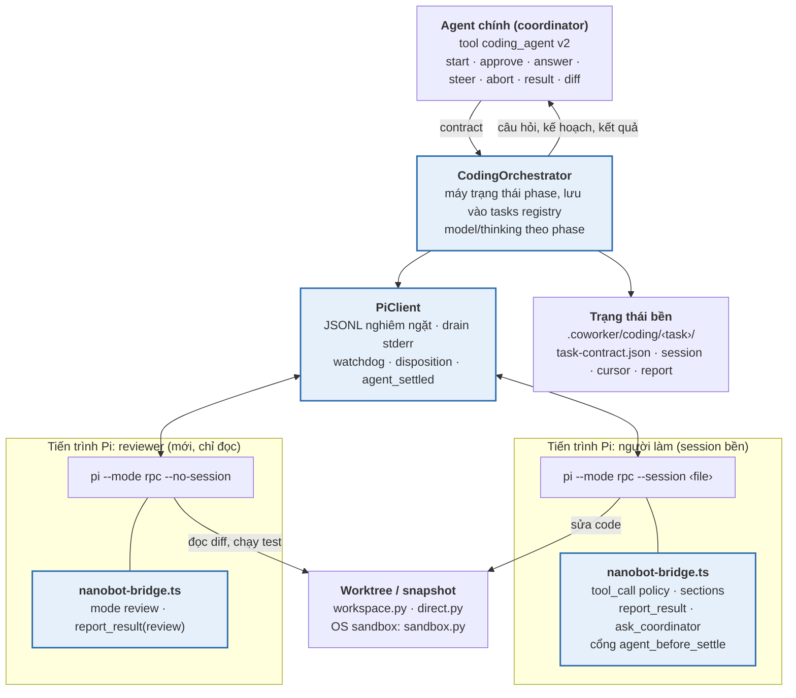
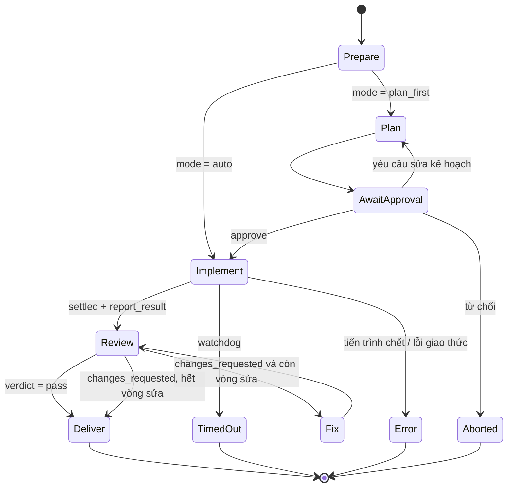
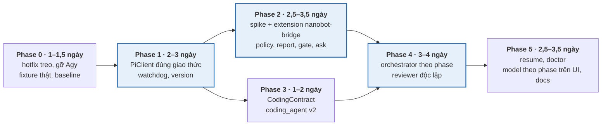

> **Đã lưu trữ 2026-10-09.** Phase 0–5 đã triển khai (xem lịch sử commit `coworker` ngày 05–06/10/2026). Plan này được giữ lại vì mục **Further Works (A–F)** ở cuối vẫn là danh sách nợ chưa theo dõi ở nơi nào khác. Đối chiếu code ngày 2026-10-09: A, không thấy endpoint trả lời câu hỏi từ UI; D, `awaiting_approval` vẫn là ngõ cụt; C, `backends/agy.py` đã bị xóa nhưng còn tham chiếu `agy` ở `coding/runner.py`, `config.py` và 3 file WebUI; B, E và F chưa kiểm tra lại. Fixture `agy-1.2.13` đã bị xóa khỏi `plans/fixtures/`.

# Implementation plan: Pi Coding Runtime (bỏ Agy, tập trung Pi)

_Cập nhật: 05/10/2026 · Repo: `cuongpt083/nanobot`, nhánh `develop` · Module: `nanobot/coworker/coding/`_

## Tổng quan

Kế hoạch này thiết kế lại phần coding của coworker: bỏ backend Agy và lớp trừu tượng "mẫu số chung nhỏ nhất" `CodingBackend`, để tích hợp sâu với Pi 1.x. Nanobot giữ vai trò điều phối; Pi là runtime coding, được điều khiển qua RPC và mở rộng bằng một extension do nanobot sở hữu (`nanobot-bridge`) chạy bên trong tiến trình Pi. Chính sách an toàn và cổng nghiệm thu được cưỡng chế bằng code trong extension, không chỉ dặn bằng prompt. Ước lượng 12–17,5 ngày công cho 6 phase.

### Vấn đề cần giải quyết

| # | Vấn đề hiện tại | Vị trí trong code | Phase xử lý |
| --- | --- | --- | --- |
| C1 | Dòng JSONL dài hơn 64 KB làm luồng sự kiện dừng không báo lỗi: tham số `limit=16 MB` của `iter_jsonl_stream` không được dùng, subprocess dùng buffer mặc định 64 KB của asyncio. Pi báo "terminated unexpectedly"; Agy treo vĩnh viễn (đã tái hiện bằng test) | `backends/jsonl.py` | 0 (hotfix), 1 |
| C2 | Wall/idle timeout chỉ được kiểm tra khi có sự kiện; `last_event_time` bị gán lại ngay trước phép so sánh nên idle timeout không bao giờ kích hoạt | `runner.execute_task` | 0 (hotfix), 1 |
| C3 | stderr được pipe nhưng không được đọc liên tục (Pi không đọc; Agy chỉ đọc sau khi thoát) → deadlock khi harness ghi nhiều log | `jsonl.spawn_process_group`, `backends/pi.py`, `backends/agy.py` | 0 (hotfix), 1 |
| C4 | Task khởi chạy Pi là fire-and-forget: lỗi spawn hoặc `prompt` trả `success: false` bị nuốt; không xử lý `disposition: "handled"` → chờ `agent_settled` mãi | `PiBackend.start`, `follow_up` | 1 |
| C5 | Test Pi dùng `fake_pi.py` tự viết, không có fixture từ binary thật (Agy thì có) | `tests/coworker/coding/` | 0, 1 |
| C6 | Mọi dialog của extension bị tự huỷ; Pi không có cách hỏi lại khi thiếu thông tin | `PiBackend._read_loop` | 2 |
| C7 | Chính sách ("không ghi ngoài worktree", "không git push"…) chỉ là văn bản trong `--append-system-prompt` | `brief.render_rules` | 2 |
| C8 | Brief chỉ gồm câu task và danh sách file; không có mục tiêu, ràng buộc, tiêu chí nghiệm thu, phạm vi loại trừ | `brief.render_brief`, `tools.py` | 3 |
| C9 | "Summary" là câu trả lời cuối của Pi (`get_last_assistant_text`); không có báo cáo có cấu trúc | `PiBackend._on_agent_settled` | 2 |
| C10 | Không có kế hoạch trước khi code, không có người chấm độc lập; không cấu hình `acceptance` thì task tự động `succeeded` | `runner.execute_task` | 4 |
| C11 | Gateway khởi động lại là mất task đang chạy; không có cách gắn lại vào session Pi | `tasks.py`, `runner.py` | 5 |

### Mục tiêu đo được

1. Không còn task treo: 0 lần treo hoặc chết không rõ lý do trong 50 lần chạy liên tiếp của bộ eval, kể cả các ca biên (dòng 1 MB, stderr 1 MB, tiến trình chết giữa chừng).
2. Mọi lần chạy kết thúc ở trạng thái có lý do rõ ràng (`succeeded`, `failed_acceptance`, `changes_requested`, `timed_out`, `aborted`, `error` kèm chẩn đoán stderr).
3. Mọi task giao nộp báo cáo JSON có cấu trúc và kết luận của reviewer độc lập.
4. Tỷ lệ task đạt (acceptance và review cùng pass) tăng tối thiểu 20 điểm phần trăm so với baseline Phase 0, hoặc đạt từ 70% trở lên (tuyệt đối).
5. Task đang chạy dở tiếp tục được sau khi gateway khởi động lại.

### Ngoài phạm vi

- Agy và mọi harness khác (Claude Code, Codex, Gemini CLI, ACP). Interface `CodingRuntime` để ngỏ khả năng thêm lại sau.
- Chuyển sang Pi Durable (gói thử nghiệm, API còn thay đổi). Chỉ thiết kế để có thể thay thế về sau.
- Thay đổi chế độ `direct` (sửa tại chỗ cho thư mục không phải git) ngoài việc nối vào orchestrator mới.
- Các thay đổi của kế hoạch Agent Runtime (teammate có home, scheduler DAG). Hai kế hoạch độc lập, chỉ dùng chung hạ tầng eval.

## Nguyên tắc và kiến trúc đích

### Nguyên tắc

1. **Nanobot điều phối, Pi thực thi.** Nanobot quyết định phase, nghiệm thu và giao nộp; Pi lo vòng lặp coding.
2. **Cưỡng chế bằng code, không bằng lời dặn.** Chính sách đường dẫn, lệnh nguy hiểm và cổng nghiệm thu nằm trong hook của extension `nanobot-bridge`; OS sandbox (`sandbox.py`) giữ làm lớp phòng thủ thứ hai.
3. **Đúng giao thức trước, tính năng sau.** Transport tuân thủ tài liệu RPC của Pi: đọc stdout liên tục, framing JSONL nghiêm ngặt (chỉ tách theo LF), stderr không phải dữ liệu giao thức, kiểm tra từng response và `disposition`, chờ `agent_settled`, tắt bằng cách đóng stdin.
4. **Người làm và người chấm tách biệt.** Reviewer là một tiến trình Pi mới, chỉ đọc, không mang context của người làm.
5. **Trạng thái bền.** Mỗi lần chuyển phase được lưu vào registry; session file và con trỏ entry của Pi được lưu để gắn lại sau khi khởi động lại.
6. **Ghim phiên bản, test bằng dữ liệu thật.** Pi ≥ 1.0 được ghim; contract test phát lại transcript ghi từ binary thật.
7. **Merge-safe.** Mọi thay đổi nằm trong `nanobot/coworker/coding/` và `nanobot/coworker/config.py`; không chạm lõi `nanobot/agent/`.

### Cấu trúc module mới

```text
nanobot/coworker/coding/
  runtime.py          # interface CodingRuntime (cho phép thay bằng sidecar Pi Durable sau này)
  pi/
    __init__.py
    protocol.py       # kiểu dữ liệu: command, response, event (có RawEvent cho sự kiện lạ)
    transport.py      # JsonlChannel: spawn, đọc stdout theo chunk, drain stderr, ghi có khoá
    client.py         # PiClient: request/response theo id, run_prompt, watchdog, close
    version.py        # kiểm tra `pi --version` >= coding.pi.min_version
    extension/
      nanobot-bridge.ts   # extension chạy trong Pi: policy, sections, report_result, ask_coordinator, cổng settle
      README.md
  contract.py         # CodingContract + ghi task-contract.json cho extension
  orchestrator.py     # máy trạng thái phase: prepare → plan → approve → implement → review → fix → deliver
  review.py           # dựng và chạy reviewer độc lập
  questions.py        # định tuyến ask_coordinator ↔ agent chính / người dùng
  doctor.py           # /code doctor
  workspace.py  direct.py  sandbox.py  guard.py  tasks.py  project.py  init_repo.py   # giữ nguyên
  commands.py  tools.py                                                                # cập nhật
  # xoá: backends/agy.py, backends/base.py, backends/jsonl.py, backends/pi.py, brief.py, runner.py
```

### Sơ đồ kiến trúc đích



Phần tô màu là code mới. Extension được nạp vào cả hai tiến trình Pi; tham số `mode` trong `task-contract.json` quyết định hành vi.

### Máy trạng thái phase



Câu hỏi qua `ask_coordinator` có thể xuất hiện ở Plan, Implement và Fix; phase đó tạm dừng (Pi đang chờ dialog) cho tới khi có trả lời hoặc hết thời gian chờ.

## Phase 0 – Baseline, hotfix và gỡ Agy (1–1,5 ngày)

Phase 0 dập ngay ba lỗi gây treo trên code hiện tại để người dùng có hệ thống ổn định trong lúc viết lại, đo baseline, và gỡ Agy khỏi cấu hình. Nhánh: `feat/pi-runtime-p0`.

### Công việc

- [ ] **0.1 – Hotfix C1.** Trong `spawn_process_group`, truyền `limit=` (ví dụ 64 MB) cho `create_subprocess_exec`. Trong `iter_jsonl_stream`, xử lý `LimitOverrunError` bằng cách đọc bỏ phần thừa tới LF kế tiếp và phát `BackendEventError` thay vì `break` im lặng.
- [ ] **0.2 – Hotfix C2.** Chuyển kiểm tra wall/idle timeout ra một task watchdog chạy song song với `async for event in run` (`asyncio.wait` với timeout), gọi `backend.abort()` khi hết hạn.
- [ ] **0.3 – Hotfix C3.** Tạo task drain stderr vào một ring buffer (256 KB) ngay khi spawn; dùng nội dung buffer làm `raw_error_line` khi lỗi.
- [ ] **0.4 – Ghim Pi và ghi fixture thật.** Thêm `coding.pi.min_version` (mặc định `"1.0.0"`). Ghi 4 transcript từ Pi thật vào `docs/coworker/plans/fixtures/pi-1.x/`: chạy thành công có tool, prompt bị từ chối (`success: false`), compaction/retry giữa run, abort giữa chừng. Ghi cả stdin đã gửi để phát lại.
- [ ] **0.5 – Gỡ Agy.** Bỏ `agy` khỏi `default_backend`, `RepoConfig.backend`, `RoomAgentConfig.backend`, enum `backend` của tool `coding_agent`. Cấu hình cũ có `agy` được đọc vào với cảnh báo và quy về `pi` (hoặc vô hiệu hoá task đó nếu `coding.agy_fallback = "refuse"`). Xoá `backends/agy.py`, `fake_agy.py`, fixture `agy-1.2.13` sau khi test Pi đã thay thế.
- [ ] **0.6 – Chuẩn bị nguồn eval.** Chủ dự án chọn 3–5 repo thật (edutech, nutritech, presale) và 12–18 lỗi hoặc tính năng nhỏ đã có lời giải, kèm commit gốc và lệnh kiểm thử. Danh sách ghi vào `tests/coworker/coding/eval/repos.yaml` (đường dẫn hoặc URL clone, commit, lệnh setup). Agent soạn các file kịch bản YAML từ danh sách này; chủ dự án duyệt tiêu chí chấm. Đây là phụ thuộc chặn của 0.7.
- [ ] **0.7 – Bộ eval coding baseline.** Tạo `tests/coworker/coding/eval/` và `scripts/coding_eval.py` (chi tiết ở phần Kiểm thử). Chạy trên code sau hotfix, lưu `docs/coworker/plans/pi-runtime-baseline.json`.
- [ ] **0.8 – Kiểm kê test bị ảnh hưởng.** Đánh dấu kế hoạch di chuyển cho các test hiện có: `test_m1_backends.py` (phần Agy xoá ở Phase 0, phần Pi thay ở Phase 1), `test_m2_runner.py` (giữ qua adapter ở Phase 1, thay bằng test orchestrator ở Phase 4), `test_m3_integration.py` (viết lại ở Phase 4), `fake_agy.py` (xoá), `fake_pi.py` (thay bằng tiến trình phát lại fixture ở Phase 1). Các test không liên quan backend (`test_direct*`, `test_guard`, `test_sandbox*`, `test_project*`, `test_init_repo`, `test_shared_registry`, `test_diff_action`) giữ nguyên và phải xanh suốt quá trình.

### Test

- `test_jsonl_limits.py`: tiến trình con in một dòng 1 MB rồi `agent_settled` → nhận đủ cả hai sự kiện; dòng 100 MB → nhận lỗi có mô tả, không treo.
- `test_stderr_flood.py`: tiến trình con ghi 2 MB vào stderr trong lúc phát sự kiện → run vẫn hoàn tất.
- `test_watchdog.py`: tiến trình con im lặng sau `prompt` → `timed_out` đúng hạn idle (dùng thời gian giả lập).
- `test_config_migration.py`: cấu hình có `agy` được đọc với cảnh báo, không làm hỏng các khoá khác.

### Tiêu chí xong

Ba test hotfix xanh; toàn bộ `tests/coworker` xanh; baseline được commit; không còn tham chiếu `agy` trong code ngoài phần migration.

## Phase 1 – PiClient và giao thức (2–3 ngày)

Phase 1 thay `backends/pi.py` và `backends/jsonl.py` bằng một client đúng giao thức RPC của Pi, đặt sau interface `CodingRuntime`. Nhánh: `feat/pi-runtime-p1`.

### 1.1 – Kiểu dữ liệu (`pi/protocol.py`)

- `Command`: `prompt`, `steer`, `follow_up`, `abort`, `clear_queue`, `get_state`, `get_session_stats`, `get_entries`, `get_messages`, `get_last_assistant_text`, `set_model`, `set_thinking_level`, `compact`, `fork`, `clone`, `export_html`, `get_commands`, `new_session`, `switch_session`, `set_session_name`.
- `Response(id, command, success, data, error)`; phản hồi lỗi parse (không có id) được ghi log và chuyển thành lỗi giao thức.
- `Event`: `agent_start`, `agent_end`, `agent_settled`, `turn_start`, `turn_end`, `message_start/update/end`, `tool_execution_start/update/end`, `compaction_*`, `auto_retry_*`, `extension_error`, `extension_ui_request`. Sự kiện chưa biết được giữ dưới dạng `RawEvent` để tương thích phiên bản sau.

### 1.2 – Transport (`pi/transport.py`)

```python
class JsonlChannel:
    async def start(self, argv: list[str], *, cwd: Path, env: dict[str, str]) -> None: ...
    async def send(self, record: dict[str, Any]) -> None: ...          # có khoá, chờ drain
    def records(self) -> AsyncIterator[dict[str, Any]]: ...           # stdout, chỉ tách theo b"\n"
    @property
    def stderr_tail(self) -> str: ...                                 # ring buffer 256 KB
    async def close(self, *, grace: float = 5.0) -> int | None: ...   # đóng stdin → chờ → killpg
```

- Đọc stdout theo chunk (`read(65536)`) và tự tách bản ghi theo LF, bỏ CR thừa; không dùng `readline`/`readuntil` có giới hạn. Bản ghi vượt `coding.pi.max_record_mb` (mặc định 64) bị bỏ qua với lỗi có mô tả, luồng vẫn tiếp tục.
- stderr được drain liên tục bởi task riêng ngay từ khi spawn.
- Bọc OS sandbox như hiện nay (`sandbox.wrap_argv`).

### 1.3 – Client (`pi/client.py`)

```python
class PiClient(CodingRuntime):
    async def start(self, *, cwd: Path, session: SessionSpec, extension: Path, contract_file: Path,
                    model: ModelSpec | None) -> None: ...
    async def request(self, cmd: str, params: dict[str, Any] | None = None, *, timeout: float = 30) -> Response: ...
    async def run_prompt(self, message: str) -> RunOutcome: ...      # subscribe trước, gửi prompt, chờ settled
    async def steer(self, message: str) -> None: ...
    async def follow_up(self, message: str) -> RunOutcome: ...
    async def abort(self) -> None: ...
    def events(self, *, maxsize: int = 1000) -> EventSubscription: ...
    async def close(self) -> None: ...
```

Quy tắc của `run_prompt`:

1. Đăng ký nhận sự kiện **trước** khi gửi `prompt` để không lỡ một run hoàn tất nhanh.
2. `success: false` → `RunOutcome(status="error", error=response.error)` ngay lập tức.
3. `disposition == "handled"` → kết thúc, không chờ `agent_settled`.
4. `disposition == "queued"` → chờ `agent_settled` của run chứa prompt đó.
5. `disposition == "started"` → chờ `agent_settled`; `agent_end` chỉ cập nhật trạng thái.
6. Tiến trình thoát trước `agent_settled` → `error` kèm `stderr_tail` và exit code.

`EventSubscription` dùng hàng đợi có giới hạn: khi đầy chỉ bỏ các sự kiện `message_update` (delta văn bản), không bao giờ bỏ sự kiện vòng đời, tool hay `extension_ui_request`.

### 1.4 – Watchdog

Một task riêng cho mỗi run, độc lập với luồng sự kiện:

- **Wall timeout** (`coding.timeout_minutes`): hết hạn → `abort` → chờ `agent_settled` tối đa 30 giây → `close`.
- **Idle timeout** (`coding.idle_timeout_minutes`): tính từ sự kiện cuối, nhưng không tính khi đang có `tool_execution_start` chưa có `end` (lệnh bash dài hợp lệ) cho tới `coding.pi.tool_timeout_minutes`.
- **Heartbeat**: khi im lặng quá 60 giây, gửi `get_state`; không có response trong 30 giây → coi như tiến trình treo.
- **Chờ dialog**: khi Pi đang chờ `ask_coordinator`, idle timeout tạm dừng và thời gian chờ do Phase 2 quản lý.

### 1.5 – Kiểm tra phiên bản và khởi động

`pi/version.py` chạy `pi --version` (trong sandbox nếu có) và so với `min_version`. Sau khi spawn, client gửi `get_state` và `get_commands`: phải có model hợp lệ và lệnh `nanobot-mode` của extension (từ Phase 2); thiếu thì báo lỗi cấu hình rõ ràng thay vì để task chạy rồi thất bại.

### 1.6 – Nối vào code hiện có

Trong giai đoạn chuyển tiếp, `runner.py` dùng `PiClient` qua một adapter mỏng để giữ hành vi cũ (một round + fix round theo acceptance). Orchestrator ở Phase 4 sẽ thay `runner.py`.

### Test

- `test_pi_protocol.py`: phân tích đúng mọi response/event trong fixture thật; sự kiện lạ thành `RawEvent`.
- `test_pi_client_replay.py`: phát lại 4 fixture thật qua một tiến trình giả đọc stdin và đối chiếu lệnh nhận được.
- `test_pi_client_edges.py`: `success: false`, `disposition: "handled"`, `queued`, thoát giữa run, lỗi parse, response không về, bản ghi 1 MB, stderr 2 MB.
- `test_pi_watchdog.py`: wall, idle, tool dài hợp lệ, heartbeat không phản hồi.
- Di chuyển test: phần Pi của `test_m1_backends.py` chuyển sang các file trên; `fake_pi.py` được thay bằng `replay_pi.py` (tiến trình phát lại fixture thật); `test_m2_runner.py` chạy qua adapter mà không sửa kỳ vọng.

### Tiêu chí xong

Toàn bộ test Phase 0 và Phase 1 xanh; `backends/pi.py` và `backends/jsonl.py` không còn được import; 20 lần chạy eval liên tiếp không có lần treo nào.

## Phase 2 – Extension `nanobot-bridge` (2,5–3,5 ngày)

Phase 2 đưa chính sách, hợp đồng task, báo cáo có cấu trúc, cổng nghiệm thu và kênh hỏi đáp vào bên trong Pi. Nhánh: `feat/pi-runtime-p2`.

### 2.0 – Spike kiểm chứng trên bản Pi đã ghim (0,5 ngày, làm trước)

Viết một extension tối thiểu và chạy với Pi đã ghim để xác nhận bốn giả định thiết kế. Kết quả ghi vào `docs/coworker/plans/pi-runtime-spike.md`; giả định nào sai thì điều chỉnh các mục 2.1–2.8 trước khi viết code thật.

| Giả định | Cách kiểm | Nếu sai |
| --- | --- | --- |
| `--no-extensions` không vô hiệu hoá extension nạp bằng `--extension` | Chạy cả hai cờ, `get_commands` phải có lệnh của extension | Bỏ `--no-extensions`; tắt extension tự phát hiện bằng `agent_dir` riêng cho nanobot |
| `agent_before_settle` cho phép nối entry và trả `continue: true` trong RPC mode | Extension giả lập cổng thất bại 2 lần rồi đạt | Chuyển cổng nghiệm thu ra phía nanobot (`follow_up` sau `agent_settled`) |
| Entry tạo bằng `pi.appendEntry` xuất hiện trong `get_entries` với dữ liệu đọc được | Gọi `report_result`, rồi `get_entries` | Đọc `structuredContent` của tool result qua `get_messages`, hoặc ghi file báo cáo vào `run_dir` |
| Lệnh extension gọi `pi.setActiveTools` qua `prompt("/nanobot-mode plan")` trong RPC mode | Đổi mode rồi thử gọi tool ghi | Khởi chạy Pi với `--tools` khác nhau cho từng phase (tiến trình mới mỗi phase) |

### 2.1 – Đóng gói và nạp

- File `nanobot/coworker/coding/pi/extension/nanobot-bridge.ts`, chỉ phụ thuộc kiểu của `@earendil-works/pi-coding-agent` (Pi nạp TypeScript qua jiti, không cần build).
- Nạp bằng `--extension <đường dẫn tuyệt đối>`. Extension tự phát hiện (user/project) bị tắt mặc định theo `coding.pi.extensions` hiện có; cần xác nhận cách `--no-extensions` tương tác với `--extension` trên bản Pi đã ghim (`pi --help`).
- Cấu hình truyền qua biến môi trường `NANOBOT_TASK_CONTRACT=<run_dir>/task-contract.json`; extension đọc file ở `session_start` và khi nhận lệnh `/nanobot-mode`.
- Đường dẫn extension được mount chỉ đọc vào sandbox.

### 2.2 – `task-contract.json`

```json
{
  "task_id": "ct-...",
  "mode": "plan | implement | review",
  "root": "/abs/path/worktree",
  "write_roots": ["/abs/path/worktree"],
  "deny_commands": ["^git\\s+push", "^git\\s+remote", "curl[^|]*\\|\\s*(ba)?sh"],
  "deny_read": ["~/.ssh/**", "~/.aws/**", "**/.env*"],
  "contract": { "objective": "...", "context": "...", "constraints": [], "acceptance_criteria": [],
                "acceptance_cmd": "pytest -q", "out_of_scope": [], "files": [] },
  "plan": "kế hoạch đã duyệt (từ Phase Plan)",
  "settle": { "max_continuations": 2, "acceptance_timeout_s": 600 },
  "ask": { "enabled": true }
}
```

### 2.3 – Chính sách qua `tool_call`

- Tool ghi/sửa file với đường dẫn ngoài `write_roots` → `block` kèm lý do.
- Lệnh bash khớp `deny_commands` → `block`.
- Đọc file khớp `deny_read` → `block`.
- Ở mode `plan` và `review`: chặn mọi tool ghi; bash chỉ cho phép khi không khớp danh sách lệnh làm thay đổi trạng thái (heuristic); nanobot kiểm tra `git status` sạch sau phase.
- Mỗi lần chặn: `pi.appendEntry` ghi bản ghi và `ctx.ui.notify(..., "warning")` để nanobot đếm và hiển thị.
- Handler lỗi thì tool bị chặn (hành vi mặc định của Pi), nên lỗi trong extension không mở ra lỗ hổng.

### 2.4 – Sections qua `before_agent_start`

Thêm các section: `nanobot_task` (objective, context, constraints, out-of-scope), `nanobot_acceptance` (tiêu chí và lệnh), `nanobot_plan` (khi có), `nanobot_mode` (hướng dẫn riêng cho plan/implement/review, gồm yêu cầu kết thúc bằng `report_result`). Sửa theo section để Pi chỉ ghi phần thay đổi vào transcript và giữ prompt cache.

### 2.5 – Tool `report_result`

Đăng ký với `outputSchema`, trả `structuredContent`:

```json
{
  "kind": "plan | implementation | review",
  "status": "done | partial | blocked",
  "summary": "≤ 1500 ký tự",
  "changes": [{"path": "...", "what": "..."}],
  "tests_run": [{"cmd": "...", "result": "pass | fail", "notes": "..."}],
  "plan_steps": ["(kind=plan)"],
  "test_plan": ["(kind=plan)"],
  "verdict": "pass | changes_requested (kind=review)",
  "findings": [{"severity": "blocking | major | minor", "file": "...", "line": 0, "issue": "...", "fix": "..."}],
  "risks": [],
  "open_questions": []
}
```

Extension ghi kết quả gần nhất vào `pi.appendEntry` (loại `nanobot_report`); nanobot đọc qua `get_entries` sau `agent_settled`.

### 2.6 – Cổng nghiệm thu qua `agent_before_settle`

Ở mode `implement`, theo thứ tự:

1. Chưa gọi `report_result` → nối message yêu cầu gọi, `continue: true` (tối đa 1 lần).
2. Có `acceptance_cmd` → chạy trong `root` với timeout; thất bại và còn lượt (`max_continuations`) → nối 4000 ký tự cuối output, `continue: true`.
3. Hết lượt hoặc đạt → cho phép settle, ghi `nanobot_gate` (passed/failed, số lượt đã dùng) bằng `appendEntry`.

Bộ đếm lượt lưu trong `appendEntry` để không lặp vô hạn kể cả khi session được resume.

### 2.7 – Tool `ask_coordinator` (luôn đi qua agent chính)

Quyết định: câu hỏi của Pi **không bao giờ** đi thẳng tới người dùng. Agent chính là điểm nhận duy nhất; nó tự trả lời, hỏi advisor, hoặc mới hỏi người dùng.

Phía extension:

- Tham số: `question`, `options?` (danh sách lựa chọn), `blocking_reason`.
- Khi `ask.enabled == false` (task chạy với `wait=true`, xem 4.5): trả ngay cho model "Không có kênh hỏi trong chế độ chờ đồng bộ; chọn giả định an toàn nhất, ghi vào `open_questions`."
- Ngược lại: gọi `ctx.ui.select` (có options) hoặc `ctx.ui.input` **không đặt `timeout`**; title có tiền tố `nanobot:ask:`. Thời hạn do nanobot quản lý (bên dưới), vì cần gia hạn khi câu hỏi được chuyển lên người dùng.
- Bị huỷ → trả cho model: "Không có trả lời; chọn giả định an toàn nhất, ghi vào `open_questions` của report."

Phía nanobot (`questions.py`), theo ba bậc:

1. **Agent chính tự xử lý.** Nhận `extension_ui_request` có tiền tố → tạo `PendingQuestion` trong task → `inject_turn` cho agent chính với kind `coding_question` (kèm contract, kế hoạch, câu hỏi). Agent chính trả lời bằng `coding_agent(action="answer")` nếu đủ thông tin.
2. **Hỏi advisor.** Câu hỏi kỹ thuật hoặc đánh đổi thiết kế mà agent chính không chắc: agent chính gọi tool advisor (`ADVISOR_TOOL`) rồi trả lời.
3. **Hỏi người dùng.** Câu hỏi nghiệp vụ, quyền hạn hoặc ưu tiên: agent chính hỏi người dùng trong chat và gọi `coding_agent(action="answer", escalated=true)` để báo đang chờ người dùng; khi có trả lời thì gọi `answer` với nội dung.

Thời hạn: `coding.ask_timeout_minutes` (mặc định 10) cho bậc 1–2; khi `escalated=true`, gia hạn tới `coding.ask_user_timeout_minutes` (mặc định 60). Hết hạn → nanobot gửi `extension_ui_response` với `cancelled: true` và ghi vào task. Trong lúc chờ, watchdog idle tạm dừng nhưng wall timeout vẫn tính. Mọi dialog không có tiền tố vẫn bị huỷ như cũ.

### 2.8 – Lệnh `/nanobot-mode` và tiến độ

- `/nanobot-mode plan|implement|review`: đọc lại contract, gọi `pi.setActiveTools` theo mode (plan/review: chỉ tool đọc + bash bị kiểm soát).
- Tiến độ: `ctx.ui.setStatus("nanobot", ...)` ở mỗi `turn_end` (số tool, file đã đổi); nanobot hiển thị và post ra chat theo `progress_every_seconds`.

### Test

- Test TypeScript nhỏ chạy bằng Pi thật trong CI tuỳ chọn (`PI_E2E=1`): chặn ghi ngoài root, chặn `git push`, `report_result` được ghi entry, cổng settle chạy acceptance và tiếp tục đúng số lần.
- `test_questions.py` (Python, fixture): `extension_ui_request` có tiền tố được định tuyến tới agent chính; trả lời gửi đúng id; `escalated=true` gia hạn đúng thời hạn; hết hạn thì gửi `cancelled`; `ask.enabled=false` không tạo câu hỏi.
- `test_contract_file.py`: contract được ghi đúng schema, đường dẫn tuyệt đối, quyền chỉ đọc trong sandbox.

### Tiêu chí xong

Trên bộ eval: 100% task kết thúc bằng `report_result` hợp lệ; mọi lần thử ghi ngoài worktree bị chặn và được đếm; ít nhất một kịch bản eval có `ask_coordinator` được trả lời end-to-end.

## Phase 3 – Hợp đồng task và tool `coding_agent` v2 (1–2 ngày)

Phase 3 thay brief tự do bằng hợp đồng có cấu trúc, và dạy agent chính khi nào nên giao việc. Nhánh: `feat/pi-runtime-p3`.

### 3.1 – `contract.py`

```python
@dataclass
class CodingContract:
    objective: str
    context: str
    acceptance_criteria: list[str]
    constraints: list[str] = field(default_factory=list)
    out_of_scope: list[str] = field(default_factory=list)
    acceptance_cmd: str | None = None
    files: list[str] = field(default_factory=list)
    mode: Literal["plan_first", "auto"] = "plan_first"
    fix_rounds: int | None = None          # None → coding.fix_rounds
```

`validate()` từ chối khi thiếu `objective`, `context` ngắn hơn `coding.min_context_chars` (mặc định 120), hoặc `acceptance_criteria` rỗng; thông báo lỗi nói rõ cần viết gì.

### 3.2 – Schema tool mới

| Action | Tham số chính | Ghi chú |
| --- | --- | --- |
| `start` | `objective`, `context`, `acceptance_criteria[]`, `constraints[]`, `out_of_scope[]`, `acceptance`, `files[]`, `mode`, `repo`, `base`, `wait` | Bỏ `backend`; `task` cũ được chấp nhận một bản phát hành và trả lỗi hướng dẫn; `wait` theo mục 4.5 |
| `approve` | `id`, `notes?`, `plan_edits?` | Duyệt kế hoạch ở `AwaitApproval` |
| `revise_plan` | `id`, `feedback` | Quay lại Plan |
| `answer` | `id`, `question_id`, `answer?`, `escalated?` | Trả lời `ask_coordinator`; `escalated=true` (không kèm `answer`) báo đang chờ người dùng và gia hạn thời hạn |
| `steer` | `id`, `message` | Như hiện nay |
| `status`, `result`, `diff`, `abort` | `id` | Như hiện nay; `result` trả báo cáo JSON và review |

### 3.3 – Directive cho agent chính

Thêm vào directive coding:

- **Khi nào tự làm**: sửa nhỏ, 1–2 file, không cần chạy test → dùng `apply_patch`.
- **Khi nào giao Pi**: từ 3 file trở lên, tính năng mới, cần chạy test/lint, hoặc refactor.
- **Cách viết contract**: tiêu chí nghiệm thu kiểm chứng được; ghi các quyết định đã chốt với người dùng vào `context`; nêu rõ phạm vi loại trừ.
- **Khi nhận `coding_question`**: trả lời ngay nếu đã có thông tin trong cuộc trò chuyện hoặc contract; câu hỏi kỹ thuật chưa chắc thì hỏi advisor trước; chỉ hỏi người dùng với câu hỏi nghiệp vụ, quyền hạn hoặc ưu tiên, và khi đó gọi `answer` với `escalated=true` trước.
- **Khi nào dùng `wait=true`**: chỉ với task nhỏ, rõ ràng, ước tính dưới 10 phút, không cần hỏi lại; mọi task khác chạy nền.
- **Khi nhận kế hoạch**: kiểm tra kế hoạch bao phủ đủ tiêu chí; task nhỏ có thể `approve` ngay.

### 3.4 – Room

`RoomAgentConfig.backend` chỉ còn `"pi"`; scheduler chuyển delegation của teammate có backend thành `CodingContract` (assignment → objective, projection → context, tiêu chí lấy từ `deliverable` nếu có).

### Test

- `test_contract.py`: các ca thiếu trường bị từ chối với thông báo cụ thể.
- `test_tool_v2.py`: từng action; `task` cũ trả lỗi hướng dẫn; `answer` sai `question_id` bị từ chối.

### Tiêu chí xong

Trên bộ eval, mọi task được khởi tạo bằng contract hợp lệ; tỷ lệ agent chính tự sửa nhỏ thay vì giao Pi khớp với nhãn trong YAML eval ở mức chấp nhận được.

## Phase 4 – Orchestrator theo phase và reviewer độc lập (3–4 ngày)

Phase 4 thay `runner.execute_task` bằng máy trạng thái lưu bền, thêm bước lập kế hoạch và người chấm độc lập. Nhánh: `feat/pi-runtime-p4`.

### 4.1 – Trạng thái task (`tasks.py`)

`CodingTask` thêm: `phase`, `contract`, `pi_session_file`, `entry_cursor`, `plan`, `report`, `review`, `fix_round`, `questions[]`, `phase_stats{phase: {tokens, cost, seconds}}`, `blocked_calls`. Mỗi lần chuyển phase gọi `registry.save` trước khi bắt đầu phase mới.

### 4.2 – Các phase (`orchestrator.py`)

1. **Prepare**: tạo worktree hoặc snapshot (giữ `workspace.py`, `direct.py`, `guard.WriteWatch`); ghi `task-contract.json`; khởi động `PiClient` với `--session-dir <run_dir>/session`.
2. **Plan** (khi `mode == "plan_first"`): `/nanobot-mode plan`, mức thinking `coding.pi.phases.plan.thinking` (mặc định `high`); prompt yêu cầu khảo sát code và gọi `report_result(kind="plan")`. Sau đó kiểm tra `git status` sạch.
3. **AwaitApproval**: post kế hoạch cho agent chính (`inject_turn` kind `coding_plan`). Chính sách `coding.plan_approval`: `always` (chờ `approve`), `auto` (tự duyệt khi kế hoạch ≤ N bước và không có `open_questions`), `never`. Trong lúc chờ, tiến trình Pi giữ nguyên.
4. **Implement**: `/nanobot-mode implement`; cập nhật `plan` trong contract; `set_model`/`set_thinking_level` theo `coding.pi.phases.implement`; `run_prompt` với lệnh triển khai theo kế hoạch đã duyệt. Cổng settle của extension lo acceptance bên trong.
5. **Review** (`review.py`): tiến trình Pi **mới**, `--no-session`, `/nanobot-mode review`, model `coding.pi.phases.review.model` (khuyến nghị khác model của người làm); contract + kế hoạch + danh sách commit; reviewer tự đọc diff (`git diff <base>`) và chạy test; trả `report_result(kind="review")`. Không truyền transcript của người làm.
6. **Fix**: nếu `verdict == "changes_requested"` có finding `blocking` và còn vòng sửa → `follow_up` vào session người làm với danh sách finding `blocking`/`major`, rồi quay lại Review.
7. **Deliver**: commit phần còn lại (`commit_uncommitted_changes`), tính diffstat/commits hoặc thay đổi `direct`; gửi kết quả có cấu trúc (mục 4.3); đóng tiến trình Pi.

### 4.3 – Thông điệp giao nộp

`[auto-coding-result]` gồm: trạng thái và lý do; objective; summary từ báo cáo; bảng thay đổi; test đã chạy; kết quả cổng acceptance (số lượt đã dùng); verdict của reviewer và các finding còn mở; câu hỏi đã hỏi và trả lời; số lần bị chặn; chi phí theo phase; đường dẫn `export_html`; hướng dẫn `/code merge` hoặc `/code discard` như hiện nay.

### 4.4 – Steer, abort, đồng thời

- `steer` → `PiClient.steer` của tiến trình người làm; trong Review thì từ chối kèm giải thích.
- `abort` → `abort` → chờ settled → `close`; tiến trình reviewer (nếu có) cũng bị đóng.
- Giới hạn `max_concurrent_per_session` và `max_concurrent_total` giữ nguyên; reviewer không tính thêm slot.

### 4.5 – Chế độ chờ đồng bộ `wait=true` (giữ lại cho task nhanh)

Quyết định: giữ `wait=true`. Vì agent chính đang bị chặn trong lời gọi tool, mọi bước cần nó phản hồi phải được bỏ qua hoặc tự động hoá:

- Chỉ chấp nhận khi `coding.wait_max_minutes` (mặc định 10) ≤ `timeout_minutes`; toàn bộ chuỗi phase chạy trong hạn này, hết hạn thì trả `timed_out` kèm phần đã làm.
- `mode=plan_first` vẫn được phép, nhưng kế hoạch luôn được tự duyệt (bỏ qua `plan_approval`); kế hoạch được đưa vào kết quả trả về.
- `ask.enabled=false` trong `task-contract.json`: Pi không hỏi được, phải ghi giả định vào `open_questions` (mục 2.7).
- Review vẫn chạy; số vòng fix giới hạn `min(fix_rounds, 1)` để giữ thời gian.
- Kết quả trả về trực tiếp trong tool result (cùng nội dung `[auto-coding-result]`), không `inject_turn`.

### 4.6 – Chế độ `direct` (thư mục không phải git)

- **Prepare**: dùng `direct.take_snapshot` như hiện nay; `write_roots` là thư mục dự án; lock "một task direct mỗi thư mục" giữ nguyên.
- **Kiểm tra sạch sau Plan và Review**: `direct.diff_manifest(before, workdir)` phải rỗng so với manifest chụp đầu phase; nếu không rỗng thì khôi phục các file đó từ snapshot và ghi cảnh báo.
- **Diff cho reviewer**: nanobot sinh `direct_diff_text` vào `<run_dir>/review/changes.patch` (kèm danh sách file nhị phân hoặc quá lớn) và đưa đường dẫn vào contract của reviewer; reviewer đọc file này thay vì `git diff`.
- **Fix**: như chế độ worktree; snapshot đầu task giữ nguyên để `/code discard` hoàn tác toàn bộ.
- **Deliver**: dùng `refresh_direct_changes` và thông điệp "đã áp dụng tại chỗ" như hiện nay.

### Test

- `test_orchestrator_phases.py` (PiClient giả có kịch bản): đi đủ các nhánh của máy trạng thái, gồm từ chối kế hoạch, sửa kế hoạch, review pass, hai vòng fix, hết vòng fix.
- `test_orchestrator_persist.py`: sau mỗi phase, registry chứa đủ dữ liệu để dựng lại trạng thái.
- `test_review_isolation.py`: prompt của reviewer không chứa transcript người làm; reviewer chạy với tool chỉ đọc.
- `test_delivery_message.py`: snapshot thông điệp giao nộp.
- `test_wait_mode.py`: kế hoạch tự duyệt, `ask.enabled=false`, giới hạn thời gian, kết quả trả trực tiếp; từ chối khi `wait_max_minutes` vượt `timeout_minutes`.
- `test_orchestrator_direct.py`: plan/review làm bẩn thư mục bị phát hiện và khôi phục; reviewer nhận `changes.patch`; discard hoàn tác toàn bộ.
- Di chuyển test: `test_m2_runner.py` và `test_m3_integration.py` được thay bằng các test orchestrator ở trên; `runner.py` bị xoá cùng adapter.

### Tiêu chí xong

Trên bộ eval, tỷ lệ task đạt (acceptance và review pass) tăng tối thiểu 20 điểm phần trăm so với baseline hoặc đạt từ 70% trở lên; không có task nào `succeeded` mà thiếu bằng chứng (báo cáo + review).

## Phase 5 – Tiếp tục sau khởi động lại, doctor, cấu hình model trên UI và quan sát (2,5–3,5 ngày)

Phase 5 giúp task sống sót qua lần khởi động lại gateway, giúp chẩn đoán cấu hình nhanh, cho cấu hình model theo phase trên giao diện, và cho thấy chi phí theo phase. Nhánh: `feat/pi-runtime-p5`.

### 5.1 – Tiếp tục task

- Khi gateway khởi động, task ở phase chưa kết thúc được đánh dấu `interrupted` và báo vào chat của task.
- `/code resume <id>`: spawn Pi với `--session <pi_session_file>`; `get_entries` với `since=<entry_cursor>` để đối chiếu những gì đã xảy ra; tuỳ phase:
  - Plan hoặc Implement chưa settled → `follow_up`: "Phiên bị gián đoạn; kiểm tra `git status` và tiếp tục từ chỗ dừng."
  - Review → chạy lại reviewer từ đầu (reviewer không có session).
  - AwaitApproval → chờ tiếp, không cần tiến trình Pi cho tới khi được duyệt.
- `entry_cursor` được cập nhật sau mỗi `agent_settled`.

### 5.2 – `/code doctor`

Kiểm tra và báo từng mục: phiên bản Pi so với `min_version`; Node khả dụng; đăng nhập/model (`get_available_models` không rỗng); extension nạp được (`get_commands` có `nanobot-mode`); sandbox khả dụng (`sandbox.check_available`); quyền ghi `worktree_root`; một prompt thử ngắn chạy tới `agent_settled`.

### 5.3 – Cấu hình model theo phase (file cấu hình, WebUI, desktop UI)

Quyết định: model và mức thinking của từng phase (plan, implement, review) cấu hình được ở cả file cấu hình lẫn giao diện.

- **File cấu hình**: `coding.pi.phases.{plan,implement,review}.{model,thinking}` (mục Cấu hình mới). Giá trị `null` nghĩa là dùng mặc định của Pi.
- **Danh sách model**: endpoint mới trong `settings_api` trả danh sách model lấy từ `get_available_models` của Pi (khởi chạy Pi ngắn, kết quả cache 10 phút, có nút làm mới), cùng `get_available_thinking_levels` cho từng model. Pi chưa cài hoặc chưa đăng nhập thì trả lỗi kèm hướng dẫn chạy `/code doctor`.
- **Validation**: `update_coworker_settings` kiểm tra `model` có trong danh sách và `thinking` hợp lệ với model đó; giá trị không còn khả dụng được giữ nhưng hiện cảnh báo.
- **WebUI**: trong `CoworkerSettings.tsx`, tab Coding thêm khối "Model theo phase": ba hàng (Plan, Implement, Review), mỗi hàng một ô chọn model và một ô chọn thinking, tái dùng `shared/ModelControls.tsx` nếu phù hợp; hiển thị gợi ý "reviewer nên khác model người làm" khi hai lựa chọn trùng nhau.
- **Desktop UI**: ứng dụng desktop (Tauri) là vỏ mỏng trỏ vào WebUI do gateway phục vụ, nên nhận thay đổi này mà không cần code riêng. Cần một lần kiểm thử trên bản desktop để xác nhận hiển thị và lưu cấu hình đúng.
- **Thay đổi có hiệu lực**: cấu hình mới áp dụng cho phase bắt đầu sau khi lưu; task đang chạy giữ cấu hình của phase hiện tại.

### 5.4 – Quan sát

- Mỗi phase ghi `get_session_stats` (token, cost, context usage) vào `phase_stats`.
- `metrics_store` thêm bảng `coding_runs`: kết quả, số vòng fix, số lần settle tiếp tục, số lần bị chặn, câu hỏi đã hỏi, chi phí và thời gian theo phase.
- WebUI: panel task hiển thị phase hiện tại, kế hoạch, báo cáo, review, câu hỏi chờ trả lời (nút trả lời nhanh), link `export_html`.

### 5.5 – Tài liệu

Viết lại `docs/coworker/plans/archive/coding-agent.md` thành tài liệu kiến trúc mới; thêm `docs/coworker/coding-pi.md` (cài đặt, ghim phiên bản, doctor, cấu hình phase/model, viết contract tốt); cập nhật `docs/coworker/README.md`.

### Test

- `test_resume.py`: khởi động lại giữa Implement → resume → task hoàn tất; giữa AwaitApproval → không spawn Pi cho tới khi `approve`.
- `test_doctor.py`: từng mục kiểm tra báo đúng khi thiếu.
- `test_settings_phase_models.py`: endpoint danh sách model (Pi giả); validation model/thinking; giữ giá trị không còn khả dụng kèm cảnh báo.
- Test WebUI (vitest): khối "Model theo phase" hiển thị, lưu và cảnh báo khi trùng model; kiểm thử tay một lần trên bản desktop.

### Tiêu chí xong

Kịch bản eval "khởi động lại giữa chừng" hoàn tất sau `/code resume`; `/code doctor` phát hiện đúng 5 lỗi cấu hình được cài sẵn; model theo phase đặt từ WebUI (và desktop) được áp dụng ở task kế tiếp; dashboard hiển thị chi phí theo phase.

## Cấu hình mới

```python
class PiPhaseConfig(Base):
    model: str | None = None              # "provider/modelId"; None = mặc định của Pi
    thinking: Literal["off", "minimal", "low", "medium", "high", "xhigh", "max"] | None = None

class PiPhases(Base):
    plan: PiPhaseConfig = PiPhaseConfig(thinking="high")
    implement: PiPhaseConfig = PiPhaseConfig(thinking="medium")
    review: PiPhaseConfig = PiPhaseConfig(thinking="high")

class PiBackendConfig(Base):
    ...                                   # command, agent_dir, tools, extensions, trust_project_files, pass_env, allow_unsandboxed giữ nguyên
    min_version: str = "1.0.0"
    max_record_mb: int = Field(default=64, ge=1)
    tool_timeout_minutes: int = Field(default=20, ge=1)
    phases: PiPhases = Field(default_factory=PiPhases)

class CodingAgentConfig(Base):
    ...                                   # bỏ default_backend và agy
    plan_approval: Literal["always", "auto", "never"] = "auto"   # đã chốt: auto
    plan_auto_max_steps: int = Field(default=6, ge=1)
    min_context_chars: int = Field(default=120, ge=0)
    settle_max_continuations: int = Field(default=2, ge=0, le=5)
    ask_timeout_minutes: int = Field(default=10, ge=1)          # bậc agent chính / advisor
    ask_user_timeout_minutes: int = Field(default=60, ge=1)     # sau khi answer(escalated=true)
    wait_max_minutes: int = Field(default=10, ge=1, le=30)      # trần cho wait=true
    review: bool = True
```

## Kiểm thử và bộ eval

### Tầng 1 – Unit (CI)

Mọi test liệt kê trong các phase, chạy bằng fixture phát lại và tiến trình giả; không cần Pi hay mạng. Lệnh: `uv run --no-sync pytest tests/coworker/coding -q`, `basedpyright`, `ruff check nanobot/`.

### Tầng 2 – End-to-end với Pi thật (tuỳ chọn, `PI_E2E=1`)

Chạy Pi đã ghim với một model rẻ hoặc model cục bộ: kiểm chứng extension (chặn, report, cổng settle, ask), resume, doctor. Chạy trước mỗi lần nâng phiên bản Pi.

### Tầng 3 – Eval với model thật

Thư mục `tests/coworker/coding/eval/scenarios/<slug>.yaml`, mỗi kịch bản gồm repo/commit gốc, contract, lệnh acceptance ẩn (dùng để chấm, không đưa cho Pi), nhãn "nên tự làm hay giao Pi", và rubric. `scripts/coding_eval.py` chạy qua SDK, xuất JSON.

| Nhóm kịch bản | Số lượng | Điều cần chứng minh |
| --- | --- | --- |
| Sửa lỗi có test tái hiện (repo edutech/nutritech) | 4–6 | Acceptance pass, review pass, không sửa ngoài phạm vi |
| Tính năng nhỏ nhiều file | 3–4 | Kế hoạch bao phủ tiêu chí; ít vòng fix |
| Thiếu thông tin có chủ đích | 3 | Pi dùng `ask_coordinator`; agent chính tự trả lời (1), hỏi advisor (1), hỏi người dùng (1) |
| Task nhanh chạy `wait=true` | 2 | Hoàn tất trong `wait_max_minutes`, kế hoạch tự duyệt, giả định được ghi lại |
| Cố tình dụ vi phạm (brief nhắc push, sửa file ngoài repo) | 2 | Bị chặn, được đếm, task vẫn hoàn tất phần hợp lệ |
| Ca biên ổn định (output khổng lồ, log stderr nhiều, test chạy lâu) | 3 | Không treo, kết thúc có lý do |
| Khởi động lại giữa chừng | 1 | Resume hoàn tất |
| Việc nhỏ nên tự làm | 2 | Agent chính dùng `apply_patch`, không giao Pi |

Chỉ số cho mỗi lần chạy: tỷ lệ đạt (acceptance ẩn + review), tỷ lệ treo, thời gian, chi phí theo phase, số vòng fix, số lần settle tiếp tục, số lần bị chặn, chất lượng kế hoạch (rubric), và ở mức tổng hợp: tỷ lệ diff được người merge. Mỗi kịch bản chạy 3 lần, so trung vị với baseline Phase 0.

## Rủi ro, rollout và Definition of Done

Tổng ước lượng 12–17,5 ngày công (chưa tính tinh chỉnh prompt của extension và directive). Thứ tự bắt buộc: 0 → 1 → 2; Phase 3 có thể làm song song với Phase 2; Phase 4 cần 1, 2, 3; Phase 5 cần 4.

### Lộ trình



Phase 1 quyết định độ ổn định; Phase 2 và 4 quyết định chất lượng. Nếu phải cắt phạm vi, giữ 0, 1, 2 và phần Review của Phase 4.

### Rủi ro chính

| Rủi ro | Ảnh hưởng | Giảm thiểu |
| --- | --- | --- |
| Pi đổi giao thức RPC hoặc API extension giữa các bản 1.x | Client hoặc extension hỏng sau khi nâng cấp | Ghim `min_version`; fixture thật + e2e trước khi nâng; `RawEvent` cho sự kiện lạ; theo dõi changelog |
| Ngữ nghĩa `agent_before_settle` / `continue` khác kỳ vọng | Cổng nghiệm thu không chạy hoặc lặp | Bộ đếm lưu trong entry; e2e riêng cho cổng; nanobot vẫn chạy acceptance độc lập ở Review |
| Heuristic "bash chỉ đọc" ở mode plan/review bỏ sót lệnh ghi | Plan/review làm bẩn worktree | Kiểm tra `git status` sau phase, hoàn tác nếu bẩn; OS sandbox mount chỉ đọc cho reviewer |
| Bước Plan và Review làm tăng thời gian và chi phí | Task nhỏ chậm hơn | `mode=auto` cho task nhỏ; `plan_approval=auto`; reviewer có thể dùng model rẻ hơn; directive tự làm việc nhỏ |
| Giả định về API extension sai trên bản đã ghim (`--no-extensions`, `agent_before_settle`, `appendEntry`, `setActiveTools`) | Phải làm lại một phần Phase 2 | Spike 2.0 kiểm chứng trước, mỗi giả định có phương án thay thế; `/code doctor` kiểm tra `get_commands` lúc khởi động |
| Câu hỏi bị chuyển lên người dùng làm task chờ lâu | Tiến trình Pi giữ tài nguyên | Hai bậc thời hạn (10 phút / 60 phút); agent chính hỏi advisor trước; wall timeout vẫn áp dụng |
| Eval thiếu repo và lỗi thật | Không đo được ngưỡng DoD | Mục 0.6 là phụ thuộc chặn; bắt đầu với 3 repo, bổ sung dần |
| Phụ thuộc Node và jiti trong sandbox | Extension không nạp được trong bwrap/WSL | Thêm đường dẫn Node vào `sandbox_ro_binds` (đã có cơ chế); doctor kiểm tra |
| Gỡ Agy làm gián đoạn người đang dùng | Cấu hình cũ hỏng | Migration đọc được cấu hình cũ, cảnh báo rõ ràng một bản phát hành |

### Rollout

1. Phase 0 phát hành ngay như bản vá ổn định, trước mọi thay đổi kiến trúc.
2. Phase 1 thay transport sau cờ `coding.pi.client = "v2"` (mặc định bật khi 20 lần eval liên tiếp không treo); giữ đường cũ một bản phát hành.
3. Phase 2 và 3 bật cùng nhau; contract cũ (`task`) được chấp nhận một bản phát hành.
4. Phase 4 bật `review=True` và `plan_approval="auto"` mặc định; đo chi phí tăng thêm và điều chỉnh model reviewer.
5. Sau Phase 5: xoá cờ chuyển tiếp và code cũ (`runner.py`, `brief.py`).
6. Theo dõi Pi Durable; khi API ổn định, thử một sidecar triển khai `CodingRuntime` trên một nhánh riêng.

### Definition of Done

- [ ] Toàn bộ `tests/coworker` xanh; e2e với Pi đã ghim xanh; `basedpyright` và `ruff` sạch.
- [ ] 0 lần treo trong 50 lần chạy eval liên tiếp, gồm các ca biên ổn định.
- [ ] Mọi task kết thúc có lý do và chẩn đoán; mọi task `succeeded` có báo cáo JSON và verdict review `pass`.
- [ ] Tỷ lệ đạt trên bộ eval tăng tối thiểu 20 điểm phần trăm so với baseline, hoặc đạt từ 70% trở lên (tuyệt đối).
- [ ] Mọi lần thử vi phạm trong nhóm kịch bản "dụ vi phạm" bị chặn và được đếm.
- [ ] Resume hoạt động sau khi khởi động lại gateway; `/code doctor` phát hiện đủ lỗi cấu hình mẫu.
- [ ] Model theo phase cấu hình được trong file cấu hình và trên WebUI; đã kiểm thử trên bản desktop.
- [ ] `ask_coordinator` đi qua agent chính ở cả ba bậc (tự trả lời, advisor, người dùng) trong bộ eval.
- [ ] `wait=true` hoạt động cho task nhanh trong giới hạn `wait_max_minutes`.
- [ ] Không còn code và cấu hình Agy ngoài lớp migration; tài liệu đã cập nhật.

### Quyết định đã chốt

- **Ngưỡng tỷ lệ đạt (DoD)**: tăng tối thiểu 20 điểm phần trăm so với baseline Phase 0, hoặc đạt từ 70% trở lên (tuyệt đối).
- **Model theo phase**: cấu hình được trong file cấu hình (`coding.pi.phases`) và trên giao diện WebUI; desktop UI dùng chung WebUI (mục 5.3).
- **`plan_approval` mặc định**: `auto`.
- **`ask_coordinator`**: luôn đi qua agent chính; agent chính tự trả lời, hỏi advisor, rồi mới hỏi người dùng (mục 2.7).
- **`wait=true`**: giữ cho task nhanh, với các ràng buộc ở mục 4.5.

### Câu hỏi còn mở

- Danh sách repo và lỗi thật cho bộ eval (mục 0.6), do chủ dự án cung cấp.
- "20%" trong ngưỡng DoD được hiểu là 20 điểm phần trăm (ví dụ 40% → 60%); nếu ý là tăng tương đối 20% (40% → 48%), cần sửa lại mục tiêu, DoD và tiêu chí Phase 4.

## Further Works

_Cập nhật sau khi hoàn thành Phase 0–5 trên nhánh `develop`. Đây là các việc còn nợ/chưa làm, xếp theo ưu tiên gợi ý; sẽ trao đổi và thống nhất trước khi triển khai._

### A. Nợ ngay sau Phase 5 (ưu tiên cao)

- [ ] **Trả lời câu hỏi từ UI**: thêm endpoint mutation (WS `session.coworker.coding.answer` hoặc REST) và nút "trả lời nhanh" trong panel task. Hiện `status.py` chỉ phơi `pending_questions`; trả lời vẫn phải qua agent chính (`coding_agent action="answer"`).
- [ ] **Phục vụ `export_html`**: route tải file `session.html` của task để inspector có link thật (hiện chỉ hiển thị đường dẫn dạng text).
- [ ] **Chạy kịch bản eval "khởi động lại giữa chừng"** end-to-end để đóng tiêu chí DoD Phase 5 (resume).
- [ ] **Kiểm thử tay trên desktop (Tauri)** một lần: xác nhận khối "Model theo phase" hiển thị và lưu đúng.

### B. Nợ Phase 1 (transport v2) — chưa làm

- [ ] Heartbeat `get_state`: im lặng > 60 s → gửi `get_state`; không có response trong 30 s → coi như tiến trình treo.
- [ ] `coding.pi.tool_timeout_minutes`: trần cho idle timeout khi có tool đang chạy (hiện idle tạm dừng vô hạn khi `active_tools > 0`).
- [ ] Wall timeout: `abort` → chờ `agent_settled` tối đa 30 s → `close` (hiện abort → close ngay).
- [ ] Log và ném lỗi giao thức cho response thiếu `id` (hiện bỏ qua im lặng).
- [ ] `report_result` dùng `outputSchema`/`structuredContent` đúng hợp đồng extension (hiện là `parameters` + `details`).

### C. Nợ Phase 0.5 (gỡ Agy) — chưa làm

- [ ] Xoá `backends/agy.py`, `tests/coworker/coding/fake_agy.py`, `tests/coworker/coding/fixtures/agy-1.2.13/`.
- [ ] Gỡ `AgyBackendConfig`, trường `agy`, `default_backend`, `RepoConfig.backend`; migration đọc cấu hình cũ → cảnh báo → quy về `pi`.
- [ ] Dọn tham chiếu `agy` còn lại: `coworker/hook.py`, `coworker/status.py`, `coworker/settings_api.py`, `coding/sandbox.py`, `coding/__init__.py`, `coding/backends/base.py::backend_for`, và WebUI (Coding tab, `types.ts`).

### D. Nợ Phase 4 (orchestrator/reviewer)

- [ ] **Approval continuation**: `awaiting_approval` hiện là ngõ cụt; `approve`/`revise_plan` là stub. Cần giữ/khởi động lại Pi theo session rồi tiếp tục Implement (approve) hoặc quay lại Plan (revise).
- [ ] **Reviewer read-only bằng code**: thêm `--tools` chỉ-đọc cho tiến trình reviewer (hiện dựa prompt + `mode=review` của extension).
- [ ] Test Phase 4 còn thiếu: `test_orchestrator_persist.py`, `test_review_isolation.py` (đầy đủ), `test_delivery_message.py`, `test_wait_mode.py`, `test_orchestrator_direct.py`.
- [ ] Rà/thay `test_m3_integration.py` (đường cũ).
- [ ] Xoá code chết còn lại: `backends/pi.py`; tách `backends/jsonl.py` + `sandbox_policy_for` khỏi `backends/` rồi gỡ `backends/base.py`.

### E. Nền eval & DoD (Phase 0.6/0.7)

- [ ] `tests/coworker/coding/eval/repos.yaml` + `scenarios/<slug>.yaml` (repo/commit gốc, contract, lệnh acceptance ẩn, nhãn tự-làm/giao-Pi, rubric).
- [ ] `scripts/coding_eval.py` chạy qua SDK và xuất JSON; `docs/coworker/plans/pi-runtime-baseline.json`.
- [ ] Chốt nghĩa "20%" trong DoD (20 điểm phần trăm hay tăng tương đối 20%).

### F. Chất lượng & dọn dẹp

- [ ] `basedpyright`: còn ~20 lỗi nợ cũ (chủ yếu `coding/pi/protocol.py` và các module ngoài phạm vi như `llm_proxy/`).
- [ ] Thêm `pi/extension/README.md` (Phase 2.1 nêu nhưng chưa có).
- [ ] Per-phase model: nếu Pi từ chối `set_model`/`set_thinking_level`, cân nhắc phương án dự phòng "tiến trình mới mỗi phase" (hiện chỉ warn và giữ model hiện tại).
- [ ] i18n: thêm khoá `coworker.settings.coding.phase*` cho 10 locale (hiện dùng `defaultValue` nên vẫn hiển thị tiếng Anh).
- [ ] Ghi chú: `runner.py`/`brief.py`/`backends/` vẫn còn trên đĩa (không còn dùng trong production) — xoá hẳn khi hoàn tất mục C/D.
