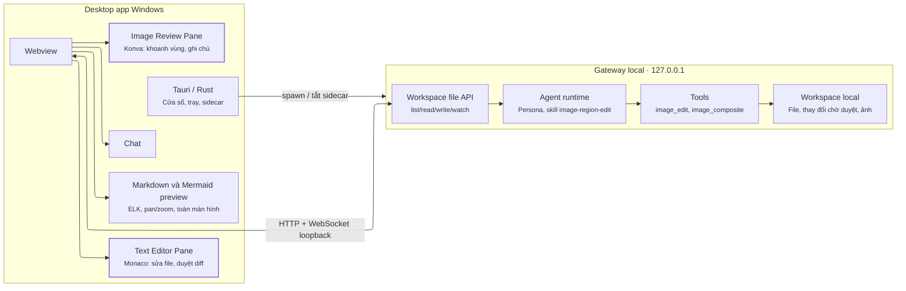
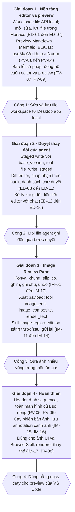

# Đặc tả tính năng: Text Editor Pane & Image Review Pane cho nanobot

2026-10-07 · Cuong Fam

## Bối cảnh và mục tiêu

Nanobot sẽ có hai pane làm việc cạnh khung chat: Text Editor Pane (Monaco) để xem, sửa và duyệt nội dung agent tạo ra, và Image Review Pane (Konva) để khoanh vùng, ghi chú và gửi yêu cầu sửa ảnh cho agent. Cả hai phục vụ mục đích chính của nanobot: brainstorm, thiết kế hệ thống, lập trình và marketing.

Vấn đề cần giải quyết:

- Sơ đồ Mermaid hiển thị rối, chữ nhỏ trên sơ đồ lớn và không zoom riêng được.
- Không có chỗ duyệt thay đổi agent thực hiện trên file trước khi chấp nhận.
- Yêu cầu sửa ảnh bằng lời khó chính xác; khoanh vùng kèm ghi chú truyền đạt ý định tốt hơn.

Mục tiêu đo được:

1. Người dùng duyệt và chấp nhận/từ chối từng khối thay đổi của agent ngay trong app, không cần mở VS Code.
2. Sơ đồ sequence 15+ participant đọc được chữ mà không phải zoom cả trang.
3. Một yêu cầu sửa ảnh nhiều vùng được gửi trong một lần, phần ngoài vùng khoanh giữ nguyên tuyệt đối khi bật ghép ảnh.

## Phạm vi và ngoài phạm vi

| Trong phạm vi | Ngoài phạm vi |
| --- | --- |
| Editor Monaco cho file text trong workspace local | IDE đầy đủ: debugger, terminal tích hợp, marketplace extension |
| Diff view duyệt thay đổi của agent | Language server (LSP) cho mọi ngôn ngữ; chỉ cân nhắc sau |
| Preview Markdown + Mermaid (ELK, pan/zoom, toàn màn hình) | Chỉnh sửa đồng thời nhiều người theo thời gian thực (CRDT) |
| Image pane: khoanh vùng, ghi chú, xuất mask/ảnh đánh dấu/JSON | Công cụ chỉnh ảnh thủ công (crop, lọc màu, lớp) |
| Ghép vùng sửa lên ảnh gốc, lịch sử phiên bản ảnh | Tự phát triển model sinh ảnh hay engine bố cục sơ đồ |
| Tool + skill `image-region-edit` cho agent | Remote use (VPS + tunnel); hỗ trợ đầy đủ trên điện thoại |

Khi cần lập trình nặng, người dùng chuyển sang VS Code thật; nanobot không cạnh tranh ở mảng IDE.

## Bối cảnh kiến trúc

Mục tiêu là Desktop app local trên Windows. Webview, gateway Python và workspace nằm trên cùng máy. Rust/Tauri chỉ lo việc native (cửa sổ, tray, thông báo, mở file local, vòng đời sidecar). Chat, file và ảnh đi thẳng từ webview tới gateway qua HTTP/WebSocket loopback (`127.0.0.1`), không qua IPC của Tauri. Remote use (VPS + tunnel) nằm ngoài phạm vi.

*Sơ đồ: kiến trúc local desktop (hai pane mới được tô màu)*



Webview không đọc ghi workspace qua Tauri `invoke`. Mọi thao tác file đi qua workspace file API của gateway; gateway phát sự kiện thay đổi qua WebSocket. Xử lý ảnh (sinh, ghép, chèn chữ) chạy trong gateway; webview chỉ vẽ vùng và xuất payload. Guardrail IPC: xem `dac-ta-hieu-nang-desktop.md`.

## Text Editor Pane (Monaco)

Pane dùng Monaco Editor (MIT), bố cục ba cột: cây file, editor, chat. Trọng tâm là duyệt và sửa nội dung agent tạo ra, không phải IDE.

### Cây file và mở file

- **ED-01** Cây file của workspace local: mở, tạo, đổi tên, xóa (xóa cần xác nhận).
- **ED-02** Tab nhiều file, đánh dấu file chưa lưu, khôi phục tab khi mở lại app.
- **ED-03** Mở file theo loại: text/code → Monaco; `.md` → Monaco + preview; ảnh → Image Review Pane.
- **ED-04** Chặn mở file nhị phân lớn hoặc file text > 5 MB ở chế độ sửa; chỉ cho xem.

### Soạn thảo

- **ED-05** Syntax highlight theo đuôi file, tìm/thay thế, multi-cursor, phím tắt mặc định của Monaco.
- **ED-06** Lưu thủ công (Ctrl+S) và tự lưu tùy chọn; mỗi lần lưu gửi kèm phiên bản file (xem phần Mô hình dữ liệu).
- **ED-07** Theme đồng bộ dark/light với app.

### Duyệt thay đổi của agent

- **ED-08** Khi agent ghi file, thay đổi hiện dưới dạng diff (Monaco diff editor, hai bên hoặc inline).
- **ED-09** Chấp nhận/từ chối theo từng khối (hunk) và toàn bộ file.
- **ED-10** Danh sách "thay đổi chờ duyệt" cho mọi file agent đã sửa trong phiên, kèm tên persona đã sửa.
- **ED-11** Chế độ tự chấp nhận theo cấu hình (ví dụ cho thư mục nháp); mặc định tắt.

### Kết nối với chat

- **ED-12** Bôi đen đoạn text → "Hỏi agent về đoạn này": chat nhận đường dẫn file, khoảng dòng và nội dung đoạn.
- **ED-13** Tham chiếu file trong chat (ví dụ `@docs/arch.md`) mở file tương ứng trong editor.
- **ED-14** Agent biết file người dùng đang mở và vị trí con trỏ khi người dùng cho phép (bật/tắt trong cài đặt).

### Xung đột người dùng và agent

- **ED-15** File đang mở bị agent sửa: hiện thông báo trên tab, cho xem diff giữa bản đang sửa và bản mới.
- **ED-16** Agent ghi đè khi phiên bản đã đổi → bị từ chối, agent phải đọc lại file trước khi ghi.

## Markdown và Mermaid preview

Preview hiển thị cạnh editor, cập nhật khi gõ, và dùng chung một component render Mermaid với khung chat để sơ đồ trông giống nhau ở mọi nơi.

- **PV-01** Bật ELK làm layout mặc định cho flowchart và các loại hỗ trợ; sơ đồ khai báo layout riêng thì giữ nguyên.
- **PV-02** Tắt `useMaxWidth` cho sequence và flowchart để sơ đồ hiển thị ở kích thước thật; bật `wrap: true`, `mirrorActors: false` cho sequence.
- **PV-03** Pan/zoom trong khung sơ đồ bằng @panzoom/panzoom: Ctrl + cuộn chuột hoặc pinch để zoom, kéo để pan, nhấp đúp để reset. Cuộn thường vẫn cuộn trang.
- **PV-04** Thanh công cụ trên mỗi sơ đồ: phóng to, thu nhỏ, fit width, fit height, toàn màn hình, tải SVG/PNG, sao chép mã nguồn.
- **PV-05** Chế độ toàn màn hình (lớp phủ trong app; trên Desktop có thể tách ra cửa sổ riêng).
- **PV-06** Header dính cho sequence: hàng participant luôn hiện ở đầu khung khi cuộn dọc, dịch ngang theo pan.
- **PV-07** Lỗi cú pháp Mermaid: hiện thông báo lỗi kèm dòng, giữ bản render hợp lệ gần nhất.
- **PV-08** Renderer thay thế (beautiful-mermaid) để ngỏ qua cấu hình; fallback về Mermaid + ELK với loại sơ đồ không hỗ trợ.
- **PV-09** Đồng bộ cuộn giữa editor và preview cho Markdown dài.

Ghi chú cho prompt của persona kiến trúc sư: sequence tối đa khoảng 6 participant và 25 message; dài hơn thì tách theo giai đoạn và có một sơ đồ tổng quan.

## Image Review Pane (Konva)

Pane dùng Konva.js (MIT), tự xây bộ công cụ tối giản để kiểm soát hoàn toàn định dạng xuất cho agent. Mở khi người dùng mở file ảnh hoặc bấm "Sửa ảnh này" trên ảnh agent trả về trong chat.

### Hiển thị

- **IM-01** Hiển thị ảnh với zoom/pan, fit màn hình, xem 100%.
- **IM-02** Hỗ trợ PNG, JPEG, WebP; ảnh lớn được thu nhỏ để hiển thị nhưng tọa độ luôn tính theo ảnh gốc.

### Công cụ khoanh vùng

- **IM-03** Khung chữ nhật và elip: vẽ, di chuyển, đổi kích thước, xóa.
- **IM-04** Cọ tô vùng tự do, có chỉnh kích thước cọ và tẩy; dùng cho vùng hình dạng bất kỳ (ví dụ xóa một người).
- **IM-05** Ghim điểm (pin) cho ghi chú không cần vùng, ví dụ "thêm logo ở đây".
- **IM-06** Mỗi vùng tự đánh số theo thứ tự tạo, màu phân biệt, số hiển thị cạnh vùng.
- **IM-07** Undo/redo cho mọi thao tác.

### Ghi chú

- **IM-08** Mỗi vùng có một ô ghi chú; danh sách ghi chú hiện ở cột bên, nhấp vào ghi chú thì làm nổi vùng tương ứng.
- **IM-09** Ghi chú chung cho toàn ảnh (`global_note`).
- **IM-10** Công tắc "Chỉ sửa trong vùng khoanh" (bật mặc định) quyết định có ghép kết quả lên ảnh gốc hay không.

### Gửi và nhận kết quả

- **IM-11** Nút "Gửi chỉnh sửa": xuất mask theo vùng, ảnh đánh dấu và JSON, gửi vào chat như một tin nhắn có đính kèm.
- **IM-12** Kết quả trả về mở thành phiên bản mới; thanh trượt so sánh trước/sau.
- **IM-13** Báo cáo của agent theo số vùng (đạt/chưa đạt) hiện cạnh từng ghi chú.
- **IM-14** Gửi lại: giữ nguyên vùng và ghi chú cũ, người dùng chỉ sửa ghi chú vùng chưa đạt.

### Lịch sử phiên bản

- **IM-15** Cây phiên bản: mỗi lần sửa là một nút, có thể quay lại và rẽ nhánh từ phiên bản cũ.
- **IM-16** Lưu phiên bản dưới dạng file trong workspace (ví dụ `banner.v3.png`) kèm file annotation tương ứng.

### Dùng lại

- **IM-17** Cùng pane dùng cho ảnh chụp màn hình UI (góp ý thiết kế) và ảnh chụp từ BrowserSkill; khi đó nút gửi tạo tin nhắn góp ý thay vì yêu cầu sửa ảnh.

## Mô hình dữ liệu và API

Mọi file nằm trong workspace local; webview chỉ truy cập qua workspace file API của gateway (HTTP/WebSocket loopback). Mỗi file có một `version` (hash nội dung hoặc số tăng dần) để phát hiện ghi đè.

### Workspace file API (gateway local)

| Thao tác | Đầu vào | Đầu ra / Ghi chú |
| --- | --- | --- |
| `fs.list` | đường dẫn thư mục | danh sách file, kích thước, `version` |
| `fs.read` | đường dẫn | nội dung + `version` |
| `fs.write` | đường dẫn, nội dung, `base_version` | `version` mới; từ chối nếu `base_version` lệch |
| `fs.rename` / `fs.delete` | đường dẫn | xóa cần xác nhận từ client |
| `fs.watch` | đường dẫn | sự kiện thay đổi qua WebSocket, kèm tác giả (user hoặc persona) |
| `changes.list` | phiên chat | các thay đổi agent đang chờ duyệt |
| `changes.resolve` | id thay đổi, danh sách hunk chấp nhận | áp dụng hoặc hủy |

Nguyên tắc: agent ghi vào vùng chờ duyệt (staged) trước, chỉ ghi vào file thật khi người dùng chấp nhận hoặc khi bật tự chấp nhận (ED-11).

### Payload chỉnh sửa ảnh

Tọa độ dạng tỉ lệ 0–1 theo ảnh gốc. Mask là PNG cùng kích thước ảnh gốc, vùng cần sửa trong suốt.

```json
{
  "schema": "nanobot.image-annotations/v1",
  "image": "assets/banner.v3.png",
  "image_version": "a91c...",
  "composite_to_original": true,
  "global_note": "Giữ nguyên tông màu tổng thể",
  "edits": [
    { "id": 1, "shape": "rect", "box": [0.62, 0.08, 0.95, 0.30],
      "note": "Đổi logo sang bản trắng, nhỏ hơn khoảng 20%" },
    { "id": 2, "shape": "brush", "mask_ref": "mask_2.png",
      "note": "Xóa người đứng phía sau" },
    { "id": 3, "shape": "pin", "point": [0.12, 0.85],
      "note": "Thêm dòng chữ 'Ưu đãi tháng 10'" }
  ],
  "attachments": {
    "annotated": "banner.v3.annotated.png",
    "masks": ["mask_1.png", "mask_2.png"]
  }
}
```

File annotation lưu cạnh ảnh (ví dụ `banner.v3.annotations.json`) để mở lại và gửi lại được (IM-14, IM-16).

## Tích hợp agent

Phần xác định (tính toán, xử lý ảnh) nằm trong tool; phần phán đoán (hiểu ghi chú, chọn cách sửa, kiểm tra kết quả) nằm trong skill. Agent không tự tính tọa độ hay tự ghép ảnh.

### Tool mới

| Tool | Chạy ở | Việc làm |
| --- | --- | --- |
| `file_write_staged` | Gateway local | Ghi thay đổi vào vùng chờ duyệt, kèm `base_version` |
| `editor_context` | Gateway local (dữ liệu từ webview) | Trả file đang mở, vị trí con trỏ, đoạn bôi đen (khi người dùng cho phép) |
| `image_annotations_read` | Gateway local | Đọc payload, trả ghi chú theo vùng và đường dẫn mask |
| `image_edit` | Gateway local | Gọi model sinh ảnh theo mask hoặc theo lời; chọn provider qua cấu hình |
| `image_composite` | Gateway local | Dán vùng đã sửa lên ảnh gốc, làm mờ viền vài pixel |
| `render_text` | Gateway local | Chèn chữ (kể cả tiếng Việt có dấu) lên ảnh bằng font thật |
| `image_version_save` | Gateway local | Lưu phiên bản mới và ảnh so sánh trước/sau |

Định dạng payload được mô tả ngay trong description của `image_annotations_read` để model nào gọi tool cũng hiểu cấu trúc.

### Skill `image-region-edit`

Skill dựng sẵn, dùng chung cho persona designer, marketer và sales; không do persona tự tạo. Quy trình:

1. Đọc tất cả ghi chú, giải quyết tham chiếu chéo giữa các vùng. Ghi chú mơ hồ ("đẹp hơn") → đề xuất 2–3 phương án cụ thể và hỏi lại.
2. Phân loại từng vùng: xóa, thay thế, thêm, chỉnh màu/sáng, thêm hoặc sửa chữ.
3. Vùng có chữ tiếng Việt → model sinh nền, chữ chèn bằng `render_text`.
4. Gộp các vùng cùng loại, không chồng nhau vào một lần gọi; vùng mâu thuẫn xử lý tuần tự.
5. Prompt cho model ảnh viết bằng tiếng Anh; nêu rõ khung và số chỉ là chú thích, không được vẽ ra.
6. Giữ `composite_to_original` theo lựa chọn của người dùng.
7. Xem ảnh kết quả, đối chiếu từng ghi chú, báo cáo theo số vùng: đạt/chưa đạt và lý do.

Skill này là hạt giống cho cơ chế tự tạo skill (port Hermes): persona marketer có thể tự sinh skill con ghi lại khẩu vị riêng như font, tông màu, vị trí logo.

## Yêu cầu phi chức năng

- **Hiệu năng:** mở file text 1 MB dưới 1 giây trên máy local; preview Mermaid cập nhật trong 300 ms sau khi ngừng gõ; Monaco, Konva và Mermaid tải lười, không làm chậm lần mở app đầu tiên. File, ảnh và stream không đi qua Tauri `invoke` (xem `dac-ta-hieu-nang-desktop.md`).
- **Kết nối:** gateway local tạm tắt thì giữ nội dung đang sửa trong webview; nối lại không mất thay đổi chưa lưu.
- **Bảo mật:** workspace file API chỉ nghe loopback, có token bootstrap; mọi đường dẫn bị giới hạn trong workspace (chặn `../`); xóa file luôn cần xác nhận.
- **Merge-safe:** phần lớn code nằm trong extension; core chỉ thêm seam tối thiểu cho staged write và sự kiện thay đổi file.
- **Nền tảng:** Desktop app trên Windows là mục tiêu duy nhất của đặc tả này; WebUI trình duyệt desktop dùng chung renderer; điện thoại ngoài phạm vi.
- **Khả năng mở rộng:** provider sinh ảnh và renderer Mermaid chọn qua cấu hình, không viết cứng.

## Đề xuất phân giai đoạn

Bốn giai đoạn, sắp theo giá trị sử dụng; mỗi giai đoạn kết thúc bằng một cổng kiểm tra được trước khi sang giai đoạn sau.

*Sơ đồ: lộ trình · 4 giai đoạn, 4 cổng*



Giai đoạn 3 chỉ cần workspace file API của giai đoạn 1, nên có thể chạy song song với giai đoạn 2 nếu có đủ người.

## Definition of Done

Một yêu cầu chỉ được tính là xong khi qua toàn bộ DoD chung; một giai đoạn chỉ qua cổng khi mọi tiêu chí của giai đoạn đó được kiểm chứng trên Desktop app Windows local (webview nối gateway `127.0.0.1`).

### DoD chung cho mọi yêu cầu

- [ ] Logic có unit test; luồng UI chính có test e2e (Playwright) chạy được trong CI.
- [ ] Đã chạy trên Desktop app Windows local (webview → gateway loopback), không chỉ `bun run dev` của WebUI.
- [ ] Không sửa core ngoài seam đã thống nhất; rebase lên upstream nanobot không xung đột.
- [ ] Hoạt động đúng ở cả dark và light theme; thao tác chính dùng được bằng bàn phím.
- [ ] Lỗi được ghi log kèm ngữ cảnh (file, phiên, persona); người dùng thấy thông báo dễ hiểu, không thấy stack trace.
- [ ] Description của tool mới và README của extension đã cập nhật.
- [ ] Đã dùng thật trong công việc hằng ngày ít nhất 3 phiên mà không phải quay lại cách làm cũ (ngưỡng đề xuất, điều chỉnh khi phản biện).

### DoD theo giai đoạn

| Giai đoạn | Tiêu chí kiểm tra được |
| --- | --- |
| 1 · Nền tảng editor và preview | Mở file 1 MB dưới 1 giây trên máy local · Sửa, lưu, đóng, mở lại cho đúng nội dung · Ghi với `base_version` lệch bị từ chối · Sequence 15 participant đọc được chữ ở 100% mà không zoom cả trang · Ctrl + cuộn zoom sơ đồ, cuộn thường cuộn trang · Lỗi cú pháp Mermaid giữ bản render hợp lệ gần nhất · File/ảnh không đi qua Tauri `invoke` |
| 2 · Duyệt thay đổi của agent | Agent không có đường ghi file trực tiếp ngoài `file_write_staged` (trừ thư mục tự chấp nhận) · Chấp nhận một hunk chỉ áp dụng đúng hunk đó · Agent sửa file người dùng đang gõ: không mất ký tự nào của người dùng · Bôi đen rồi hỏi agent: chat nhận đúng đường dẫn và khoảng dòng |
| 3 · Image Review Pane | Payload hợp lệ theo JSON Schema `image-annotations/v1` · Mask cùng kích thước ảnh gốc, lệch tọa độ không quá 1 px khi ảnh hiển thị thu nhỏ · Bật ghép ảnh: pixel ngoài vùng khoanh (trừ dải làm mờ viền) giống hệt ảnh gốc · Chữ tiếng Việt chèn bằng `render_text` đúng dấu · Agent báo cáo đạt/chưa đạt theo từng số vùng |
| 4 · Hoàn thiện | Header dính đúng cột sau pan và zoom · Quay lại phiên bản ảnh cũ và rẽ nhánh được · Có test hồi quy cho header dính, chạy lại mỗi khi nâng phiên bản Mermaid |

## Not-to-do

Đây là những cách làm bị cấm khi triển khai, khác với phần Ngoài phạm vi (những thứ chưa làm). Một PR vi phạm mục nào dưới đây thì không được merge, kể cả khi chạy đúng.

| Không làm | Lý do |
| --- | --- |
| Cho agent ghi file trực tiếp, bỏ qua staged write (ngoài thư mục tự chấp nhận đã cấu hình) | Phá bước duyệt, là lý do chính để có editor pane |
| Để LLM tự tính tọa độ, tự sinh mask hay tự ghép ảnh | LLM tính toán không ổn định; mọi phép tính hình học đi qua tool |
| Để model sinh ảnh vẽ chữ tiếng Việt | Hay sai dấu; chữ luôn chèn bằng `render_text` |
| Gửi ảnh đánh dấu cho model mà không dặn rằng khung và số chỉ là chú thích | Model vẽ luôn khung và số vào kết quả |
| Gộp các vùng có ghi chú mâu thuẫn vào một lần gọi model | Kết quả khó đoán, không báo cáo được theo vùng |
| Sửa core nanobot ngoài seam đã thống nhất, hoặc fork Monaco, Konva, Mermaid | Mất khả năng rebase lên upstream và nâng cấp thư viện |
| Tự viết engine bố cục sơ đồ hoặc lõi editor | ELK và Monaco đã giải tốt; công sức nên dành cho lớp tích hợp |
| Mở port gateway hay file API ra ngoài loopback, hoặc cho phép đường dẫn ra ngoài workspace | Rủi ro lộ toàn bộ workspace |
| Đưa nội dung file, ảnh hay stream chat qua Tauri `invoke` | IPC WebView2 trên Windows chậm với payload lớn; webview phải nói chuyện thẳng với gateway |
| Coi webview là nơi lưu file lâu dài | Workspace local của gateway là nguồn sự thật duy nhất; webview chỉ đệm tạm khi gateway tắt |
| Bắt sự kiện cuộn chuột thường để zoom sơ đồ | Người dùng không cuộn được đoạn chat qua sơ đồ |
| Thêm LSP, debugger, terminal hay extension marketplace vào editor pane | Biến pane thành IDE; nhu cầu đó chuyển sang VS Code thật |
| Tự động xóa phiên bản ảnh cũ hoặc file annotation | Người dùng mất khả năng quay lại và gửi lại |
| Gắn cứng một provider sinh ảnh hay một renderer Mermaid | Phải chọn được qua cấu hình (yêu cầu phi chức năng) |

## Câu hỏi mở và rủi ro

### Câu hỏi mở

- [ ] Provider sinh ảnh nào dùng trước, và provider đó có nhận mask không?
- [ ] Staged write áp dụng cho mọi file, hay chỉ file người dùng đang mở và file ngoài thư mục nháp?
- [ ] `editor_context` bật mặc định hay để người dùng tự bật?
- [ ] Lưu phiên bản ảnh trong workspace hay một kho riêng (tránh workspace phình to)?

### Rủi ro

| Rủi ro | Ảnh hưởng | Giảm thiểu |
| --- | --- | --- |
| Monaco nặng, làm chậm Desktop app | Lần mở đầu chậm | Lazy load, chỉ tải khi mở editor |
| Model sửa ảnh đổi cả vùng ngoài khoanh | Mất chi tiết người dùng muốn giữ | `image_composite` bật mặc định |
| Model vẽ sai dấu tiếng Việt | Banner marketing dùng không được | Chữ chèn bằng `render_text` |
| Người dùng và agent cùng sửa một file | Mất thay đổi | `base_version` + staged write |
| Header dính sequence phụ thuộc cấu trúc SVG nội bộ của Mermaid | Vỡ khi nâng phiên bản Mermaid | Test hồi quy khi nâng cấp, khóa phiên bản |
