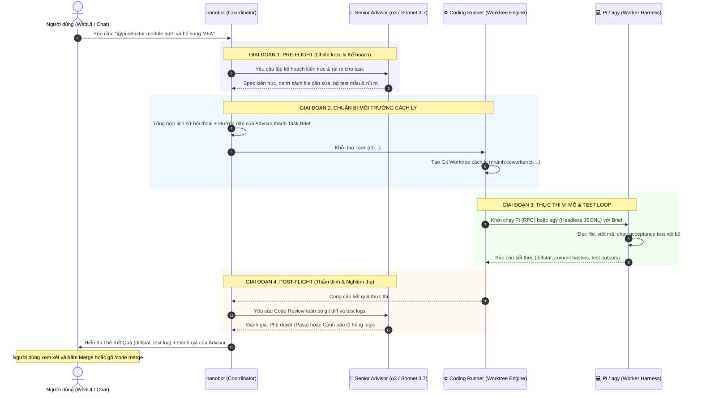

# Đề Xuất Kiến Trúc: Tác Tử Kép (Dual-Brain Architecture) & Tích Hợp Coding Agent Vào WebUI

- **Tác giả:** Đội ngũ phát triển nanobot / AICoworker
- **Ngày lập:** 30/09/2026
- **Trạng thái:** Bản thảo đề xuất (Draft Proposal - Chờ duyệt)
- **Tài liệu liên quan:** `docs/coworker/README.md`, `docs/coworker/plans/coding-agent.md`

---

## 1. Tóm Tắt Đề Xuất (Executive Summary)

Đề xuất này giải quyết hai bài toán then chốt nhằm nâng cấp trải nghiệm lập trình tự động trên **nanobot**:
1. **Kiến trúc Tác tử kép (Dual-Brain Multi-Agent Architecture):** Kết hợp tối ưu sức mạnh suy luận chiến lược của **Senior Advisor** (các mô hình siêu mạnh như `OpenAI o3-mini`, `Claude 3.7 Sonnet Thinking`) với năng lực thực thi mã nguồn chuyên sâu của **Coding Worker Harnesses** (`Pi` với Claude Code, `agy` với Antigravity CLI/Gemini).
2. **Tích hợp WebUI toàn diện (`#/apps` & Chat Stream):** Đưa các Coding Agent vào màn hình Quản lý Ứng dụng/Tiến trình con `http://127.0.0.1:8765/#/apps`, hỗ trợ phát hiện nhị phân, giao diện cấu hình trực quan và tương tác tự nhiên qua cú pháp mention `@pi` / `@agy`.

---

## 2. Bối Cảnh & Vấn Đề Hiện Tại (Motivation & Problem Statement)

### 2.1. Nghịch lý chi phí và năng lực của mô hình đơn lẻ (Single-Model Dilemma)
- Nếu dùng **model siêu mạnh (o3, Claude 3.7 Thinking)** cho toàn bộ quy trình: Rất tốn kém chi phí token khi model phải làm các thao tác vi mô lặp đi lặp lại như đọc file lớn, gõ boilerplate code, chạy linter, debug lỗi cú pháp cơ bản.
- Nếu dùng **model rẻ hoặc Worker CLI chạy độc lập**: Thiếu tầm nhìn kiến trúc tổng thể, dễ tạo ra code ngây thơ, bỏ sót các ca biên (edge-cases) hoặc phá vỡ cấu trúc phần mềm hiện hữu.

### 2.2. Vấn đề truyền ngữ cảnh (Context Dilution / Isolation)
- Khi gọi trực tiếp CLI từ terminal (`pi`, `agy`), công cụ không nắm được toàn bộ lịch sử trao đổi, các quyết định thiết kế đã thảo luận giữa người dùng và nanobot.
- Nếu đẩy toàn bộ 50.000+ tokens lịch sử chat vào CLI, prompt sẽ bị loãng, chi phí tăng vọt và giảm độ chính xác của agent.

### 2.3. Thiếu khả năng quản lý và cấu hình trên WebUI
- Màn hình `#/apps` hiện tại mới chỉ hiển thị các CLI Apps đơn giản (`gimp`, `drawio`, `linear`) và MCP Servers.
- Người dùng chưa có giao diện trên WebUI để xem trạng thái nhị phân của `pi`/`agy`, cũng như chưa có form trực quan để cấu hình kho mã nguồn (`repositories`), lệnh kiểm thử (`acceptance command`) và chiến lược merge.

---

## 3. Kiến Trúc "Dual-Brain" (Não Chiến Lược + Tay Thực Thi)

Hệ thống được tổ chức thành 3 tầng phân cấp rõ ràng:

```
┌────────────────────────────────────────────────────────────────────────┐
│                      TẦNG 1: NÃO CHIẾN LƯỢC (STRATEGIC BRAIN)           │
│         Senior Advisor (OpenAI o3-mini / Claude 3.7 Sonnet Thinking)   │
│  - Phân tích yêu cầu, thiết kế kiến trúc và danh sách ca biên         │
│  - Soạn thảo tiêu chuẩn kiểm thử chấp nhận (Acceptance Criteria)      │
│  - Thẩm định, Code Review chuyên sâu trước khi cho phép Merge         │
└───────────────────────────────────┬────────────────────────────────────┘
                                    │ (Strategic Guidance & Gatekeeping)
                                    ▼
┌────────────────────────────────────────────────────────────────────────┐
│                  TẦNG 2: BỘ ĐIỀU PHỐI (COORDINATOR & RUNNER)            │
│                     nanobot Core & Coworker Engine                     │
│  - Lọc ngữ cảnh thông minh (Context Distillation) từ lịch sử chat      │
│  - Đóng gói Task Brief tự chứa (Self-contained Brief)                  │
│  - Khởi tạo & dọn dẹp Git Worktree cách ly trên nhánh riêng           │
│  - Giám sát tiến trình, vòng lặp tự sửa lỗi (Fix Rounds) & WebUI Event │
└───────────────────────────────────┬────────────────────────────────────┘
                                    │ (Isolated Execution & IPC)
                                    ▼
┌────────────────────────────────────────────────────────────────────────┐
│                      TẦNG 3: TAY THỰC THI (EXECUTION HANDS)             │
│               Coding Worker Harnesses (Pi / Antigravity agy)           │
│  - Chạy tiến trình con (Subprocess) độc lập trong Git Worktree         │
│  - Thực thi vi mô: Đọc/Sửa file, chạy lệnh Shell, chạy Test           │
│  - Tận dụng gói thuê bao không giới hạn (Claude Pro/Max, Gemini CLI)  │
└────────────────────────────────────────────────────────────────────────┘
```

---

## 4. Quy Trình Hoạt Động Chi Tiết (End-to-End Workflow)



---

## 5. Thiết Kế Tích Hợp Vào WebUI

### 5.1. Màn hình `http://127.0.0.1:8765/#/apps`
Bổ sung một phân loại mới bên cạnh `Ready`, `CLI Apps`, `MCP Servers`:
- **Tab Filter:** `Coding Agents` (hoặc hiển thị trực tiếp với badge `Coding Harness`).
- **Thẻ Card cho Pi:**
  - Tiêu đề: **Pi Coding Harness (Anthropic Claude Code RPC)**.
  - Trạng thái nhị phân: 🟢 *Installed (`/usr/local/bin/pi` - v0.84.2)* hoặc ⚪ *Not found*.
  - Huy hiệu tính năng: `Git Worktree`, `RPC Extension Auto-Cancel`, `Live Steering`.
  - Nút **Cấu hình**: Mở modal thiết lập danh sách Repo, Acceptance command mặc định.
- **Thẻ Card cho agy:**
  - Tiêu đề: **Antigravity CLI (Google DeepMind agy)**.
  - Trạng thái nhị phân: 🟢 *Installed (`agy` - v1.2.13)* hoặc ⚪ *Not found*.
  - Huy hiệu tính năng: `Headless JSONL Stream`, `Sandbox Isolation`, `Delta Tokens`.
  - Nút **Cấu hình**: Mở modal thiết lập cờ bổ sung (`extra_args`), sandbox mode.

### 5.2. Khung Chat (Composer & In-Chat Cards)
- **Tương tác Mention:** Hỗ trợ gõ `@pi` hoặc `@agy` ngay trong ô nhập liệu (tự động hiện autocomplete trong mention palette).
- **Thẻ tin nhắn chuyên biệt (`CoworkerMessageCard`):**
  - **Thẻ Cố vấn (Advisor Review):** Khung tím sang trọng, icon 🧠, hiển thị định hướng kiến trúc trước khi code và đánh giá chất lượng sau khi code.
  - **Thẻ Kết quả Coding (Coding Result):** Khung xanh ngọc, icon 💻, hiển thị Task ID, nhánh Git, bảng diffstat (`+45 -12`), log kiểm thử có thể bấm mở rộng/thu gọn.

---

## 6. Kế Hoạch Triển Khai Kỹ Thuật (Phân Kỳ Dự Kiến)

### Giai đoạn 1: REST API Cấu hình Coworker Backend
- Xây dựng endpoint `GET /api/coworker/config` và `POST /api/coworker/config` trong `nanobot/webui/`.
- Kết nối đọc/ghi trực tiếp vào file `~/.nanobot/coworker.json` (bảo đảm an toàn dữ liệu, hot-reload tự động).

### Giai đoạn 2: Tích hợp Giao diện `#/apps`
- Bổ sung nhóm `Coding Agents` vào component `webui/src/components/settings/system/AppsSettings.tsx`.
- Thêm modal cấu hình kho mã nguồn (Repositories, Base branch, Acceptance test).
- Thêm kiểm tra phát hiện binary hệ thống (`which pi`, `which agy`) trả về qua API.

### Giai đoạn 3: Tự động hóa Hook "Pre-Flight & Post-Flight" của Advisor
- Trong `nanobot/coworker/hook.py`:
  - Khi phát hiện lệnh `@pi` / `@agy` hoặc tool `coding_agent`: Tự động tham vấn Advisor nếu bài toán vượt ngưỡng độ phức tạp.
  - Khi nhận `[auto-coding-result]`: Tự động gọi Advisor review diff trước khi thông báo cho người dùng.

---

## 7. Lợi Ích Mang Lại (Key Benefits & ROI)

1. **Tiết kiệm chi phí vượt trội (70% - 85%):**
   - Không lãng phí token đắt đỏ của các model suy luận thượng tầng cho việc lặp code vi mô.
   - Tận dụng tối đa các gói thuê bao phẳng (Flat-rate Subscriptions) của Claude Pro/Max (qua Pi) hoặc Gemini (qua agy).
2. **Chất lượng phần mềm đạt chuẩn doanh nghiệp:**
   - Code sinh ra được kiểm soát bởi hai tầng bảo vệ: Kiểm thử tự động (Acceptance Test) + Phê duyệt logic của Senior Advisor.
3. **Trải nghiệm người dùng mượt mà:**
   - Quản lý tập trung mọi công cụ từ CLI, MCP đến Coding Agent tại một màn hình duy nhất `#/apps`.
   - Dễ dàng thao tác bằng cả giao diện đồ họa (UI) lẫn lệnh chat (`@pi`, `/code`).
