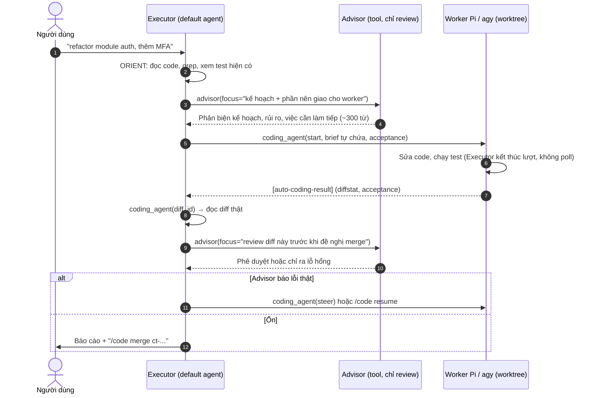

# Đề Xuất: Advisor-Assisted Coding Agent & WebUI cho Team Agent

- **Ngày lập:** 30/09/2026
- **Trạng thái:** Draft v2 (viết lại; thay thế bản "Dual-Brain" 3 tầng)
- **Tài liệu liên quan:** `docs/coworker/README.md`, `docs/coworker/plans/coding-agent.md`
- **Mã nguồn tham chiếu:** `nanobot/coworker/advisor/`, `nanobot/coworker/hook.py`, `nanobot/coworker/room/scheduler.py`, `nanobot/coworker/status.py`, `webui/src/components/coworker/`; gốc AICoworker: `electron/openclaw-bundled/tools/advisor.cjs`, `directives/advisor.cjs`.

---

## 1. Tóm tắt

Bản nháp trước coi Advisor là "não chiến lược" đứng trên cùng: Coordinator bắt buộc hỏi Advisor trước (lập spec, danh sách file, test) và sau (review diff) mỗi task code. Cách đó **đi ngược thiết kế Advisor đang chạy** (port từ AICoworker) và bị bỏ.

Đề xuất này làm hai việc:

1. **Giữ nguyên mô hình Advisor hiện tại** (executor chủ động hỏi, advisor chỉ review, không làm thay) và chỉ vá những chỗ nó chưa khớp với `coding_agent`: executor chưa có cách đọc diff thật, và hook nudge đang tắt đúng ở lượt nhận kết quả code.
2. **Chốt phần WebUI**: trang cấu hình Coworker (Advisor / Team / Coding) và một bảng **Participants** cho biết agent nào đang tham gia phiên hiện tại, đang làm gì, ở trạng thái nào.

---

## 2. Advisor hoạt động thế nào (nền tảng, không đổi)

| Đặc điểm | Hiện thực |
|---|---|
| Ai quyết định gọi | **Executor** (default agent) gọi tool `advisor(focus?)`; luật thời điểm nằm ở directive (`ADVISOR`) |
| Advisor làm gì | Chỉ trả văn bản, không tool, không hành động; prompt cấm tự làm deliverable |
| Advisor thấy gì | Toàn bộ system prompt + transcript của executor (tool result bị cắt còn ~4k ký tự) |
| Chống advice chung chung | `insufficient_context`: chưa có bằng chứng thì lần gọi đầu bị từ chối miễn phí |
| Thời điểm | Orient → consult → plan → execute; khi kẹt; trước khi đổi hướng; mỗi milestone; một lần trước khi báo xong; lần ghi file đầu tiên phải sau một consult thành công |
| Guard | `max_uses`, timeout cứng, circuit breaker (2 lỗi → nghỉ 30 phút), token cap |
| Hook | `_maybe_nudge_advisor` chỉ *nhắc* executor tự gọi, không gọi thay |

Nguyên tắc rút ra: **Advisor chỉ tốt bằng những gì executor đã nhìn thấy.** Mọi thiết kế tích hợp phải đưa bằng chứng vào transcript của executor, không được đi vòng qua nó.

---

## 3. Luồng đề xuất khi có Coding Agent



Khác bản cũ: không có pre-flight/post-flight cưỡng bức, Advisor không lập spec hay test. Executor tự viết brief (đây là bước "context distillation" duy nhất), tự quyết định hỏi Advisor lúc nào.

Worker không bao giờ thấy Advisor; lời khuyên đến Worker chỉ qua brief và `steer` của executor. Advisor cũng không thấy transcript nội bộ của Worker, nên review dựa trên **diff + kết quả acceptance mà executor đã đọc**. Đây là giới hạn được chấp nhận.

---

## 4. Thay đổi backend (nhỏ)

| # | Vấn đề hiện tại | Thay đổi |
|---|---|---|
| B1 | `coding_agent` không có cách đọc diff: `result` chỉ trả summary + diffstat + acceptance; diff đầy đủ chỉ qua slash command `/code diff` (dành cho người dùng). Advisor không thể review thứ executor chưa từng thấy. | Thêm `action="diff"` (read-only), trả diff cắt theo ngân sách (ví dụ 20k ký tự, ưu tiên file quan trọng, có ghi chú phần bị cắt). |
| B2 | `_maybe_nudge_advisor` thoát ngay khi `self._kind is not None`, tức là **không bao giờ nhắc** ở lượt `[auto-coding-result]`, đúng lúc cần review nhất. | Cho phép nhắc khi kind là `coding_result` (và `room_review`): nếu advisor bật, còn budget, và lượt đó chưa gọi advisor thì nhắc gọi với focus review diff. Vẫn chỉ là nhắc. |
| B3 | Directive `CODING` mới nói "ask the advisor" chung chung. | Ghi rõ: trước khi giao việc (sau orient), khi worker fail acceptance lần 2, và trước khi đề nghị merge. |
| B4 | Kết quả `coding_agent` có tính là bằng chứng không? | Đã đúng: không nằm trong `NON_EVIDENCE_TOOLS`. Thêm test khóa hành vi này. |

Không đổi: prompt Advisor, `run_consult`, breaker, budget, cấu hình `advisor.*`.

Loại bỏ so với bản cũ: pre-flight/post-flight tự động, ngưỡng "độ phức tạp", Advisor sinh acceptance criteria, tên model hardcode (Advisor chọn qua `preset`), con số tiết kiệm "70–85%" (chưa đo; xem §8).

---

## 5. WebUI: quyết định chốt

### 5.1. Hiện trạng

Đã có: `CoworkerInspectorPopover` (Cache / Advisor / Room / Coding), `CoworkerMessageCard`, hook `useCoworkerStatus` (poll 4s **chỉ khi popover mở**), endpoint `GET /api/sessions/{key}/coworker`.

Thiếu:
- Không có UI nào sửa `~/.nanobot/coworker.json` (chỉ sửa tay).
- "Available Agents" chỉ là danh sách cấu hình tĩnh, không nói agent nào **đang** làm gì.
- Tiến độ task (số tool, tool cuối, thời gian) chỉ nằm trong biến cục bộ của `runner.py` rồi gửi thành tin nhắn chat; API status không thấy.
- Thẻ "Advisor" đang hiển thị nội dung nudge `[auto-advisor-review]` (lời nhắc cho executor), không phải lời khuyên thật của Advisor.
- `status.py` chọn task bằng `t.session_key == key or len(tasks_list) < 5`, nên có thể lẫn task của phiên khác.

### 5.2. Cấu hình

**Quyết định:** một trang mới **Settings → Capabilities → Coworker** làm nơi sửa cấu hình duy nhất, gồm 3 tab. `#/apps` chỉ thêm bộ lọc `Coding` hiển thị thẻ Pi / agy (trạng thái binary, phiên bản) kèm nút "Configure" dẫn sang tab Coding. Không nhân đôi form ở hai nơi.

| Tab | Trường cấu hình | Ghi chú |
|---|---|---|
| **Advisor** | `preset` (dropdown từ danh sách preset + Off), `max_uses`, `max_tokens`, `timeout_seconds`, `review_nudge`; gập "Nâng cao": `first_consult_gap`, `reconsult_gap` | Hiển thị breaker hiện tại; nút test consult tùy chọn (phase sau) |
| **Team** | CRUD `room.agents` (`id`, `name`, `emoji`, `bio`, `preset`, `backend`, `instructions`), `max_chained_turns`, `guest_timeout_seconds` | `id` validate theo regex hiện có; `backend` chỉ chọn được backend đã phát hiện |
| **Coding** | `enabled`, `default_backend`, `sandbox`, timeouts, `max_concurrent_*`, `fix_rounds`, `merge_strategy`, `delete_branch_after_merge`; theo backend: `command`, `extra_args`, `agy_sandbox`, `mode`, `pass_env`, `allow_unsandboxed`; `repos[]` (`path`, `acceptance`, `base_ref`, `backend`) | Repo được kiểm tra là git repo hợp lệ trước khi lưu; `allow_unsandboxed` có cảnh báo rõ |

Không có trong UI (theo quyết định 30/09 của `coding-agent.md`): model / provider / effort / API key của Pi và agy, vì mỗi harness được đăng nhập và cấu hình bên ngoài nanobot. Nhóm `context.*` (cache, trim, keepalive) ngoài phạm vi đề xuất này.

**API** (theo mẫu `/api/settings/*/update` hiện có, thay cho `/api/coworker/config` của bản cũ):
- `GET /api/settings/coworker` → cấu hình hiện tại + `detection` (`pi`/`agy`: đường dẫn, phiên bản, có sẵn hay không) + danh sách preset + kết quả kiểm tra từng repo.
- `POST /api/settings/coworker/update` → validate bằng `CoworkerConfig`, ghi nguyên tử vào `coworker.json` (loader đã hot-reload theo mtime); trả lỗi theo từng trường.

Nhu cầu đổi advisor theo từng phiên (thay cho lệnh `/advisor <preset>`): một dropdown trong Inspector, gọi `POST /api/sessions/{key}/coworker/advisor`. Đặt ở phase 3.

### 5.3. Hiển thị agent đang tham gia

**Quyết định:** thêm khái niệm **participant** vào status API và hai bề mặt UI.

Status API mở rộng thêm `participants[]`:

```jsonc
{
  "id": "coder-pi",
  "kind": "coordinator | advisor | teammate | coding",
  "label": "🤖 Coder Pi",
  "engine": "preset:sonnet | backend:pi",
  "state": "idle | queued | working | waiting | done | error | paused",
  "task": "refactor auth (ct-2026...)",
  "since": 1790000000,
  "detail": { "tools": 12, "last_tool": "run_command: pytest", "uses": "3/10", "last_focus": "review diff" }
}
```

| Kind | Nguồn dữ liệu | Việc backend cần thêm |
|---|---|---|
| coordinator | Hook `before_run` / `after_run` | Ghi cờ "đang chạy lượt" theo session |
| advisor | `advisor_state` + registry consult đang bay | `run_consult` đăng ký/hủy đăng ký consult (state `working` khi đang gọi); lưu `last_consult {at, focus, duration_ms, ok}` vào slot session; breaker → `paused` |
| teammate | `_Room` trong `scheduler.py` | `_run_room` hiện dùng biến cục bộ; thêm `_Room.active` (agent, task, started_at) và hàng đợi `pending` → `queued`; teammate đợi `WAIT_FOR` → `waiting` |
| coding | `TaskRegistry` + runner | Ghi `live {tool_count, last_tool, elapsed}` vào bản ghi task trong bộ nhớ (không ghi đĩa mỗi event); lọc đúng theo `session_key` |

**Bề mặt 1: Participants strip** trong `ThreadHeader`: các chip nhỏ (emoji/icon + tên + chấm trạng thái nhấp nháy khi `working`), chỉ hiện khi có ít nhất một participant khác `idle` hoặc phòng đang `armed`. Bấm chip mở Inspector tại đúng mục.

**Bề mặt 2: Inspector** đổi phần "Room & Teammates" và "Coding Tasks" thành danh sách participant có trạng thái, thời gian, tiến độ (tool cuối, số tool); phần Advisor thêm lần consult gần nhất (focus, mô hình, thời gian) bên cạnh `uses/max`.

**Cập nhật dữ liệu:** dùng lại endpoint hiện có. Poll 3 giây khi có participant không `idle` hoặc lượt đang chạy, dừng khi tất cả `idle`; refetch ngay khi nhận tin nhắn `[auto-*]`. Đẩy qua WebSocket là bước sau, chỉ làm nếu poll không đủ.

### 5.4. Thẻ trong luồng chat

- **Advisor:** hiển thị lời khuyên thật (kết quả tool `advisor`: model, `advice n/max`, nội dung) thay cho nudge; nudge chuyển thành một dòng hệ thống nhỏ.
- **Teammate:** tin nhắn của teammate mang metadata `{coworker: {kind, agent}}` để WebUI gán avatar/tên thay vì đoán từ chuỗi `"{label}:\n..."`.
- **Coding:** thẻ kết quả giữ nguyên, thêm badge backend, trạng thái, diffstat dạng số (+/−), nút `Merge` / `Discard` gọi `/code merge|discard` (trước đây chỉ có lệnh chat).
- Tiến độ task cập nhật tại chỗ trên một thẻ thay vì thêm một dòng chat mỗi phút.

Cần xác minh trước khi làm: `OutboundMessage.metadata` có đi tới WebUI không, và tool result của `advisor` được WebUI nhận ở dạng nào.

---

## 6. Phân kỳ

| Phase | Nội dung | Điều kiện xong |
|---|---|---|
| **1. Backend vá** | B1–B4; `participants[]` trong `status.py`; `_Room.active`, registry consult, `live` của task; sửa lọc `session_key` | `pytest tests/coworker` xanh; test mới cho diff, nudge ở lượt `coding_result`, `participants` |
| **2. Participants UI** | Strip + Inspector mới + poll thích ứng + thẻ Advisor/Teammate/Coding | `bun run test` xanh; chip đổi trạng thái đúng khi chạy room và task giả |
| **3. Cấu hình UI** | Trang Coworker (3 tab), `GET/POST /api/settings/coworker`, phát hiện binary, thẻ `Coding` trong `#/apps`, dropdown advisor theo phiên | Sửa được `coworker.json` hoàn toàn từ UI, lỗi validate hiện đúng trường |

Phase 1 trước vì Phase 2 phụ thuộc dữ liệu của nó; Phase 3 độc lập, có thể song song.

---

## 7. Rủi ro

- **Phát hiện binary** chạy `which` + `--version` trên máy chủ gateway: chỉ chạy khi mở trang cấu hình, có timeout, không chạy lệnh tùy ý từ UI.
- **`command` / `extra_args` do người dùng nhập** đi vào subprocess: giữ denylist hiện có (`--model`, `--effort`, `-p`, …), UI không cho nhập `pass_env` chứa tên biến khóa API của nanobot.
- **`allow_unsandboxed`** chỉ bật được kèm xác nhận riêng.
- **Ghi `coworker.json`**: ghi nguyên tử (temp + rename), giữ quyền file, không xóa các khóa lạ mà UI chưa biết.
- **Chi phí poll**: 3 giây/lần chỉ khi có hoạt động; endpoint chỉ đọc bộ nhớ và một thư mục task nhỏ.

---

## 8. Đo lường (thay cho con số tiết kiệm cũ)

Bản cũ nêu "tiết kiệm 70–85%" nhưng chưa có phép đo nào. Đề xuất này chỉ cam kết những gì đo được sau Phase 1: số lần consult/phiên, token prompt mỗi consult, tỷ lệ task `succeeded` ở lần đầu, tỷ lệ diff bị Advisor chỉ ra lỗi sau khi acceptance đã qua. Kết luận về chi phí chỉ đưa ra sau khi có số liệu.

---

## 9. Câu hỏi còn mở

1. `OutboundMessage.metadata` có tới được WebUI không (§5.4)?
2. Nút Merge/Discard trong thẻ: chạy qua lệnh `/code` hiện có hay endpoint riêng (cần kiểm tra điều kiện "checkout sạch" của §9.2 trong `coding-agent.md`)?
3. Preset của Advisor có cần lọc theo khả năng (cửa sổ context đủ cho `TRANSCRIPT_MAX_CHARS` ≈ 120k token) khi hiện trong dropdown không?
