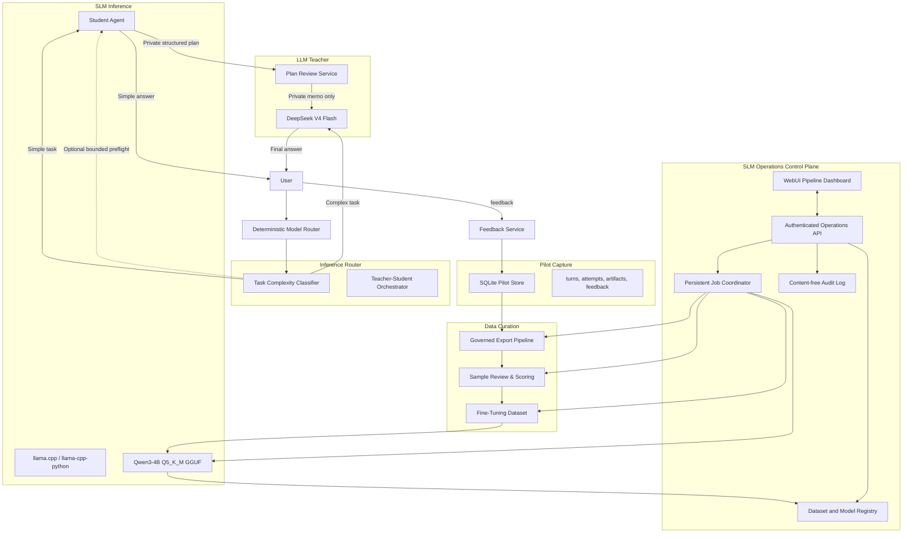

# SLM Distillation & Teacher-Student Architecture Plan

> **Prerequisite:** The Pilot Exit Gate (defined in the consolidated plan, Part 4) must be passed before any work on this plan begins. This plan is a sub-plan of `docs/superpowers/plans/2026-08-07-pilot-consolidated-implementation-plan.md` (Part 5).
>
> **Exit gate verification (run before any task below):**
> 1. Confirm that `PilotGate.state == "passed"` in the PilotService health snapshot.
> 2. Confirm the SQLite pilot store has at least 100 training-eligible turns (`SELECT COUNT(*) FROM turns WHERE training_eligible = 1`).
> 3. Run `pytest tests/pilot/ -k "gate or exit" -q` — all must pass.
> If any check fails, stop and do not begin this plan.

- [ ] Verify exit gate: confirm Part 4 is complete, store has ≥100 training-eligible rows, and Part 4 gate tests pass. If not, abort.

**Goal:** Build a governed, observable data curation and fine-tuning pipeline from the SQLite pilot
store, fine-tune Qwen3-4B-Instruct-2507 Q5_K_M as a primary student model, and deploy a
teacher-student architecture where the SLM handles simple tasks independently and plans complex
tasks under LLM teacher (DeepSeek V4 Flash) review. All long-running distillation work runs in the
background and is observable and safely controllable from an authenticated WebUI operations surface.

**Architecture:**



## Dependencies

```
E.20 Data Curation ──► E.21 Format Conversion ──► E.22 Fine-tune Qwen3-4B-2507
                                                          │
                                                          ▼
                                         E.27.1 Artifact Registry & Job Store
                                                          │
                                                          ▼
                                                   E.23 SLM Inference
                                                          │
                                              ┌───────────┼───────────┐
                                              ▼           ▼           ▼
                                         E.24 Teacher-   E.25         E.26
                                         Student         Evaluation   Telemetry
                                         Orchestrator
                                              │             │           │
                                              └─────────────┴───────────┘
                                                            ▼
                                         E.27.2 Pipeline Coordinator & Gates
                                                            │
                                                            ▼
                                              E.28 Operations API & Controls
                                                            │
                                                            ▼
                                              E.29 WebUI Operations Dashboard
```

## Tech Stack

- Python 3.11+, asyncio, Pydantic
- Hugging Face `transformers` + `TRL` (SFTTrainer) for QLoRA fine-tuning (not `torchtune` — pick TRL for ecosystem compatibility with `datasets`)
- `llama-cpp-python` for embedded GGUF inference; evaluate `llama-server` separately for
  multi-request batching and process isolation
- Base model: `Qwen/Qwen3-4B-Instruct-2507` (Hugging Face hub ID); this exact revision is used by
  preparation, fine-tuning, evaluation, conversion, and inference compatibility checks
- Student model: a Q5_K_M GGUF registered under an opaque `ArtifactRegistry` model ID; its local
  location is server-private
- DeepSeek V4 Flash API (teacher model)
- Hugging Face `datasets` / local JSONL for fine-tuning data
- `rouge-score` for ROUGE-L evaluation
- `sentence-transformers` (all-MiniLM-L6-v2) for semantic similarity
- `llama.cpp` (standalone binary) for GGUF quantization via `llama-quantize`
- React 18, TypeScript, Vite, and Vitest for the SLM Operations dashboard
- pytest/pytest-asyncio, Ruff, basedpyright

---

## Status and agent filtering

The checkboxes under each task track **implementation**, not document authorship. A file or scaffold
already present in the repository is not implementation-complete until its task acceptance criteria,
tests, lint, and type checks pass.

- `[x] [PLAN-DONE]` — the requirement has been reviewed and made implementation-ready in this plan.
- `[ ] [IMPLEMENT]` — code/work remains; agents must not infer completion from a `[PLAN-DONE]` marker.
- `[NEW]` — a new implementation task introduced by the operations/WebUI expansion.
- `[REVISED]` — an existing task whose implementation contract was materially changed; read it in full
  before extending an existing scaffold.

| Task | Planning status | Implementation status | Agent filter |
|---|---|---|---|
| E.20 Data curation | `[x] [PLAN-DONE]` | `[ ] [IMPLEMENT]` | `[REVISED]` |
| E.21 Conversation format | `[x] [PLAN-DONE]` | `[ ] [IMPLEMENT]` | `[REVISED]` |
| E.22 Fine-tuning/quantization | `[x] [PLAN-DONE]` | `[ ] [IMPLEMENT]` | `[REVISED]` |
| E.23 Student inference | `[x] [PLAN-DONE]` | `[ ] [IMPLEMENT]` | `[REVISED]` |
| E.24 Teacher-student orchestration | `[x] [PLAN-DONE]` | `[ ] [IMPLEMENT]` | `[REVISED]` |
| E.25 Evaluation | `[x] [PLAN-DONE]` | `[ ] [IMPLEMENT]` | `[REVISED]` |
| E.26 Runtime telemetry | `[x] [PLAN-DONE]` | `[ ] [IMPLEMENT]` | `[REVISED]` |
| E.27 Background coordinator/lineage | `[x] [PLAN-DONE]` | `[ ] [IMPLEMENT]` | `[NEW]` |
| E.28 Operations API/events | `[x] [PLAN-DONE]` | `[ ] [IMPLEMENT]` | `[NEW]` |
| E.29 WebUI operations dashboard | `[x] [PLAN-DONE]` | `[ ] [IMPLEMENT]` | `[NEW]` |

- [x] [PLAN-DONE] Reconciled the plan with the current provider factory, `LLMProvider`, pilot routing,
  gateway composition, privacy boundary, and existing scaffold status.
- [x] [PLAN-DONE] Finalized background job, artifact-lineage, operations API, and WebUI requirements.
- [ ] [IMPLEMENT] Verify the Pilot exit gate before beginning any E.20–E.29 implementation task.

To list only new scope, run:

```bash
rg -n '\[NEW\]' docs/superpowers/plans/2026-08-07-pilot-slm-distillation-plan.md
```

To list all work remaining, run:

```bash
rg -n '^[-] \[ \] \[IMPLEMENT\]|^- \[ \]' docs/superpowers/plans/2026-08-07-pilot-slm-distillation-plan.md
```

---

## Cross-cutting background execution and observability requirements

- Capture remains an always-on bounded service; export, curation, conversation formatting,
  fine-tuning, GGUF conversion/quantization, evaluation, and model activation run as background jobs.
  None may block message delivery, the gateway event loop, or teacher fallback.
- Each stage exposes a callable service API in addition to its CLI entry point. The CLI and WebUI job
  coordinator must call the same implementation so behavior cannot drift.
- Every job has a persistent opaque ID, type, state, created/started/updated/finished timestamps,
  progress units, current stage, sanitized status code, immutable configuration snapshot version,
  input artifact IDs, output artifact IDs, and parent pipeline-run ID.
- Allowed job states are `queued`, `running`, `pause_requested`, `paused`, `cancel_requested`,
  `cancelled`, `succeeded`, and `failed`. State transitions use compare-and-swap semantics and remain
  valid across gateway restart or host reboot.
- Progress and logs are content-free: they may contain counts, rates, durations, enum reason codes,
  model/dataset logical IDs, hashes, and aggregate distributions. They must never contain prompts,
  answers, teacher reasoning, tool arguments, credentials, user/session identifiers, raw provider
  errors, or local filesystem paths.
- Each stage accepts a cancellation token and progress callback. Checkpointable stages support
  graceful pause/resume; non-checkpointable stages expose `pause_requested` until a safe boundary.
  Cancellation must never publish a partial dataset or activate a partial model.
- Each produced dataset, checkpoint, merged model, GGUF, and evaluation report has a manifest with
  schema version, logical artifact ID, content hash, producer job ID, parent artifact IDs, counts,
  safe configuration fingerprint, and creation time. Writes are atomic and incomplete artifacts are
  quarantined.
- A full pipeline run is resumable and idempotent from the latest valid checkpoint. Retry creates a
  new attempt under the same job lineage; it never overwrites prior evidence.
- Runtime configuration is split into `hot_apply`, `drain_and_reload`, and `next_job_only` fields.
  The API validates and previews impact before apply. Every running job keeps its immutable config
  snapshot even if defaults change later.
- Resource guards cover free disk, RAM, VRAM, GPU temperature when available, queue capacity, teacher
  token/cost budget, and minimum training-eligible sample count. A guard pauses or rejects new work
  with a stable reason code and never takes down the chat path.
- Model activation is a separate atomic action after evaluation gates pass. Keep the previous known-good
  model available for one-click rollback; activation drains current student requests before swapping.
- Polling and runtime events are both supported: REST provides authoritative snapshots and bounded,
  paginated history; WebSocket events are hints carrying only changed IDs/state/version so reconnects
  can recover without event replay gaps.

---

## Implementation decisions and repository reconciliation

This section resolves ambiguities in earlier task text. It is normative: when a later bullet conflicts
with this section, follow this section and amend the later bullet in the same pull request.

- **Reconcile before editing.** Some E.23–E.26 scaffold files may already exist. They are incomplete
  until they meet the acceptance tests in this plan; do not mark a task complete merely because a file
  exists. Preserve unrelated user changes and use the current `LLMProvider`, provider factory, routing,
  gateway, and runtime-event contracts instead of inventing parallel ones.
- **One canonical target model.** Use `Qwen/Qwen3-4B-Instruct-2507` everywhere. Persist the resolved
  Hub revision/commit hash in every dataset and model manifest. A model artifact with a different base
  model, tokenizer hash, or chat-template hash is incompatible and cannot be activated.
- **Optional dependencies.** Add a bounded `distillation` extra for training/evaluation libraries and
  a separate `student` extra for `llama-cpp-python`. Pin compatible major/minor ranges in
  `pyproject.toml`, document accelerator-specific installation, and make imports lazy so core chat
  installs and CPU-only CI continue to work.
- **No placeholder success.** Missing model files, unavailable optional libraries, failed accelerator
  initialization, failed checkpoint load, and unavailable teacher service are typed unavailable/error
  states. They never produce fabricated text, fabricated token usage, or a successful job result.
- **Private data boundary.** Raw captured training artifacts may only be read by the governed export,
  curation, training, and evaluation workers on the server. They are never returned by WebUI/API,
  emitted as runtime events, logged, or used as metric labels. All visible summaries are aggregate and
  bounded. Tool trajectories retained for training are structural only: tool name, allowlisted argument
  key/type shape, result class, and success/failure code; never argument values, result text, paths,
  or credentials.
- **Eligibility is immutable per turn.** `turns.training_eligible` is the capture-time consent
  snapshot and is the only eligibility field used for export/train decisions. Current rows in
  `consents` are used only for future capture and deletion/retention operations. A withdrawal triggers
  deletion/quarantine through the existing retention/privacy flow before any subsequent job starts.
- **Cursor ordering is deterministic.** UUID4/hex turn IDs are opaque and do not sort by creation time.
  Incremental export uses `(created_at_ms, turn_id)` as a composite cursor with a strict tuple
  comparison and stable `ORDER BY created_at_ms, turn_id`. Store an opaque cursor state containing
  `{last_created_at_ms, last_turn_id, exported_at_ms, schema_version}` atomically only after the
  exported batch is fsynced and its manifest is committed.
- **Routing must reflect need, not registry size.** The global list of tools registered in `AgentLoop`
  is not evidence that a request needs tools. `RoutingInput` gains `required_tool_names`, populated
  only from explicit channel/request metadata or a bounded deterministic request heuristic. Existing
  `available_tools` is retained only for compatibility and must not by itself route a turn to
  `tool_heavy` or disqualify it from student routing.
- **AgentRunner remains the sole tool executor.** The SLM may draft a structured plan, but it never
  executes a tool and never directly asks the teacher provider to execute one. Complex turns retain
  the original teacher runtime and normal `AgentRunner` tool loop. Any student planning memo is an
  optional bounded private input to teacher review, never user-visible content or an authority to call
  tools. See E.24 integration contract.
- **Provider registration follows this repository.** Add a `student` `ProviderSpec` and a dedicated
  `student` branch in `nanobot/providers/factory.py::_make_provider_core`; do not add a nonexistent
  `PROVIDER_ALIAS_MAP` or `_generate`/`_generate_stream` abstraction. The provider implements the
  existing `chat` and `chat_stream` callbacks from `nanobot/providers/base.py`.
- **Configuration changes are transactional.** Parse configuration with Pydantic, persist through the
  existing configuration owner, validate referenced logical artifact IDs before committing, and reload
  only the affected service. A bad hot update leaves the last known-good config and student model live.

---

### Task E.20 [REVISED]: Data curation pipeline from SQLite store

**Files:**
- Create: `scripts/pilot_export.py`
- Create: `scripts/pilot_curate.py`
- Create: `tests/pilot/test_export_pipeline.py`
- Create: `docs/pilot/data-curation.md`

**Interfaces:**
- `pilot_export.py` reads from the SQLite store via cursor-based incremental queries and produces governed JSONL.
- `pilot_curate.py` filters, deduplicates, and splits into train/validation/test.

**Redaction and trajectory policy:** Reuse the `Redactor` from Task B.10
(`nanobot/pilot/redaction.py`) with every rule enabled. Apply it again at export as defence in depth,
then discard raw `tool_trajectory` values and emit only the structural representation defined below.
The exporter fails closed if a required redaction dependency is unavailable or its canary scan fails.

**Incremental export cursor:** `pilot_export.py` reads/writes a versioned JSON cursor at
`~/.nanobot/pilot/export_cursor.json` by default. UUID4 is not time-sortable: a cursor is the tuple
`(last_created_at_ms, last_turn_id)`, and the next batch uses the strict composite predicate below.
`--since-turn-id` is not supported. For deterministic replay, accept both
`--since-created-at-ms` and `--since-turn-id-tiebreaker`, or `--cursor-path`; the two modes are
mutually exclusive. The output JSONL and its sidecar manifest are atomically written and fsynced before
the cursor advances. A failed write leaves the old cursor unchanged and may safely re-export a batch.

**SQL join query pattern for export:**
```sql
WITH latest_artifact AS (
    SELECT
        a.*,
        ROW_NUMBER() OVER (
            PARTITION BY a.turn_id
            ORDER BY a.rowid DESC
        ) AS artifact_rank
    FROM artifacts AS a
)
SELECT
    t.turn_id,
    t.created_at_ms,
    t.session_pseudonym,
    t.channel,
    json_extract(t.routing_decision, '$.route_class') AS route_class,
    json_extract(t.routing_decision, '$.reason_code') AS reason_code,
    a.prompt_text       AS prompt,
    a.reasoning_text    AS reasoning,
    a.answer_text       AS answer,
    a.tool_trajectory,
    a.prompt_chars,
    a.reasoning_chars,
    a.answer_chars,
    a.consent_version,
    a.redaction_version,
    a.capture_policy,
    t.training_eligible
FROM turns AS t
JOIN latest_artifact AS a ON a.turn_id = t.turn_id AND a.artifact_rank = 1
WHERE t.training_eligible = 1
  AND t.store_prompt = 1
  AND t.store_answer = 1
  AND a.prompt_text IS NOT NULL
  AND a.answer_text IS NOT NULL
  AND (t.created_at_ms > :last_created_at_ms
       OR (t.created_at_ms = :last_created_at_ms AND t.turn_id > :last_turn_id))
ORDER BY t.created_at_ms, t.turn_id
LIMIT 500
```

`created_at_ms` is selected internally for cursor advancement but is not a training feature. Any
training-eligible turn without a complete prompt/answer artifact is counted as `skipped_incomplete` in
the export manifest and is never silently converted into an empty example.

**Attempts summary sub-query (per turn):**
```sql
SELECT json_group_array(
    json_object('provider', provider, 'model', model, 'latency_ms', latency_ms,
                'error_class', error_class, 'retry_index', retry_index,
                'fallback_index', fallback_index)
) AS attempts_json
FROM attempts
WHERE turn_id = ?
```

**Feedback aggregation sub-query (per turn):**
```sql
SELECT json_group_array(
    json_object('kind', kind, 'created_at_ms', created_at_ms)
) AS feedback_json
FROM feedback
WHERE turn_id = ?
```

**Output JSONL row schema (one row per training-eligible, complete turn):**
```json
{
  "turn_id": "abc123...",
  "split_group": "opaque-hmac-of-session",
  "channel": "webui",
  "route_class": "reasoning",
  "reason_code": "REASONING_MATH_LOGIC",
  "prompt": "...redacted...",
  "reasoning": "...redacted or null...",
  "answer": "...redacted...",
  "tool_trajectory": [
    {
      "tool_name": "read_file",
      "argument_shape": {"path": "string"},
      "result_class": "success",
      "result_chars": 0
    }
  ],
  "attempts": [{
    "provider": "teacher",
    "model": "teacher-model",
    "latency_ms": 123,
    "error_class": null,
    "retry_index": 0,
    "fallback_index": null
  }],
  "feedback": [{"kind": "helpful", "created_at_ms": 1712345678000}],
  "consent_version": "pilot-product-v1",
  "redaction_version": "pilot-redaction-v1",
  "capture_policy": "reasoning",
  "prompt_chars": 1234,
  "reasoning_chars": 567,
  "answer_chars": 890,
  "training_eligible": true,
  "exported_at_ms": 1712345678000
}
```

The adjacent manifest is JSON with `schema_version`, source cursor, destination cursor, export job ID
when present, row counts (`seen`, `written`, `skipped_incomplete`, `redaction_failed`), redaction rule
counts, output SHA-256, and timestamps. It contains no row content, raw IDs, paths, or error strings.

- [ ] Build `pilot_export.py` that:
  - Reads from the SQLite store using the join pattern above.
  - Supports the composite cursor contract above; writes the cursor only after atomic JSONL and manifest
    commit.
  - Applies export-time redaction with every rule enabled, transforms raw tool trajectories into
    structural-only values, and rejects a row on any redaction/canary failure.
  - Produces governed JSONL and a manifest matching the schemas above.
  - Uses `turns.training_eligible` as the immutable capture-time eligibility decision. Default export
    writes only eligible rows; an internal diagnostic mode may count ineligible rows but never writes
    their content.
  - Derives `split_group` from `session_pseudonym` with a domain-separated HMAC. It is an opaque
    grouping key used only by curation and is removed before the final SFT artifact; never write the
    source session pseudonym itself.
- [ ] Build `pilot_curate.py` that:
  - Filters to `training_eligible == true` rows only.
  - Deduplicates by `turn_id` (keep first occurrence).
  - Validates the export manifest hash/schema before reading rows, rejects mixed schema versions, and
    repeats the credential/path/reasoning canary scan before writing a curated artifact.
  - Splits into train/validation/test with deterministic hash bucketing on `split_group` (fall back to
    `turn_id` only for legacy rows without a group): hash bytes
    `[0, 204)` → train, `[204, 230)` → validation, `[230, 256)` → test. The same `turn_id` always
    lands in the same split across incremental exports, and turns from the same session never cross
    split boundaries.
  - Removes `split_group` before producing immutable Hugging Face-compatible JSONL or parquet outputs
    plus a dataset manifest.
  - Computes quality heuristics per row: answer length (chars), feedback score (positive ratio), retry count, reasoning-to-answer char ratio. Logs these as dataset-level summary statistics.
- [ ] Write failing tests for: capture-time eligibility is used after later consent changes; export omits
  ineligible/incomplete rows; composite cursor resumes correctly when multiple turns share a timestamp;
  a failed JSONL/manifest write does not advance the cursor; output trajectory has no argument/result
  values; export/curation produce no credentials, paths, unredacted reasoning canaries, source session
  pseudonyms, or other canary patterns; deterministic deduplication; stable split membership across
  runs; no session group crosses split boundaries; split proportions within ±2% for sufficiently large
  datasets; empty store; corrupt/mismatched manifest; and redaction failure.
- [ ] Document the data curation pipeline in `docs/pilot/data-curation.md`.
- [ ] Run: `uv run pytest tests/pilot/test_export_pipeline.py -q` and `uv run ruff check scripts/pilot_export.py scripts/pilot_curate.py`
- [ ] Commit: `git add scripts/pilot_export.py scripts/pilot_curate.py tests/pilot/test_export_pipeline.py docs/pilot/data-curation.md && git commit -m "feat(pilot): add data curation pipeline from sqlite store"`

### Task E.21 [REVISED]: Format conversion for fine-tuning

**Files:**
- Create: `scripts/pilot_prepare_ft.py`
- Create: `tests/pilot/test_prepare_ft.py`

**Interfaces:**
- Input: one validated train/validation/test curated artifact from `pilot_curate.py` plus its manifest.
- Output: Qwen chat-template-compatible JSONL and manifest ready for SFT training. The converter writes
  one output artifact per input split and never re-splits data.

**Tokenizer and template:** Use the target model's tokenizer (`Qwen/Qwen3-4B-Instruct-2507` via
`transformers.AutoTokenizer`) at the manifest-pinned revision. Token length is the length of
`tokenizer.apply_chat_template(messages, tokenize=True, add_generation_prompt=False)`, not a
character approximation or count of fields in isolation. Persist tokenizer revision/hash and
chat-template hash in the output manifest; fail if the tokenizer has no usable chat template.

**System prompt handling:** The responder dataset contains user/assistant turns only; it MUST NOT
embed the mutable nanobot system prompt. Record the runtime system-prompt template version and hash as
evaluation metadata, then evaluate the student under that exact runtime prompt. Do not place tool
definitions or tool argument values in samples: `StudentProvider` does not execute tools, and its
routes are ineligible when tools are required.

**Reasoning policy:** The activation-eligible responder dataset is answer-only. Never concatenate a
teacher reasoning trace before the user-visible answer: doing so trains the student to reveal private
reasoning and contradicts the presentation policy. `--include-reasoning` may create a separately
marked, private research-only artifact for offline analysis; it is disabled by default, excluded from
activation, cannot be selected by the Operations API, and its manifest carries
`activation_eligible=false`. A future planner-specific dataset requires a separately approved schema
and release gate; this task does not treat arbitrary teacher reasoning as an executable plan.

- [ ] Build `pilot_prepare_ft.py` that converts curated JSONL into a supervised fine-tuning format:
  - Validates the curated artifact manifest, schema, source hash, split name, and
    `activation_eligible` status before reading content.
  - **Input:** the redacted user message only. **Output:** the redacted final answer only.
  - Writes `{"messages": [{"role": "user", "content": "..."}, {"role": "assistant", "content": "..."}]}`
    using string content only; reject empty, non-string, multimodal, or tool-call messages rather
    than coercing them.
  - Defaults to `--dataset-kind responder`; `--include-reasoning` requires an explicit
    `--research-only` acknowledgement and writes a non-activation-eligible manifest.
- [ ] Support JSONL as the canonical immutable interchange format. Parquet/Arrow are optional derived
  artifacts and must have the same content hash/lineage manifest as their JSONL source.
- [ ] Add configurable length filters: exclude samples whose fully rendered tokenized chat sequence
  exceeds `max_seq_length` (default 4096). Count and manifest the rejected rows; do not truncate.
- [ ] Write failing tests for: valid message schema; exact token count using a mocked chat template;
  target tokenizer revision/template mismatch; split/manifest preservation; missing/empty/non-string
  fields; over-length rejection without truncation; default answer-only behavior; research-only
  reasoning artifact cannot be activation-eligible; empty dataset; and credential/path/reasoning canary
  scans.
- [ ] Run: `uv run pytest tests/pilot/test_prepare_ft.py -q` and `uv run ruff check scripts/pilot_prepare_ft.py`
- [ ] Commit: `git add scripts/pilot_prepare_ft.py tests/pilot/test_prepare_ft.py && git commit -m "feat(pilot): add fine-tuning format conversion"`

### Task E.22 [REVISED]: Fine-tune Qwen3-4B-Instruct-2507 on governed responder data

**Files:**
- Create: `scripts/pilot_finetune.py`
- Create: `scripts/pilot_finetune_config.yaml`
- Create: `tests/pilot/test_finetune.py`
- Create: `docs/pilot/finetuning-guide.md`

**Interfaces:**
- Input: ChatML-format JSONL from `pilot_prepare_ft.py`.
- Output: staged adapter, merged HF model, FP16 GGUF, and Q5_K_M GGUF artifacts plus manifests. E.22
  never writes directly to the active student-model location; E.27 owns registration and E.28/E.29
  own gated activation.

**Base model:** Hugging Face hub ID `Qwen/Qwen3-4B-Instruct-2507`, resolved to the revision recorded by
E.21. Download only after validating the input manifest's target-model/tokenizer/template lineage.

**Framework:** Use Hugging Face `transformers` + `TRL` (`SFTTrainer`). Do NOT use `torchtune` — TRL has better ecosystem integration with `datasets`, `accelerate`, and `bitsandbytes` for QLoRA.

**Fine-tuning pipeline (`pilot_finetune.py`):**
1. Validate the responder train/validation manifests, dataset hash, tokenizer/template hash, split
   names, and `activation_eligible=true`; reject research-only reasoning datasets.
2. Set and record all RNG seeds (`random`, `numpy`, `torch`, and trainer seed), deterministic mode
   policy, dependency versions, CUDA/driver information, and base-model revision before loading.
3. Load the base model with 4-bit NF4 (`transformers.BitsAndBytesConfig`) for training only.
4. Apply LoRA via `peft.LoraConfig` (rank=8, alpha=16, dropout=0.1,
   target_modules=["q_proj", "k_proj", "v_proj", "o_proj"]). Validate that every named target module
   exists before training begins.
5. Load the named train and validation JSONL files via `datasets.load_dataset("json", data_files=...)`.
6. Run `SFTTrainer` with an explicit formatting/tokenization function that preserves the target chat
   template and masks user tokens according to the trainer's supported assistant-only loss mechanism:
  - `max_seq_length=4096` (matches the length filter from E.21)
  - `per_device_train_batch_size=2`, `gradient_accumulation_steps=4` (effective batch size 8)
  - `learning_rate=2e-4`, `num_train_epochs=3`, `warmup_ratio=0.03`
  - `logging_steps=10`, `eval_steps=100`, `save_steps=500`
  - `bf16=True` if available, else `fp16=True`
   - `load_best_model_at_end=True` with an explicit metric, checkpoint retention limit, and
     `resume_from_checkpoint` support.
7. Save adapter checkpoints atomically. For merge, release the 4-bit training model, load a clean
   FP16/BF16 base model at the same pinned revision, load the selected adapter through `PeftModel`,
   then call `merge_and_unload()`. Do not merge into the 4-bit training instance.
8. Save the merged model into a job-specific staging directory and write a manifest before conversion.

**GGUF conversion (from merged HF model to final GGUF):**
```bash
# Convert HF model to FP16 GGUF. Resolve and record the converter command from the
# pinned llama.cpp checkout; fail if the required converter/quantizer executable is absent.
python /path/to/llama.cpp/convert_hf_to_gguf.py /job/staging/merged/ \
    --outfile /job/staging/model-f16.gguf \
    --outtype f16

# Quantize to Q5_K_M
/path/to/llama.cpp/llama-quantize \
    /job/staging/model-f16.gguf \
    /job/staging/model-q5_k_m.gguf \
    q5_k_m
```
The pinned `llama.cpp` revision and resolved converter/quantizer versions are stored in the manifest.
The implementation must use `subprocess.run([...], check=True, timeout=...)` without a shell, capture
only bounded sanitized diagnostics, and delete/quarantine partial staging outputs on failure.

- [ ] Build `pilot_finetune.py` that follows the pipeline above, accepts an immutable config snapshot
  and explicit input/output artifact IDs, and reports progress/cancellation/checkpoints to E.27.
  `--dry-run` validates config, manifests, module names, disk budget, and command construction using
  mocks; it must not download a model or allocate GPU memory in CI.
- [ ] Build `pilot_finetune_config.yaml` with:
  - Logical dataset artifact IDs and explicit train/validation split files.
  - Target model ID and pinned revision; tokenizer/chat-template hash.
  - LoRA hyperparameters: rank=8, alpha=16, dropout=0.1, target_modules=["q_proj", "k_proj", "v_proj", "o_proj"].
  - Training hyperparameters: learning_rate=2e-4, batch_size=8 (effective), epochs=3, warmup_ratio=0.03, max_seq_length=4096.
  - Quantization settings: FP16 conversion then Q5_K_M final quantization.
  - Evaluation metric, checkpoint-selection policy, seed, deterministic-mode policy, and resume policy.
  - Logical llama.cpp toolchain ID/revision, timeout, staging/artifact budget, and no shell commands.
- [ ] Verify the final GGUF by SHA-256, GGUF metadata/model/tokenizer compatibility, and a hardware-gated
  smoke inference through `StudentInferenceService`; quarantine any failing artifact.
- [ ] Write failing tests for: config/manifest validation; target-model mismatch; model loading mock;
  LoRA target-module existence; assistant-only template formatting; train/validation split separation;
  deterministic seed recording; resume from checkpoint; clean-precision merge sequence; safe converter
  command construction; timeout/cancellation/quarantine; manifest hashes; and final GGUF smoke-test
  failure.
- [ ] Document the fine-tuning process in `docs/pilot/finetuning-guide.md` with hardware requirements,
  optional dependency installation, checkpoint/resume, artifact promotion, and the exact pinned
  converter/quantizer commands.
- [ ] Run: `uv run pytest tests/pilot/test_finetune.py -q` (mock training) and `uv run ruff check scripts/pilot_finetune.py`
- [ ] Commit: `git add scripts/pilot_finetune.py scripts/pilot_finetune_config.yaml tests/pilot/test_finetune.py docs/pilot/finetuning-guide.md && git commit -m "feat(pilot): add qwen3-4b fine-tuning pipeline"`

### Task E.23 [REVISED]: Add GPU-aware SLM inference service with true token streaming

**Files:**
- Create: `nanobot/providers/student_provider.py`
- Create: `nanobot/pilot/student.py`
- Create: `tests/providers/test_student_provider.py`
- Create: `tests/pilot/test_student.py`

**Interfaces:**
- `StudentInferenceService`: loads a GGUF model through `llama-cpp-python`, exposes
  `generate()` and true incremental `generate_stream()`, and reports the effective compute
  backend.
- `StudentProvider`: wraps `StudentInferenceService` as a standard `LLMProvider` (alias `"student"`).

**Backend decision:**
- Keep GGUF inference on `llama.cpp`; `llama-cpp-python` is the in-process Python binding to
  the same native backend, not a Python implementation of model kernels.
- E.23 implements the embedded/low-concurrency mode. A separate `llama-server` deployment may
  be evaluated later for shared continuous batching and process isolation; do not replace the
  embedded path with raw `transformers.generate()` without an E.25 benchmark on target hardware.
- Never infer GPU availability only from Python packages or environment variables. Load the model,
  inspect the effective llama.cpp offload/backend metadata, and expose that state through the
  service snapshot used by health reporting in E.26.

**Runtime settings:**
- E.24's `PilotStudentConfig` must expose these E.23 constructor settings without requiring changes
  to the provider contract:
  - `n_gpu_layers: int | Literal["auto"] = "auto"`: `"auto"` requests full offload (`-1`) when the
    installed llama.cpp build supports it and otherwise uses CPU (`0`); an integer is passed through.
  - `require_gpu: bool = False`: when `True`, startup fails if the requested offload is not effective;
    it must not silently run on CPU.
  - `n_threads: int | None = None`, `n_threads_batch: int | None = None`,
    `n_batch: int = 512`, and `n_ubatch: int = 128` for hardware-specific tuning.
  - `stream_queue_capacity: int = 32` to bound the bridge between the native blocking iterator and
    the async provider stream.
- Log only model/backend configuration and aggregate timing; never log prompts, generated tokens,
  tool arguments, local model paths, or raw native exceptions.

**`LLMProvider` base class contract (from `nanobot/providers/base.py`):**
- `chat(messages, tools, model, max_tokens, temperature, reasoning_effort, tool_choice) -> LLMResponse`
  performs one non-streaming request.
- `chat_stream(..., on_content_delta, on_thinking_delta, on_tool_call_delta) -> LLMResponse`
  invokes `on_content_delta` incrementally and returns the accumulated final `LLMResponse` with
  finish reason and usage. The student provider invokes neither thinking nor tool-call callbacks.
- Provider failures are represented by the existing structured error fields on `LLMResponse`;
  cancellation is re-raised as `asyncio.CancelledError`.
- `model` property — returns the model name string.
- Registration: add a local/direct `student` `ProviderSpec`, a `ProvidersConfig.student` entry if the
  existing config lookup requires it, and a dedicated `student` branch in
  `nanobot/providers/factory.py::_make_provider_core`.

- [ ] Implement `StudentInferenceService` that:
  - Loads the fine-tuned Qwen3-4B Q5_K_M GGUF model via `llama-cpp-python` `Llama` class.
  - Receives a resolved, server-private model path from a `StudentModelResolver` using
    `PilotStudentConfig.active_model_id`; config/API/WebUI only see the logical artifact ID. Expand
    and validate the path at that resolver boundary and do not expose it in provider errors or health
    payloads.
  - Exposes `generate_chat(messages, max_tokens, temperature, stop_sequences) -> dict` returning
    `{"text": ..., "usage": {"prompt_tokens": ..., "completion_tokens": ...}, "stop_reason": ...}`.
  - Exposes a native synchronous token iterator internally and an async streaming adapter for the
    provider; both use llama.cpp with `stream=True` and yield each non-empty content delta as it is
    produced. A buffered full response or a single final content chunk is not valid streaming.
  - Supports configurable context window: `n_ctx=PilotStudentConfig.context_length` (default 4096).
  - Passes the configured `n_gpu_layers`, `n_threads`, `n_threads_batch`, `n_batch`, and `n_ubatch`
    values to `Llama`. With `n_gpu_layers="auto"`, attempt full GPU offload only when supported and
    record the effective backend (`cpu`, `cuda`, `metal`, `vulkan`, or `hybrid`).
  - Enforces `require_gpu`: fail closed with a typed `StudentUnavailableError` if the installed wheel
    lacks the requested accelerator or effective offload is zero. The orchestrator must then route
    to the teacher; never return a fabricated SLM answer.
  - Is thread-safe: each `Llama` instance has its own lock, held for the entire generation/stream
    lifetime and always released on normal completion, exception, timeout, or cancellation.
  - Supports configurable model copies: if `concurrent_instances > 1`, load that many independent
    `Llama` instances into a bounded pool. Requests wait asynchronously for an instance; do not block
    the asyncio event loop while waiting or generating. Document that each copy duplicates model and
    KV-cache memory, and reject startup when the pool cannot be allocated completely.
  - Performs blocking native calls in a worker thread. Bridge streaming chunks into a bounded
    `asyncio.Queue` with `asyncio.run_coroutine_threadsafe(queue.put(...), loop)` (or an equivalent
    blocking handoff) so a full queue applies backpressure to the producer; propagate worker
    exceptions to the async consumer.
  - Supports cancellation: stop production promptly where the binding permits it, discard queued
    chunks, release the instance, and emit no final usage chunk for a cancelled request.
  - Validates prompt plus requested output against `n_ctx` using the model tokenizer before
    generation. Raise a typed context-overflow error; do not silently truncate conversation history.
  - Returns token counts reported by llama.cpp. Character-count approximations are forbidden in the
    production path.
  - Exposes a content-free snapshot containing loaded state, accepting state, effective backend,
    effective GPU layers, pool size, busy instances, and queue depth for E.26 health reporting.
- [ ] Implement `StudentProvider(LLMProvider)` that wraps `StudentInferenceService`:
  - Registers through the repository's `ProviderSpec` and factory path described above. Its model
    preset uses provider `student`, an opaque logical model ID, and a context window no larger than the
    loaded GGUF context; provider construction receives the validated `PilotStudentConfig`.
  - Implements `chat(...)` and overrides `chat_stream(...)` without running blocking native inference
    on the event-loop thread. Do not rely on the base `chat_stream()` fallback because it emits the
    completed answer as a single delta.
  - Passes structured messages to `Llama.create_chat_completion`; use the chat template embedded in
    GGUF metadata (or an explicitly configured Qwen template). Do not concatenate message contents
    with newlines. Preserve message roles and stop sequences.
  - For streaming, await `on_content_delta(delta)` once per non-empty native delta as soon as it
    arrives, accumulate the final text once, and return one final `LLMResponse` containing exact
    usage and finish reason. Never replay the accumulated text through the callback at completion.
  - Maps llama.cpp finish reasons, typed overflow/unavailable errors, timeouts, and cancellations into
    the existing provider error taxonomy so teacher fallback remains deterministic.
  - Supports system messages, `max_tokens`, and `temperature`. It never serializes tool definitions
    or tool argument values into the student prompt. A required/specific `tool_choice` returns the
    typed non-retryable `unsupported_tool_request` error; optional tool lists are ignored only after
    E.24 has declared the turn student-eligible.
  - Does NOT support reasoning blocks or tool calls. It exposes `supports_tools=False` where the
    local provider contract supports capability discovery.
- [ ] Add an optional `student` dependency group in `pyproject.toml` for `llama-cpp-python`; document
  separate CPU and accelerator-specific installation/build commands. Do not put heavyweight local
  inference dependencies in the core install.
- [ ] Write failing unit tests for:
  - Qwen chat-template formatting, including roles, system messages, and stop sequences; verify tool
    definitions/argument values never reach the student prompt.
  - True streaming: at least two content deltas are observable before the native iterator completes;
    final usage appears exactly once and only on the terminal chunk.
  - Event-loop responsiveness while a mocked native generation is blocked.
  - Streaming cancellation and native exception propagation release the instance lock/pool lease.
  - Exact token accounting and typed context-window overflow without silent truncation.
  - Concurrent request isolation and bounded waiting when all instances are busy.
  - Missing model, failed model load, and unavailable required GPU produce an error/fallback signal,
    never placeholder answer text.
  - Explicit CPU mode passes `n_gpu_layers=0`; GPU-auto/full-offload mode passes `-1`; effective
    backend/offload state is reflected in the content-free snapshot.
- [ ] Add hardware-gated integration tests (skipped when unavailable) that load the actual GGUF and
  verify CPU inference plus effective GPU offload. Tests must assert backend state, not merely that
  generation returned text.
- [ ] Add a reproducible microbenchmark command for E.25 that records cold-load time, time to first
  token, prompt tokens/second, generation tokens/second, p50/p95 latency, requests/second at
  concurrency 1/2/4, RSS, and peak VRAM. Benchmark output must identify model hash, llama.cpp build,
  effective backend, GPU layers, context length, batch settings, and concurrency without recording
  prompt or response content.
- [ ] Run: `uv run pytest tests/providers/test_student_provider.py tests/pilot/test_student.py -q`
- [ ] Run: `uv run ruff check nanobot/providers/student_provider.py nanobot/pilot/student.py tests/providers/test_student_provider.py tests/pilot/test_student.py`
- [ ] Commit: `git add pyproject.toml nanobot/providers/student_provider.py nanobot/pilot/student.py tests/providers/test_student_provider.py tests/pilot/test_student.py && git commit -m "feat(pilot): add gpu-aware streaming slm inference"`

### Task E.24 [REVISED]: Teacher-Student orchestration and task complexity classifier

**Files:**
- Create: `nanobot/pilot/orchestrator.py`
- Create: `nanobot/pilot/complexity.py`
- Create: `tests/pilot/test_orchestrator.py`
- Create: `tests/pilot/test_complexity.py`
- Modify: `nanobot/providers/registry.py` and `nanobot/providers/factory.py` (register and construct
  the student provider through the existing provider path)
- Modify: `nanobot/config/schema.py` (add/validate student routing configuration)
- Modify: `nanobot/pilot/routing.py` (add a pure student-eligibility override)
- Modify: `nanobot/agent/loop.py` only at the existing pilot routing admission point to apply the
  override and install an optional private teacher-review memo

**Interfaces:**
- `TaskComplexityClassifier`: a pure, deterministic classifier returning a bounded score, class, and
  reason code; it does not call an LLM or inspect global tool registration.
- `TeacherStudentOrchestrator`: prepares an optional private planning memo for a teacher turn. It does
  not send a final answer, execute tools, mutate session history, or replace `AgentRunner`.
- `StudentPlan` / `PlanReview`: strict, versioned structured schemas used only in the private
  preflight path. Parse failures and unavailable preflight services degrade to the normal teacher turn.

**Plan JSON schema (shared between SLM and teacher):**
```python
@dataclass(frozen=True)
class StudentPlanStep:
    index: int
    objective: str
    needs_teacher_tool: bool = False

@dataclass(frozen=True)
class StudentPlan:
    schema_version: Literal[1]
    task_summary: str
    steps: list[StudentPlanStep]
    estimated_complexity: Literal["simple", "moderate", "high"]
    requires_teacher_tools: bool
```
The SLM generates JSON constrained to this schema. Validate maximum steps (8), each string length
(500 characters), total serialized bytes (8 KiB), contiguous step indexes, and
`requires_teacher_tools == any(step.needs_teacher_tool)`. Invalid output is discarded rather than
repaired or sent to the teacher.

```python
@dataclass(frozen=True)
class PlanReview:
    schema_version: Literal[1]
    decision: Literal["approved", "revisions", "rejected"]
    issue_codes: list[Literal["MISSING_STEP", "UNSAFE", "TOOL_REQUIRED", "OFF_TOPIC", "INCORRECT"]]
    revised_plan: StudentPlan | None = None
```

`PlanReview` does not carry a free-form reasoning field. Private source plan/review text is kept only
in memory for the current turn and is not added to session history, pilot capture, logs, metrics,
runtime events, audit records, or WebUI/API responses. Persist only aggregate decision/issue codes.

**Teacher review system prompt template:**
```
You are a plan review service for a teacher-student AI system. The student model (SLM) has
generated a plan for the user's request. Your job is to review the plan for correctness,
completeness, and safety.

User request: {user_request}

Student plan:
{plan_json}

Respond with a JSON object containing:
- "schema_version": 1
- "decision": "approved" | "revisions" | "rejected"
- "issue_codes": zero or more of "MISSING_STEP", "UNSAFE", "TOOL_REQUIRED", "OFF_TOPIC", "INCORRECT"
- "revised_plan": a complete StudentPlan object only if decision is "revisions"; otherwise null

Rules:
- APPROVE if the plan is correct, complete, safe, and would produce a good answer.
- REVISE only if a complete corrected structured plan can be supplied.
- REJECT if the plan is fundamentally wrong, unsafe, or off-topic.
- Do not include prose outside the JSON object or a free-form explanation.
```

**Execution and integration contract:**

1. `route_turn()` performs the existing deterministic baseline classification and circuit filtering.
   It must use `RoutingInput.required_tool_names`, never the globally registered tool list, for the
   `tool_heavy` decision.
2. `apply_student_eligibility(decision, input_data, student_config)` is a second pure function. It can
   return a `student` route only when all conditions hold: student is enabled and healthy, the baseline
   route is `default`, no media is attached, `required_tool_names` is empty, the complexity score is
   below threshold, and the configured student preset is not circuit-open. It returns an enum reason
   code such as `STUDENT_ELIGIBLE_SHORT_TEXT` or `STUDENT_INELIGIBLE_REQUIRED_TOOL`; it never appends
   user text to a reason code.
3. For a student route, the runtime resolver selects `student_preset`. The factory wraps that provider
   in a deterministic fallback chain whose first fallback is `teacher_preset`; this must be implemented
   in `make_provider()` for the student provider, not merely recorded in `RoutingDecision.fallback_presets`.
   A student unavailable/context/timeout error therefore reaches the teacher through the normal
   `FallbackProvider` path and yields exactly one final answer.
4. For every non-student route, the original teacher preset/runtime is unchanged. When
   `review_complex_plans=True`, `TeacherStudentOrchestrator` may run a bounded preflight using a leased
   student instance and a tool-free teacher review request. It returns either no memo or a validated
   private memo. The normal teacher `AgentRunner` turn then remains the only component that invokes
   tools and produces the final answer.
5. A preflight timeout, schema failure, cancellation, or unavailable student/teacher is non-fatal to
   the user turn: record one stable aggregate reason code and continue directly with the original
   teacher runtime. No retries are performed by the preflight after the normal fallback chain starts.

The `AgentLoop` change is limited to its existing `_build_turn` pilot-routing block: construct
`RoutingInput(required_tool_names=...)`, call the two pure routing functions, resolve the selected
runtime, and attach an in-memory private preflight memo through the established turn-context/hook
boundary. Do not add WebUI transport fields or direct tool execution to `AgentLoop`.

**`PilotConfig` extension (in `nanobot/config/schema.py`):**
```python
class PilotStudentConfig(Base):
    enabled: bool = False
    student_preset: str = "student"
    teacher_preset: str | None = None  # required when enabled
    active_model_id: str | None = None  # logical ArtifactRegistry ID; never a path
    context_length: int = 4096
    max_tokens: int = 2048
    temperature: float = 0.7
    concurrent_instances: int = 1
    n_gpu_layers: int | Literal["auto"] = "auto"
    require_gpu: bool = False
    n_threads: int | None = None
    n_threads_batch: int | None = None
    n_batch: int = 512
    n_ubatch: int = 128
    stream_queue_capacity: int = 32
    complexity_threshold: float = 0.5  # 0.0 = all to student, 1.0 = all to teacher
    review_complex_plans: bool = False
    preflight_timeout_seconds: float = 3.0
    max_preflight_prompt_chars: int = 8_000
    max_preflight_plan_bytes: int = 8_192

class PilotConfig(Base):
    ... existing fields ...
    student: PilotStudentConfig | None = None  # NEW
```
Note: `PilotStudentConfig` is optional (`None` when disabled). When enabled, config validation requires
that `student_preset` and `teacher_preset` exist, differ, student preset uses provider `student`,
teacher preset is tool-capable, `active_model_id` resolves to a compatible registered artifact, numeric
bounds are positive/safe, and `context_length >= max_tokens`. Paths to model files and llama.cpp tools
belong only to server-private artifact/toolchain configuration, never to this WebUI-readable config.

**`complexity_threshold` behavior:**
- The `TaskComplexityClassifier` produces a raw `complexity_score` float between 0.0 and 1.0 and a
  bounded reason code.
- Heuristic rules produce fixed scores: < 100 chars + no patterns → 0.1 (simple), code blocks → 0.8
  (complex), math → 0.7, media → 0.9, multi-step → 0.75, explicitly required heavy tools → 0.85.
  The ordinary presence of registered tools has no score effect.
- The classifier compares `complexity_score >= PilotStudentConfig.complexity_threshold` to decide `"complex"` vs `"simple"`.
- Default threshold 0.5 means most heuristic-ruled cases are correctly classified.

- [ ] Add `RouteClass` value `"student"` and `RoutingInput.required_tool_names`. Keep `route_turn`
  deterministic, then add the separately testable `apply_student_eligibility()` override described
  above. Preserve the original route class/reason code in dedicated fields for telemetry rather than
  rewriting a string reason code.
- [ ] Add and validate `PilotStudentConfig` as shown above. Add the `student` provider registry/factory
  path and student-specific deterministic teacher fallback chain; do not introduce a parallel provider
  alias map.
- [ ] Implement `TaskComplexityClassifier`:
  - Heuristic rules with fixed `complexity_score` values:
    - Short messages (< 100 chars, no code blocks, no math symbols, no media) → 0.1
    - Messages with ```` or `\b(def|class|import|function)\b` → 0.8
    - Messages matching math/logic patterns → 0.7
    - Messages with media attachments → 0.9
    - Messages with explicit multi-step instructions → 0.75
    - Explicitly required heavy tools (known tool requirement or matching bounded user intent) → 0.85
    - Otherwise → 0.3
  - Compare `score >= complexity_threshold` → `"complex"`, else `"simple"`; return the score and a
    fixed reason code without storing user content.
- [ ] Implement `TeacherStudentOrchestrator`:
  - **Simple path:** select `StudentProvider` through the normal runtime resolver. A typed failure is
    handled by its teacher fallback chain; orchestration does not synthesize a response.
  - **Complex preflight (off by default):** create a bounded `StudentPlan`, validate it, call the
    configured teacher preset once with tools disabled to obtain a schema-constrained `PlanReview`, and
    derive a private memo only from a valid approved/revised plan. The memo tells the normal teacher to
    treat the draft as untrusted and independently verify it.
  - **Normal execution:** invoke neither student nor teacher tools from the orchestrator. The normal
    teacher `AgentRunner` turn receives the memo and remains responsible for all tool calls, retries,
    session history, and the one user-visible final answer.
  - Bound preflight to one student plan and one teacher review per turn; no revision loop. On any
    failure, discard the memo and proceed with teacher-only execution.
  - Mark all preflight requests non-capturable and exclude their content from session history; record
    only duration, outcome, and fixed issue/fallback codes.
- [ ] Write failing tests for:
  - Classification: simple Q&A scores 0.1 → `"simple"`; code blocks score 0.8 → `"complex"`;
    threshold equality is complex; a registry containing many tools does not become tool-heavy; an
    explicit required heavy tool does.
  - Eligibility: every guard rejects as expected (media, required tool, baseline reasoning route,
    unhealthy/open student circuit, disabled config); valid student routing preserves original decision
    metadata and builds teacher fallback in the actual factory chain.
  - Config: missing/same presets, wrong provider, non-tool-capable teacher, invalid artifact, and
    unsafe numeric bounds fail validation without loading a model.
  - Preflight: valid plan/review produces only a bounded in-memory memo; invalid JSON/schema/oversize,
    student timeout, teacher timeout, review rejection, cancellation, and concurrent turns discard it
    without changing the normal teacher route.
  - Integration: `AgentRunner` remains the only tool caller and only one final answer is delivered;
    session/capture/log/event/metrics spies prove no plan/review content leaks.
- [ ] Run: `uv run pytest tests/pilot/test_orchestrator.py tests/pilot/test_complexity.py -q`
- [ ] Commit: `git add nanobot/pilot/orchestrator.py nanobot/pilot/complexity.py tests/pilot/test_orchestrator.py tests/pilot/test_complexity.py nanobot/config/schema.py nanobot/pilot/routing.py nanobot/providers/registry.py nanobot/providers/factory.py nanobot/agent/loop.py && git commit -m "feat(pilot): add safe teacher-student routing and review"`

### Task E.25 [REVISED]: Evaluation benchmarks for SLM quality

**Files:**
- Create: `scripts/pilot_evaluate.py`
- Create: `tests/pilot/test_evaluate.py`
- Create: `docs/pilot/evaluation-results.md`

**Interfaces:**
- `pilot_evaluate.py` runs the SLM and teacher on the held-out test set and reports quality/cost/latency metrics.

**Evaluation protocol:**
- Read only the immutable `test` split and validate its manifest/hash against the candidate model
  lineage. Training and validation records must never be evaluated as held-out evidence.
- Evaluate the candidate, active model, and teacher baseline on the same ordered sample IDs with
  deterministic generation settings (`temperature=0`, fixed seed where the backend supports it,
  fixed max tokens, fixed runtime prompt template version). Record unsupported determinism as a
  capability flag rather than claiming reproducibility.
- Persist per-sample predictions only in a server-private evaluation artifact with the same governance
  controls as source data. The public/job/WebUI result contains aggregate metrics, confidence intervals
  where meaningful, sample counts, skipped/error counts, and artifact IDs/hashes only.
- Define `coverage = completed_comparisons / eligible_test_examples`. A run with coverage below the
  configured threshold, missing teacher baseline, or an invalid manifest is `inconclusive`, not a pass.
- Metrics are stratified by fixed route classes and dataset version. Do not compare runs with different
  test dataset hashes as a quality regression; show them as separate series.

**Evaluation libraries:**
- `rouge-score` for ROUGE-L (`rouge_score.rouge_scorer.RougeScorer`).
- `sentence-transformers` with model `all-MiniLM-L6-v2` for semantic similarity (cosine similarity of embeddings).

**Metric computation details:**
- **Exact match**: `response.strip() == expected.strip()` (case-insensitive).
- **ROUGE-L**: `rouge_scorer.score(target, prediction)` — report F1 score.
- **Semantic similarity**: embed both texts with `SentenceTransformer('all-MiniLM-L6-v2')`, compute `cosine_similarity(emb1, emb2)[0][0]`.
- **Teacher preference**: Use the configured `teacher_preset` with a tool-free, bounded evaluator
  prompt. It returns a schema-constrained `A`, `B`, or `same`; compare SLM answer (A) vs teacher
  answer (B). Evaluator prompts/responses remain private worker data and only aggregate preferences are
  persisted.

- [ ] Build `pilot_evaluate.py` that:
  - Loads the held-out test set from Task E.20.
  - Runs inference with the SLM (student) and the teacher LLM on the same prompts.
  - Compares outputs using:
    - **Exact match** for factual answers.
    - **ROUGE-L** (via `rouge-score`) for free-form answers.
    - **Semantic similarity** (via `sentence-transformers` `all-MiniLM-L6-v2`) for answer quality.
    - **Teacher preference** (ask the teacher LLM to rate each answer as A/better, B/better, or same).
  - Reports per-route-class metrics (general, reasoning, tool_heavy, student), test coverage,
    skipped/error reasons, confidence intervals/bootstrapped uncertainty for aggregate metrics when
    sample size permits, and model/dataset/config lineage IDs.
  - Measures latency, tokens/second, and cost per 1000 requests (teacher cost from token counts and
    provider pricing; local SLM cost from configured host/GPU energy and amortization estimates, with
    `unknown` rather than zero when no local cost model is configured).
- [ ] Track metrics over time through E.27's immutable evaluation artifacts and registry; do not append
  unbounded, unaudited JSONL files outside the artifact lifecycle.
- [ ] Write failing tests for: metric computation correctness (known strings produce expected
  ROUGE-L/similarity scores); test-split-only enforcement; paired prompt order; deterministic settings;
  coverage/inconclusive behavior; empty test set; missing fields/manifests; teacher evaluator schema
  failure; private per-sample artifact access; and aggregate-result content-leak scans.
- [ ] Document baseline results in `docs/pilot/evaluation-results.md` (compare teacher-only vs. teacher-student vs. student-only) with a table of metrics per route class.
- [ ] Run: `uv run pytest tests/pilot/test_evaluate.py -q` and `uv run ruff check scripts/pilot_evaluate.py`
- [ ] Commit: `git add scripts/pilot_evaluate.py tests/pilot/test_evaluate.py docs/pilot/evaluation-results.md && git commit -m "feat(pilot): add slm evaluation benchmarks"`

### Task E.26 [REVISED]: SLM runtime configuration, routing, and telemetry

**Files:**
- Modify: `nanobot/config/schema.py` (finalize student config — already started in E.24)
- Modify: `nanobot/pilot/metrics.py` (add student metrics)
- Modify: `nanobot/pilot/health.py` (add student health)
- Modify: `docs/pilot/configuration.md` (add student section)
- Modify: `docs/pilot/staging-checklist.md` (add student verification)

**Interfaces:**
- `PilotMetrics` gains student-specific counters and histograms.
- `GET /api/pilot/health` gains a `student` section.

- [ ] Add student-specific metrics to `PilotMetrics`:
  - `student_requests_total` by bounded `route_class` and `status` labels.
  - Time-to-first-token, prompt-processing latency, total latency, prompt tokens/second, and
    generation tokens/second histograms.
  - Current active requests, bounded inference queue depth/capacity, queue wait time, and rejected or
    cancelled request totals.
  - Teacher review count by `approved`, `revisions`, and `rejected`; revision rounds histogram.
  - Student-to-teacher fallback total by stable reason code and teacher-only request total.
  - Input/output token totals and estimated teacher cost. Local SLM cost is reported as host resource
    consumption, not incorrectly hard-coded to zero.
  - Model load/reload duration, model activation count, and rollback count by result.
- [ ] Add student health to `GET /api/pilot/health`:
  - `student.status: disabled|loading|ok|draining|degraded|down`.
  - Loaded and accepting-request state, effective backend, effective GPU layers, pool size, busy
    instances, queue depth/capacity, and last successful inference time.
  - Logical `model_id`, model content hash prefix, quantization, context length, and config version.
    Never expose the loaded model's local path.
  - Stable degraded/down reason codes; never expose raw native exception text.
- [ ] Ensure all metric labels are enum-bounded. Model IDs, job IDs, exception strings, prompts, paths,
  and user/session identifiers must not become metric labels.
- [ ] Update `docs/pilot/configuration.md` with complete student configuration example.
- [ ] Update `docs/pilot/staging-checklist.md` with student verification items.
- [ ] Run: `uv run pytest tests/pilot/test_metrics.py tests/webui/test_pilot_api.py -q`
- [ ] Commit: `git add nanobot/config/schema.py nanobot/pilot/metrics.py nanobot/pilot/health.py docs/pilot/configuration.md docs/pilot/staging-checklist.md && git commit -m "feat(pilot): add student model telemetry and configuration"`

### Task E.27 [NEW]: Persistent background pipeline coordinator and artifact lineage

**Files:**
- Create: `nanobot/pilot/distillation/__init__.py`
- Create: `nanobot/pilot/distillation/types.py`
- Create: `nanobot/pilot/distillation/store.py`
- Create: `nanobot/pilot/distillation/coordinator.py`
- Create: `nanobot/pilot/distillation/stages.py`
- Create: `nanobot/pilot/distillation/registry.py`
- Create: `nanobot/pilot/distillation/resources.py`
- Create: `tests/pilot/distillation/test_store.py`
- Create: `tests/pilot/distillation/test_coordinator.py`
- Create: `tests/pilot/distillation/test_stages.py`
- Create: `tests/pilot/distillation/test_registry.py`
- Create: `docs/pilot/distillation-operations.md`
- Modify: `nanobot/config/schema.py` (add `PilotDistillationConfig` and validate ownership paths)
- Modify: export, curation, format, fine-tune, quantization, and evaluation implementations from
  E.20–E.25 to expose callable stage functions with progress/cancellation hooks

**Interfaces:**
- `DistillationCoordinator` owns the pipeline DAG and schedules background work outside the chat
  path. `AgentLoop` and `AgentRunner` are not modified to execute or monitor jobs.
- `DistillationStore` persists jobs, attempts, stage progress, artifact manifests, model activations,
  alerts, configuration versions, and content-free audit records in a dedicated versioned SQLite
  database at a configured server-side location.
- `ArtifactRegistry` addresses datasets, checkpoints, GGUF models, and evaluation reports by opaque
  logical ID and content hash; paths remain server-private.
- `ResourceGuard` reports content-free CPU/RAM/disk/GPU availability and decides whether a job may
  start or continue.

**Configuration ownership:**
- Add `PilotDistillationConfig` under `PilotConfig.distillation`. It is server-owned and includes
  `enabled=False`, `state_database_path`, `artifact_root`, `minimum_free_disk_bytes`,
  `gpu_headroom_bytes`, `max_parallel_io_jobs`, `max_parallel_gpu_jobs=1`, checkpoint/artifact
  retention limits, and bounded worker/command timeouts. Filesystem values are `repr=False` and never
  appear in metrics, WebUI, API, events, or audit data.
- `PilotStudentConfig.active_model_id` references only a `ready` GGUF artifact owned by this registry.
  `PilotDistillationConfig` validates that state and artifact roots are distinct from the capture SQLite
  database, workspace root, and temporary staging locations to prevent accidental retention/deletion
  overlap.

**Delivery order inside E.27:**
- **E.27.1 (foundation; prerequisite for E.23):** implement `types.py`, `store.py`, `registry.py`,
  their migrations/tests, server-private artifact resolution, and read-only resource snapshots. This
  gives E.23 a `StudentModelResolver` and gives E.20–E.22 immutable manifests a canonical owner.
- **E.27.2 (coordination; after E.23–E.26):** implement `coordinator.py`, `stages.py`, resource locks,
  stage adapters, activation gates, automatic triggers, and the operational documentation. E.28 begins
  only after E.27.2 passes.

**Store schema and invariants:**

```text
jobs(job_id PK, pipeline_run_id, type, state, state_version, config_version,
     input_artifact_ids_json, output_artifact_ids_json, created_at_ms, started_at_ms,
     updated_at_ms, finished_at_ms, progress_current, progress_total, progress_unit,
     status_code, cancel_requested_at_ms, pause_requested_at_ms)
job_attempts(attempt_id PK, job_id FK, attempt_index, state, started_at_ms, finished_at_ms,
             checkpoint_artifact_id, status_code, metrics_json)
artifacts(artifact_id PK, kind, state, sha256, byte_size, producer_job_id,
          parent_artifact_ids_json, manifest_json, created_at_ms, quarantined_at_ms, status_code)
model_activations(activation_id PK, model_artifact_id, previous_model_artifact_id, state,
                  canary_percent, gate_artifact_id, config_version, created_at_ms, finished_at_ms,
                  status_code)
operator_actions(action_id PK, idempotency_key UNIQUE, actor_scope, action_type, target_id,
                 expected_version, result_state_version, reason_code, created_at_ms)
```

- IDs are UUID4/random opaque values; `metrics_json` and `manifest_json` are schema-validated,
  size-bounded, content-free records. `state_version` increments exactly once for every accepted state
  transition. Foreign-key enforcement and WAL are enabled.
- Artifact bytes live under a server-private registry root using a generated artifact directory, never
  a user-supplied path. The registry validates a manifest/schema/hash before returning a resolved path
  to a worker; `ready` is reachable only after atomic write, fsync, hash verification, and manifest
  commit. `quarantined` artifacts can never be selected as inputs or activated.

**Pipeline DAG:**
```text
capture snapshot ─► governed export ─► curate/split ─► conversation format
                                                          │
                                                          ▼
                                  fine-tune ─► merge ─► GGUF convert ─► quantize
                                                                                │
                                                                                ▼
                                                        evaluate ─► gate ─► activate
```

- [ ] **E.27.1:** Define strict Pydantic/dataclass types for `PipelineRun`, `BackgroundJob`, `JobAttempt`,
  `StageProgress`, `ArtifactManifest`, `EvaluationGate`, `ResourceSnapshot`, `OperatorAction`, and
  `AuditRecord`. Dynamic persisted JSON is validated once at the store boundary.
- [ ] **E.27.1:** Implement versioned SQLite migrations, the schema/invariants above, and atomic state
  transitions. On startup, recover
  `running`, `pause_requested`, and `cancel_requested` jobs to a safe resumable state; never mark them
  successful based only on process exit or artifact existence.
- [ ] **E.27.1:** Implement `ArtifactRegistry.resolve_model(model_id)` and immutable dataset/model
  registration. It is the only path that supplies a local GGUF path to E.23 and must reject unknown,
  incompatible, unverified, or quarantined artifacts.
- [ ] **E.27.1:** Run `uv run pytest tests/pilot/distillation/test_store.py tests/pilot/distillation/test_registry.py -q`
  before beginning E.23.
- [ ] **E.27.2:** Implement a bounded scheduler with resource classes:
  - `io_light`: export, curate, format.
  - `gpu_exclusive`: fine-tune, merge, GGUF conversion/quantization when GPU-assisted, evaluation.
  - `model_reload`: activation and rollback after inference drain.
  Only compatible classes may overlap, and chat inference keeps configurable GPU headroom priority.
- [ ] **E.27.2:** Add stage adapters around E.20–E.25. Each adapter reports processed/total units, safe counters,
  throughput, elapsed time, ETA when statistically meaningful, checkpoint ID, and stable status code.
- [ ] **E.27.2:** Persist stage-specific aggregate summaries:
  - **Capture:** eligible-turn count, capture rate, queue depth/capacity, drops by bounded kind,
    redaction-rule counts, store size, and last successful flush.
  - **Export/curation:** input/exported/ineligible/deduplicated/rejected counts, split sizes, quality
    heuristic distributions, cursor freshness/lag without the raw turn-ID watermark, leakage-scan
    result, dataset ID/hash, and schema version.
  - **Conversation formatting:** formatted/answer-only/reasoning-prefix counts, length-filter rejects,
    token-length p50/p95/max, tokenizer ID/hash, and `max_seq_length`.
  - **Fine-tuning:** phase, epoch, step/total steps, training/evaluation loss, learning rate, examples
    and tokens processed, checkpoint ID, elapsed time, ETA, GPU utilization/memory/temperature when
    available, and sanitized failure code.
  - **Conversion/quantization:** phase, source/target artifact IDs, bytes processed, quantization type,
    output size/hash, duration, and verification result.
  - **Evaluation:** dataset/model IDs, route-class sample counts, quality metrics, TTFT/latency/tokens
    per second, teacher preference distribution, estimated teacher cost, regressions, and gate result.
- [ ] **E.27.2:** Implement cooperative pause, resume, cancel, and retry. Fine-tuning pause first writes and
  verifies a checkpoint; conversion/quantization cancellation quarantines partial outputs. Retrying
  an irreversible or non-idempotent step requires a new attempt and never overwrites prior artifacts.
- [ ] **E.27.2:** Implement automatic triggers with safe defaults: minimum new eligible samples, optional cron
  schedule, maximum one pipeline run at a time, cost/resource budgets, and a manual-only activation
  default. Debounce bursts and record the trigger reason.
- [ ] **E.27.2:** Implement dataset/model lineage and comparison. A promoted model records base model, training
  dataset, format policy, fine-tune config, quantization config, evaluation report, and predecessor.
- [ ] **E.27.2:** Implement evaluation gates before activation: minimum sample coverage, no leakage findings,
  maximum quality regression, maximum fallback/error-rate regression, latency/TTFT budget, and
  required operator approval. A failed gate cannot be bypassed without an explicit audited override.
- [ ] **E.27.2:** Implement atomic activation with inference drain, startup smoke test, canary percentage, automatic
  rollback threshold, and retained previous known-good model. Failed activation restores the previous
  model without affecting the teacher path. Canary selection is deterministic per opaque turn ID using
  a server-secret HMAC bucket and the configured percentage; it never uses user identity or random
  assignment. The activation record pins candidate/previous model IDs, routing policy/config version,
  start/end times, sample count, and aggregate fallback/error/latency thresholds. Zero coverage or an
  inconclusive evaluation cannot automatically promote a canary.
- [ ] **E.27.2:** Write failure-injection tests for restart recovery, duplicate commands, stale state versions,
  disk-full, out-of-memory, worker crash, corrupt checkpoint, corrupt manifest, cancellation at each
  stage boundary, activation failure, and rollback.
- [ ] Document operational state machines, resource locking, recovery, backup/retention, artifact
  cleanup, and manual disaster-recovery procedures.
- [ ] Run: `uv run pytest tests/pilot/distillation/ -q` and
  `uv run ruff check nanobot/pilot/distillation/`
- [ ] Commit: `git add nanobot/pilot/distillation nanobot/config/schema.py tests/pilot/distillation docs/pilot/distillation-operations.md scripts/pilot_export.py scripts/pilot_curate.py scripts/pilot_prepare_ft.py scripts/pilot_finetune.py scripts/pilot_evaluate.py && git commit -m "feat(pilot): add persistent background distillation coordinator"`

### Task E.28 [NEW]: Authenticated SLM Operations API and realtime status events

**Files:**
- Create: `nanobot/webui/slm_operations_api.py`
- Create: `nanobot/webui/slm_operations_routes.py`
- Create: `nanobot/webui/slm_operations_events.py`
- Create: `tests/webui/test_slm_operations_api.py`
- Create: `tests/webui/test_slm_operations_routes.py`
- Modify: `nanobot/cli/gateway_runtime.py` (coordinator lifecycle composition)
- Modify: `nanobot/channels/manager.py` (pass the optional coordinator to the WebUI composition root)
- Modify: `nanobot/webui/gateway_services.py`
- Modify: `nanobot/webui/ws_http.py`
- Modify: `nanobot/bus/runtime_events.py` only if a new generic job-state event is required
- Modify: `nanobot/config/schema.py`

**Read API:**
- `GET /api/pilot/slm/overview` — current pipeline, capture, dataset, training, evaluation, inference,
  alerts, and active-model summary.
- `GET /api/pilot/slm/jobs?cursor=&limit=&type=&state=` and
  `GET /api/pilot/slm/jobs/{job_id}` — bounded paginated job history and attempts.
- `GET /api/pilot/slm/artifacts?kind=&cursor=&limit=` and
  `GET /api/pilot/slm/models` — safe manifests, lineage, gate and activation status.
- `GET /api/pilot/slm/config` — effective non-secret configuration, version, field mutability class,
  allowed ranges/options, and whether applying each field requires drain/reload or affects next job.
- `GET /api/pilot/slm/audit?cursor=&limit=` — bounded content-free operator action history.

**Composition and lifecycle:**
- The gateway composition root creates `DistillationCoordinator` only after the Pilot exit gate,
  `PilotService`, `ArtifactRegistry`, and `PilotSlmOperationsConfig.enabled` are available. It calls
  `await coordinator.start()` before channels accept WebUI requests and `await coordinator.stop()`
  before the capture/artifact stores close.
- `ChannelManager` receives an optional coordinator dependency and passes it through
  `build_gateway_services()` to `GatewayHTTPHandler`; do not create a second coordinator per WebSocket
  connection or HTTP request. CLI/direct-agent modes without a gateway may create the same coordinator
  from one shared application lifecycle but expose no WebUI routes.
- Bootstrap advertises only `slm_operations: {enabled, mutations_allowed}`. The browser must not infer
  permission from local state; server routes remain authoritative. When unavailable, read endpoints
  return a safe `disabled` snapshot and mutation endpoints return `404`/`403` without revealing paths
  or internal dependency names.

**Mutation API:**
- `POST /api/pilot/slm/pipelines/run` starts a full pipeline or selected safe stage range.
- `POST /api/pilot/slm/jobs/{job_id}/action` accepts `pause`, `resume`, `cancel`, or `retry` plus
  `expected_version`.
- `POST /api/pilot/slm/config/validate` previews validation and operational impact without writing.
- `PUT /api/pilot/slm/config` applies an allowlisted patch with `expected_version`; secrets and raw
  filesystem paths are not readable or writable through this surface.
- `POST /api/pilot/slm/models/{model_id}/activate` supports canary parameters and requires a passing
  gate or an explicit override reason code.
- `POST /api/pilot/slm/models/rollback` restores the previous known-good model.
- There is no WebUI endpoint for deleting raw capture, datasets, checkpoints, models, or audit records
  in this milestone; use documented retention and CLI recovery procedures.

**Action transition matrix:**

| Current job state | Allowed action | Result | Notes |
|---|---|---|---|
| `queued` | `cancel` | `cancelled` | No worker starts. |
| `running` | `pause` | `pause_requested` → `paused` | Worker checkpoints at its documented safe boundary. |
| `running` | `cancel` | `cancel_requested` → `cancelled` | Partial outputs are quarantined. |
| `pause_requested` / `cancel_requested` | none | unchanged | Duplicate action is idempotent only with same key. |
| `paused` | `resume` | `queued` | Creates a new attempt from verified checkpoint. |
| `paused` | `cancel` | `cancelled` | Retains verified checkpoint/artifacts. |
| `failed` / `cancelled` | `retry` | `queued` | New attempt; original evidence remains immutable. |
| `succeeded` | none | unchanged | Start a new pipeline/job instead. |

Every mutation requires the action to be present in the coordinator's server-generated
`allowed_actions`; the HTTP layer does not infer transitions itself.

- [ ] Require the existing WebUI bearer token for every read. Mutations additionally require a local
  browser request, `PilotSlmOperationsConfig.allow_mutations=True`, an idempotency key, and current
  resource version. Return `401/403/409/422/429` distinctly.
- [ ] Add `PilotSlmOperationsConfig` under `PilotConfig.operations` with `enabled=False`,
  `allow_mutations=False`, history/page-size bounds, refresh/event rate limits, job concurrency,
  budgets, auto-trigger settings, canary defaults, and artifact retention. Validate that operations
  cannot be enabled unless `PilotDistillationConfig.enabled` and the Pilot exit gate are both true;
  security-sensitive defaults remain off.
- [ ] Parse request bodies through narrow typed schemas, cap body size, reject unknown fields, and
  map all errors to stable codes. Never serialize arbitrary exception objects.
- [ ] Make commands idempotent and race-safe. Duplicate idempotency keys return the original result;
  stale `expected_version` returns `409` with a fresh safe snapshot.
- [ ] Publish coalesced WebSocket events for pipeline/job/stage/alert/model-activation changes. Events
  contain only entity ID, new state, progress/version, and timestamp; clients refetch authoritative
  detail over REST. Limit event rate so token streaming remains responsive.
- [ ] Write a content-leak regression test that recursively scans every REST and WebSocket payload for
  teacher reasoning, prompts/answers, tool arguments, credentials, raw errors, identity canaries, and
  POSIX/Windows paths.
- [ ] Write API tests for authentication, local-only mutations, disabled controls, validation preview,
  idempotency, optimistic concurrency, pagination limits, rate limits, job actions, activation gate,
  override audit, rollback, reconnect/refetch behavior, singleton lifecycle/start-stop ordering, and
  unavailable coordinator.
- [ ] Run: `uv run pytest tests/webui/test_slm_operations_api.py tests/webui/test_slm_operations_routes.py -q`
- [ ] Run: `uv run ruff check nanobot/webui/slm_operations_api.py nanobot/webui/slm_operations_routes.py nanobot/webui/slm_operations_events.py`
- [ ] Commit: `git add nanobot/cli/gateway_runtime.py nanobot/channels/manager.py nanobot/webui nanobot/config/schema.py nanobot/bus/runtime_events.py tests/webui && git commit -m "feat(webui): add authenticated slm operations api"`

### Task E.29 [NEW]: WebUI SLM Operations dashboard and safe operator controls

**Files:**
- Create: `webui/src/components/slm-operations/SlmOperationsView.tsx`
- Create: `webui/src/components/slm-operations/PipelineOverview.tsx`
- Create: `webui/src/components/slm-operations/CaptureDatasetPanel.tsx`
- Create: `webui/src/components/slm-operations/TrainingPanel.tsx`
- Create: `webui/src/components/slm-operations/EvaluationDeploymentPanel.tsx`
- Create: `webui/src/components/slm-operations/SlmConfigurationPanel.tsx`
- Create: `webui/src/components/slm-operations/OperationsAuditPanel.tsx`
- Create: `webui/src/hooks/useSlmOperations.ts`
- Create: `webui/src/lib/slm-operations-api.ts`
- Create: `webui/src/lib/slm-operations-types.ts`
- Create: `webui/src/tests/slm-operations-view.test.tsx`
- Create: `webui/src/tests/slm-operations-controls.test.tsx`
- Modify: `webui/src/components/settings/SettingsView.tsx` or the owning top-level navigation
- Modify: WebUI locale files for at least English and Vietnamese

**Information architecture:**
- **Overview:** pipeline DAG with per-stage state/progress, active alerts, next scheduled run, active
  model, current capture/dataset/training/evaluation/inference summaries, and last successful run.
- **Capture & Dataset:** eligible sample growth, capture/write/drop rates, redaction-rule counts,
  export cursor freshness, curation rejection/deduplication, split sizes, token-length distributions,
  dataset lineage, and leakage-scan/gate status. No row-level prompt, answer, or reasoning viewer.
- **Training:** active phase, epoch/step, loss curves, learning rate, throughput, ETA, checkpoints,
  GPU/RAM/VRAM/temperature, resource guard state, and sanitized failure remediation.
- **Evaluation & Deployment:** side-by-side model versions, quality/latency/cost/fallback trends,
  route-class breakdown, teacher preference, evaluation gates, canary status, activate and rollback.
- **Inference:** backend/offload, model/quantization/context, pool utilization, queue depth, TTFT,
  prompt/decode throughput, p50/p95 latency, cancellations/errors, route distribution, reviews,
  revisions, and teacher fallbacks.
- **Configuration & Audit:** typed configuration editor grouped by hot-apply/reload/next-job fields,
  validation preview, diff confirmation, effective version, recent operator actions, and result codes.

- [ ] Add an SLM Operations navigation item only when the bootstrap capability says the feature is
  enabled. Read-only mode remains useful when mutations are disabled.
- [ ] Use REST for initial/reconnect snapshots and WebSocket events only to invalidate/refetch affected
  entities. Poll at a bounded fallback interval with exponential backoff; pause polling when the page
  is hidden and resume with a full snapshot.
- [ ] Show stale-data and disconnected states explicitly. Never present the last cached state as live;
  include server timestamp and snapshot age.
- [ ] Add safe controls for run, pause, resume, cancel, retry, configuration apply, activate, canary,
  and rollback. Destructive or service-impacting actions require a confirmation dialog summarizing
  affected job/model, checkpoint behavior, fallback availability, and config version.
- [ ] Disable impossible actions from the server-provided allowed-action set rather than reconstructing
  the state machine in React. Handle `409` by showing the newer state and requiring reconfirmation.
- [ ] Configuration fields use server-provided types, ranges, allowed values, and operational impact.
  Show a validation/diff preview before apply and identify whether it is immediate, drains/reloads the
  student, or affects only future jobs.
- [ ] Add threshold-based visual alerts for capture drops, stale exports, leakage-scan failure,
  insufficient samples, loss divergence, disk/RAM/VRAM pressure, GPU overheating, evaluation
  regression, high fallback rate, model down, and automatic rollback. Alerts include stable reason
  codes and documented remediation links, never raw errors.
- [ ] Charts downsample bounded time series client-side or server-side and state their aggregation
  window. Do not request unbounded metric history.
- [ ] Meet keyboard navigation, focus management, non-color status indicators, reduced-motion, and
  narrow-screen requirements. Provide English and Vietnamese strings for all new controls/statuses.
- [ ] Add component tests for loading/empty/stale/error/read-only states, live progress updates,
  reconnect/refetch, confirmation flows, validation errors, optimistic concurrency conflicts, gate
  failure/override, rollback, bounded histories, privacy-safe rendering, accessibility, and responsive
  layout.
- [ ] Run: `cd webui && bun run test` and `cd webui && bun run build`.
- [ ] Commit: `git add webui/src && git commit -m "feat(webui): add slm operations dashboard"`

---

## Acceptance Traceability

| Requirement | Tasks | Required Evidence |
|-------------|-------|-------------------|
| Data curation | E.20 | Export rejects ineligible rows, no credentials, deduplication |
| Fine-tuning format | E.21 | Format correctness, token count estimation |
| Qwen3-4B fine-tuning | E.22 | LoRA structure, GGUF export, config validation |
| SLM inference | E.23 | Prompt format, streaming, token counting, concurrent isolation |
| Teacher-student orchestration | E.24 | Complexity classification, plan generation, teacher review, fallback |
| Evaluation | E.25 | Metric computation, baseline results, cost/latency comparison |
| Runtime telemetry | E.26 | Bounded metrics, GPU/backend health, queue and fallback visibility |
| Background execution | E.27 | Persistent state machine, restart recovery, pause/cancel/retry, resource guards |
| Dataset/model lineage | E.27 | Immutable manifests, hashes, checkpoints, gates, activation and rollback |
| Operations API | E.28 | Auth/local-only mutation policy, idempotency, concurrency, privacy-safe payloads |
| WebUI observability | E.29 | End-to-end pipeline, capture, dataset, training, evaluation and inference views |
| WebUI intervention | E.28–E.29 | Validated config, job controls, canary activation, audited override and rollback |

## Hardware Requirements

| Stage | Recommended | Minimum |
|-------|-------------|---------|
| Fine-tuning (QLoRA) | 24 GB VRAM (RTX 3090/4090, A10G) | 16 GB VRAM (RTX 4060 Ti) |
| SLM inference (Q5_K_M) | 8 GB RAM (CPU) or 6 GB VRAM (GPU) | 4 GB RAM (CPU, slower) |
| Data curation | 4 GB RAM, any CPU | 2 GB RAM |
| Evaluation | 8 GB RAM | 4 GB RAM |
| Operations state/metrics | 5 GB free disk plus configured artifact budget | 1 GB free disk |

## Deferred Follow-on Items

These are out of scope for this plan but should be considered after the teacher-student architecture is operational:

1. Multi-SLM ensemble routing (multiple student models, best-of-n selection).
2. Automated data labeling and reward model training.
3. SLM-specific tool fine-tuning (function calling capability).
4. Statistically powered experimentation beyond the bounded canary rollout in E.27–E.29.
5. Quantization-aware training (QAT) for even smaller model sizes.
6. Remote multi-operator RBAC and approval workflows; E.28 mutations remain local-only.
