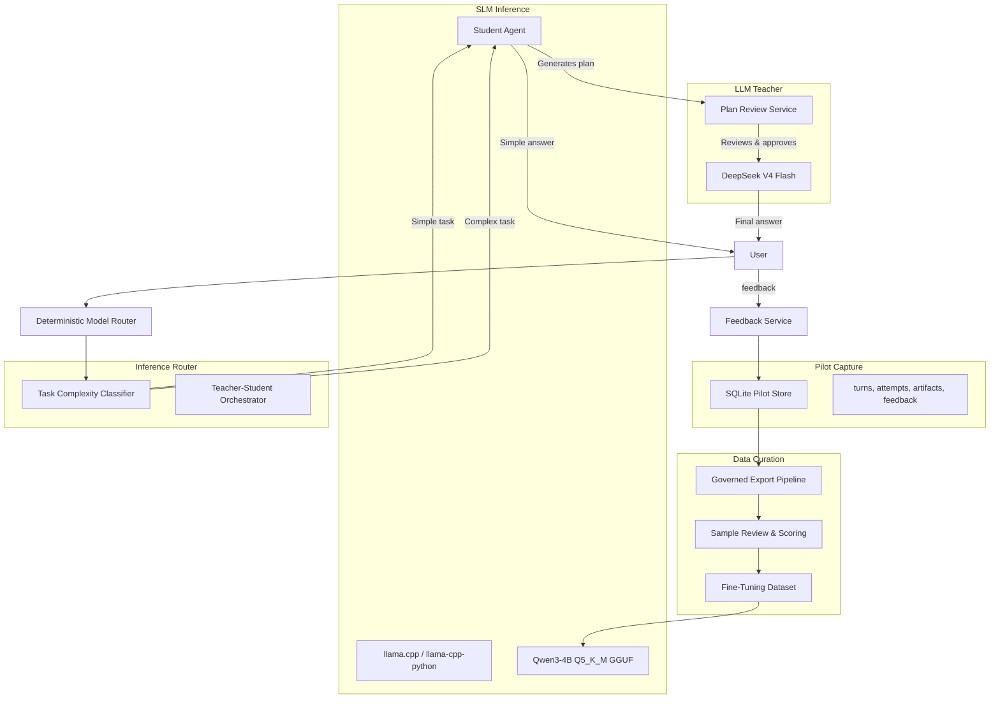

# SLM Distillation & Teacher-Student Architecture Plan

> **Prerequisite:** The Pilot Exit Gate (defined in the consolidated plan, Part 4) must be passed before any work on this plan begins. This plan is a sub-plan of `docs/superpowers/plans/2026-08-07-pilot-consolidated-implementation-plan.md` (Part 5).

**Goal:** Build a governed data curation pipeline from the SQLite pilot store, fine-tune Qwen3-4B-Instruct-2507 Q5_K_M as a primary student model, and deploy a teacher-student architecture where the SLM handles simple tasks independently and plans complex tasks under LLM teacher (DeepSeek V4 Flash) review.

**Architecture:**



## Dependencies

```
E.20 Data Curation ──► E.21 Format Conversion ──► E.22 Fine-tune Qwen3-4B
                                                          │
                                                          ▼
                                                    E.23 SLM Inference
                                                          │
                                              ┌───────────┼───────────┐
                                              ▼           ▼           ▼
                                         E.24 Teacher-   E.25         E.26
                                         Student         Evaluation   Telemetry
                                         Orchestrator
```

## Tech Stack

- Python 3.11+, asyncio, Pydantic
- Hugging Face `transformers` + `TRL` (SFTTrainer) or `torchtune` for QLoRA fine-tuning
- `llama-cpp-python` or subprocess to `llama.cpp` server for GGUF inference
- Qwen3-4B-Instruct-2507 Q5_K_M GGUF (student model)
- DeepSeek V4 Flash API (teacher model)
- Hugging Face `datasets` / local JSONL for fine-tuning data
- pytest/pytest-asyncio, Ruff, basedpyright

---

### Task E.20: Data curation pipeline from SQLite store

**Files:**
- Create: `scripts/pilot_export.py`
- Create: `scripts/pilot_curate.py`
- Create: `tests/pilot/test_export_pipeline.py`
- Create: `docs/pilot/data-curation.md`

**Interfaces:**
- `pilot_export.py` reads from the SQLite store and produces governed JSONL.
- `pilot_curate.py` filters, deduplicates, and splits into train/validation/test.

- [ ] Build `pilot_export.py` that produces a governed JSONL export with:
  - Turn-level rows: `turn_id`, `channel`, `route_class`, `reason_code`, `prompt` (redacted), `reasoning` (redacted), `answer` (redacted), `tool_trajectory` (sanitized), `attempts` (summary), `feedback` (aggregated), `consent_version`, `redaction_version`, `capture_policy_version`.
  - No raw credentials, user identifiers, paths, or provider error text.
  - Each row carries a `training_eligible` flag that is `true` only if the user had granted training consent at capture time.
- [ ] Build `pilot_curate.py` that:
  - Filters to `training_eligible == true` rows only.
  - Deduplicates by `turn_id`.
  - Splits into train/validation/test sets (80/10/10).
  - Produces a Hugging Face `datasets`-compatible JSONL or parquet output.
  - Optionally computes quality heuristics: answer length, feedback score, retry count, reasoning-to-answer ratio.
- [ ] Write failing tests for: export rejects training-ineligible rows, export produces no credentials, deduplication, train/val/test split proportions, and empty store handling.
- [ ] Document the data curation pipeline in `docs/pilot/data-curation.md`.
- [ ] Run: `uv run pytest tests/pilot/test_export_pipeline.py -q` and `uv run ruff check scripts/pilot_export.py scripts/pilot_curate.py`
- [ ] Commit: `git add scripts/pilot_export.py scripts/pilot_curate.py tests/pilot/test_export_pipeline.py docs/pilot/data-curation.md && git commit -m "feat(pilot): add data curation pipeline from sqlite store"`

### Task E.21: Format conversion for fine-tuning

**Files:**
- Create: `scripts/pilot_prepare_ft.py`
- Create: `tests/pilot/test_prepare_ft.py`

**Interfaces:**
- Input: curated JSONL from `pilot_curate.py`.
- Output: ChatML-format JSONL ready for SFT training.

- [ ] Build `pilot_prepare_ft.py` that converts curated JSONL into a supervised fine-tuning format:
  - **Input (prompt):** The user's message, system instructions, tool definitions (if any), and context.
  - **Output (completion):** The model's reasoning trace (if available and training-eligible) followed by the final answer.
  - Format: `{"messages": [{"role": "system", "content": "..."}, {"role": "user", "content": "..."}, {"role": "assistant", "content": "..."}]}` (ChatML / OpenAI-compatible format).
  - For reasoning traces: `{"role": "assistant", "content": "reasoning\n\nanswer"}` or use the model's native thinking format.
  - Option to produce a version without reasoning traces (answer-only).
- [ ] Support export to Hugging Face `datasets` format, plain JSONL, and optionally a `.arrow` file.
- [ ] Add configurable length filters to exclude samples exceeding a token budget (e.g., 4096 tokens).
- [ ] Write failing tests for format correctness, token count estimation, missing fields, and empty dataset.
- [ ] Run: `uv run pytest tests/pilot/test_prepare_ft.py -q` and `uv run ruff check scripts/pilot_prepare_ft.py`
- [ ] Commit: `git add scripts/pilot_prepare_ft.py tests/pilot/test_prepare_ft.py && git commit -m "feat(pilot): add fine-tuning format conversion"`

### Task E.22: Fine-tune Qwen3-4B-Instruct on curated reasoning data

**Files:**
- Create: `scripts/pilot_finetune.py`
- Create: `scripts/pilot_finetune_config.yaml`
- Create: `tests/pilot/test_finetune.py`
- Create: `docs/pilot/finetuning-guide.md`

**Interfaces:**
- Input: ChatML-format JSONL from `pilot_prepare_ft.py`.
- Output: Fine-tuned GGUF model file at `~/.nanobot/models/qwen3-4b-pilot-q5_k_m.gguf`.

- [ ] Build `pilot_finetune.py` that:
  - Loads the curated dataset from Task E.21.
  - Uses Hugging Face `transformers` + `TRL` (SFTTrainer) or `torchtune` for QLoRA fine-tuning.
  - Applies 4-bit quantization (QLoRA) for memory-efficient training.
  - Targets Qwen3-4B-Instruct with LoRA adapters (rank=8, alpha=16, target modules: q_proj, k_proj, v_proj, o_proj).
  - Saves adapter weights and merges them into the base model.
  - Exports the fine-tuned model in GGUF format using `llama.cpp`'s `convert.py` or `llama-quantize`.
  - Final output: `qwen3-4b-pilot-q5_k_m.gguf` (or similar).
- [ ] Build `pilot_finetune_config.yaml` with:
  - Dataset paths, train/val/test splits.
  - LoRA hyperparameters (rank, alpha, dropout, target modules).
  - Training hyperparameters (learning rate, batch size, epochs, warmup, max_seq_length).
  - Quantization settings (Q5_K_M for final, Q4_K_M for intermediate).
  - Evaluation metrics (perplexity, loss on validation set).
- [ ] Write failing tests for: config validation, model loading, adapter structure, and GGUF export (mock the actual training step to avoid GPU dependency in CI).
- [ ] Document the fine-tuning process in `docs/pilot/finetuning-guide.md` with hardware requirements (recommended: 24 GB VRAM for QLoRA, 8 GB for inference).
- [ ] Run: `uv run pytest tests/pilot/test_finetune.py -q` (mock training) and `uv run ruff check scripts/pilot_finetune.py`
- [ ] Commit: `git add scripts/pilot_finetune.py scripts/pilot_finetune_config.yaml tests/pilot/test_finetune.py docs/pilot/finetuning-guide.md && git commit -m "feat(pilot): add qwen3-4b fine-tuning pipeline"`

### Task E.23: Add SLM inference service with llama.cpp

**Files:**
- Create: `nanobot/providers/student_provider.py`
- Create: `nanobot/pilot/student.py`
- Create: `tests/providers/test_student_provider.py`
- Create: `tests/pilot/test_student.py`

**Interfaces:**
- `StudentInferenceService`: loads GGUF model, exposes `generate()` and `generate_stream()`.
- `StudentProvider`: wraps `StudentInferenceService` as a standard `LLMProvider` (alias `"student"`).

- [ ] Implement `StudentInferenceService` that:
  - Loads the fine-tuned Qwen3-4B Q5_K_M GGUF model via `llama-cpp-python` (or subprocess to `llama.cpp` server).
  - Exposes synchronous `generate(prompt, max_tokens, temperature)` and async `generate_stream(prompt, max_tokens, temperature)`.
  - Supports configurable context window (4096 or 8192 tokens).
  - Returns `usage` (prompt_tokens, completion_tokens) and finish_reason.
  - Thread-safe, with configurable number of model copies for concurrent requests.
- [ ] Implement `StudentProvider(LLMProvider)` that wraps `StudentInferenceService` as a standard nanobot provider:
  - Registers as provider alias `"student"`.
  - Implements `_generate` and `_generate_stream` by calling the student service.
  - Reports usage and finish_reason like any other provider.
  - Supports `system_prompt`, `tools`, `max_tokens`, `temperature`.
  - Does NOT support `reasoning` (the SLM is not expected to produce reasoning blocks).
- [ ] Write failing tests for: prompt format, streaming, token counting, context window overflow, and concurrent request isolation.
- [ ] Run: `uv run pytest tests/providers/test_student_provider.py tests/pilot/test_student.py -q`
- [ ] Commit: `git add nanobot/providers/student_provider.py nanobot/pilot/student.py tests/providers/test_student_provider.py tests/pilot/test_student.py && git commit -m "feat(pilot): add slm inference service with llama.cpp"`

### Task E.24: Teacher-Student orchestration and task complexity classifier

**Files:**
- Create: `nanobot/pilot/orchestrator.py`
- Create: `nanobot/pilot/complexity.py`
- Create: `tests/pilot/test_orchestrator.py`
- Create: `tests/pilot/test_complexity.py`
- Modify: `nanobot/providers/factory.py` (register student provider)
- Modify: `nanobot/config/schema.py` (add student config)
- Modify: `nanobot/pilot/routing.py` (add student route class)

**Interfaces:**
- `TaskComplexityClassifier`: classifies inbound requests as `simple` or `complex`.
- `TeacherStudentOrchestrator`: routes simple tasks to SLM, has SLM plan complex tasks then teacher reviews.

**Architecture:**

The teacher-student system works as follows:

1. **Task Complexity Classifier** at the routing boundary determines whether a request is "simple" or "complex":
   - **Simple**: factual lookup, short Q&A, light tool use, known patterns, low ambiguity.
   - **Complex**: multi-step reasoning, code generation, math, novel problems, heavy tool use, ambiguous instructions.

2. **Simple tasks** → SLM student handles independently, no teacher review.

3. **Complex tasks** → SLM student generates a plan (a structured sequence of steps), then the LLM teacher (DeepSeek V4 Flash) reviews the plan, approves/rejects/revises it, and the SLM or teacher executes the approved plan.

- [ ] Add `RouteClass` value `"student"` to `nanobot/pilot/routing.py` alongside `"default"`, `"reasoning"`, `"tool_heavy"`.
- [ ] Add `PilotStudentConfig` to `nanobot/config/schema.py`:
  ```python
  class PilotStudentConfig(Base):
      enabled: bool = False
      model_path: str = "~/.nanobot/models/qwen3-4b-pilot-q5_k_m.gguf"
      context_length: int = 4096
      max_tokens: int = 2048
      temperature: float = 0.7
      concurrent_instances: int = 1
      complexity_threshold: float = 0.5  # 0.0 = all to student, 1.0 = all to teacher
      teacher_provider: str = "deepseek"  # provider alias for the teacher LLM
  ```
- [ ] Implement `TaskComplexityClassifier`:
  - Uses heuristic rules first (no model call for simple classification):
    - Short messages (< 100 chars, no code blocks, no math symbols) → `simple`
    - Messages with ```` or `\b(def|class|import|function)\b` → `complex`
    - Messages matching math/logic patterns → `complex`
    - Messages with heavy tool use (> 3 tools available) → `complex`
    - Messages with media attachments → `complex`
    - Messages with explicit multi-step instructions → `complex`
    - Otherwise → `simple`
  - Optionally (future) use a small classifier model for ambiguous cases.
- [ ] Implement `TeacherStudentOrchestrator`:
  - **Simple path**: Route to `StudentProvider` directly. Return the SLM answer.
  - **Complex path**:
    1. SLM generates a structured plan (JSON or markdown steps).
    2. Plan is sent to the teacher LLM for review via `teacher_provider` with a system prompt like: *"Review the following plan for correctness, completeness, and safety. Approve, suggest revisions, or reject with reasoning."*
    3. If approved → execute the plan (SLM or teacher executes each step).
    4. If revisions suggested → SLM revises plan, send back to teacher (max 2 revision rounds).
    5. If rejected → fall back to teacher-only execution.
  - **Fallback**: If SLM is unavailable or the request requires tools the SLM doesn't support, fall back to the teacher LLM directly.
- [ ] Write failing tests for:
  - Complexity classification: ensure simple Q&A is classified as `simple`, code/math as `complex`.
  - Orchestration: plan generation, teacher review, approval, revision, rejection fallback.
  - Fallback behavior when SLM is unavailable.
  - Thread safety with concurrent requests.
- [ ] Run: `uv run pytest tests/pilot/test_orchestrator.py tests/pilot/test_complexity.py -q`
- [ ] Commit: `git add nanobot/pilot/orchestrator.py nanobot/pilot/complexity.py tests/pilot/test_orchestrator.py tests/pilot/test_complexity.py nanobot/config/schema.py nanobot/pilot/routing.py nanobot/providers/factory.py && git commit -m "feat(pilot): add teacher-student orchestration and complexity classifier"`

### Task E.25: Evaluation benchmarks for SLM quality

**Files:**
- Create: `scripts/pilot_evaluate.py`
- Create: `tests/pilot/test_evaluate.py`
- Create: `docs/pilot/evaluation-results.md`

**Interfaces:**
- `pilot_evaluate.py` runs the SLM and teacher on the held-out test set and reports quality/cost/latency metrics.

- [ ] Build `pilot_evaluate.py` that:
  - Loads the held-out test set from Task E.20.
  - Runs inference with the SLM (student) and the teacher LLM on the same prompts.
  - Compares outputs using:
    - **Exact match** for factual answers.
    - **ROUGE-L** for free-form answers.
    - **Semantic similarity** (using sentence embeddings) for answer quality.
    - **Teacher preference** (ask the teacher LLM to rate each answer as better/worse/same).
  - Reports per-route-class metrics (general, reasoning, tool_heavy, student).
  - Measures latency, tokens/second, and cost per 1000 requests.
- [ ] Track metrics over time as the dataset grows and the SLM is fine-tuned.
- [ ] Write failing tests for: metric computation correctness, empty test set, missing fields.
- [ ] Document baseline results in `docs/pilot/evaluation-results.md` (compare teacher-only vs. teacher-student vs. student-only).
- [ ] Run: `uv run pytest tests/pilot/test_evaluate.py -q` and `uv run ruff check scripts/pilot_evaluate.py`
- [ ] Commit: `git add scripts/pilot_evaluate.py tests/pilot/test_evaluate.py docs/pilot/evaluation-results.md && git commit -m "feat(pilot): add slm evaluation benchmarks"`

### Task E.26: SLM-specific configuration, routing, and telemetry

**Files:**
- Modify: `nanobot/config/schema.py` (finalize student config — already started in E.24)
- Modify: `nanobot/pilot/metrics.py` (add student metrics)
- Modify: `nanobot/pilot/health.py` (add student health)
- Modify: `docs/pilot/configuration.md` (add student section)
- Modify: `docs/pilot/staging-checklist.md` (add student verification)

**Interfaces:**
- `PilotMetrics` gains student-specific counters and histograms.
- `GET /api/pilot/health` gains a `student` section.

- [ ] Add student-specific metrics to `PilotMetrics`:
  - `student_requests_total` (by route_class, status)
  - `student_latency_ms` (histogram)
  - `student_tokens_per_second`
  - `student_teacher_review_count` (approvals, revisions, rejections)
  - `student_cost_per_request` (estimated, based on token count)
  - `student_fallback_count` (to teacher)
- [ ] Add student health to `GET /api/pilot/health`:
  - `student: ok|degraded|down` (model loaded, accepting requests)
  - `student.queue_depth` (concurrent request count)
  - `student.model` (loaded model path)
- [ ] Update `docs/pilot/configuration.md` with complete student configuration example.
- [ ] Update `docs/pilot/staging-checklist.md` with student verification items.
- [ ] Run: `uv run pytest tests/pilot/test_metrics.py tests/webui/test_pilot_api.py -q`
- [ ] Commit: `git add nanobot/config/schema.py nanobot/pilot/metrics.py nanobot/pilot/health.py docs/pilot/configuration.md docs/pilot/staging-checklist.md && git commit -m "feat(pilot): add student model telemetry and configuration"`

---

## Acceptance Traceability

| Requirement | Tasks | Required Evidence |
|-------------|-------|-------------------|
| Data curation | E.20 | Export rejects ineligible rows, no credentials, deduplication |
| Fine-tuning format | E.21 | Format correctness, token count estimation |
| Qwen3-4B fine-tuning | E.22 | LoRA structure, GGUF export, config validation |
| SLM inference | E.23 | Prompt format, streaming, token counting, concurrent isolation |
| Teacher-student orchestration | E.24 | Complexity classification, plan generation, teacher review, fallback |
| Evaluation | E.25 | Metric computation, baseline results, cost/latency comparison |
| Telemetry | E.26 | Student metrics, health endpoint, configuration docs |

## Hardware Requirements

| Stage | Recommended | Minimum |
|-------|-------------|---------|
| Fine-tuning (QLoRA) | 24 GB VRAM (RTX 3090/4090, A10G) | 16 GB VRAM (RTX 4060 Ti) |
| SLM inference (Q5_K_M) | 8 GB RAM (CPU) or 6 GB VRAM (GPU) | 4 GB RAM (CPU, slower) |
| Data curation | 4 GB RAM, any CPU | 2 GB RAM |
| Evaluation | 8 GB RAM | 4 GB RAM |

## Deferred Follow-on Items

These are out of scope for this plan but should be considered after the teacher-student architecture is operational:

1. Multi-SLM ensemble routing (multiple student models, best-of-n selection).
2. Automated data labeling and reward model training.
3. Continuous fine-tuning pipeline with online data collection.
4. SLM-specific tool fine-tuning (function calling capability).
5. A/B testing framework for SLM vs teacher decisions.
6. Quantization-aware training (QAT) for even smaller model sizes.