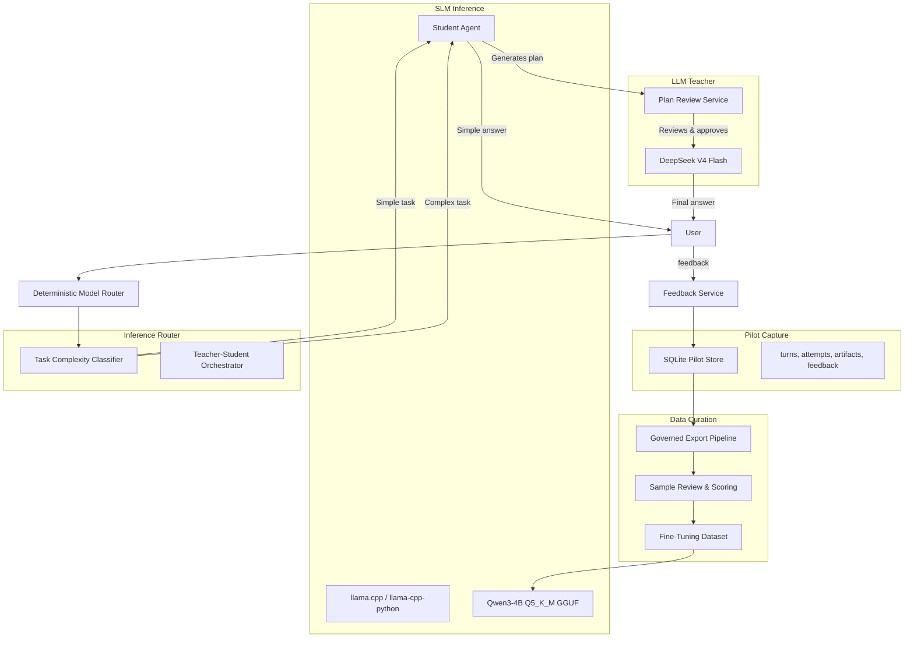

# SLM Distillation & Teacher-Student Architecture Plan

> **Prerequisite:** The Pilot Exit Gate (defined in the consolidated plan, Part 4) must be passed before any work on this plan begins. This plan is a sub-plan of `docs/superpowers/plans/2026-08-07-pilot-consolidated-implementation-plan.md` (Part 5).
>
> **Exit gate verification (run before any task below):**
> 1. Confirm that `PilotGate.state == "passed"` in the PilotService health snapshot.
> 2. Confirm the SQLite pilot store has at least 100 training-eligible turns (`SELECT COUNT(*) FROM turns WHERE training_eligible = 1`).
> 3. Run `pytest tests/pilot/ -k "gate or exit" -q` — all must pass.
> If any check fails, stop and do not begin this plan.

- [ ] Verify exit gate: confirm Part 4 is complete, store has ≥100 training-eligible rows, and Part 4 gate tests pass. If not, abort.

**Goal:** Build a governed data curation pipeline from the SQLite pilot store, fine-tune Qwen3-4B-Instruct-2507 Q5_K_M as a primary student model, and deploy a teacher-student architecture where the SLM handles simple tasks independently and plans complex tasks under LLM teacher (DeepSeek V4 Flash) review.

**Architecture:**



## Dependencies

```
E.20 Data Curation ──► E.21 Format Conversion ──► E.22 Fine-tune Qwen3-4B
                                                          │
                                                          ▼
                                                    E.23 SLM Inference
                                                          │
                                              ┌───────────┼───────────┐
                                              ▼           ▼           ▼
                                         E.24 Teacher-   E.25         E.26
                                         Student         Evaluation   Telemetry
                                         Orchestrator
```

## Tech Stack

- Python 3.11+, asyncio, Pydantic
- Hugging Face `transformers` + `TRL` (SFTTrainer) for QLoRA fine-tuning (not `torchtune` — pick TRL for ecosystem compatibility with `datasets`)
- `llama-cpp-python` for GGUF inference (not subprocess — use the Python library for thread safety)
- Base model: `Qwen/Qwen3-4B-Instruct` (Hugging Face hub ID)
- Student model (GGUF): `~/.nanobot/models/qwen3-4b-pilot-q5_k_m.gguf`
- DeepSeek V4 Flash API (teacher model)
- Hugging Face `datasets` / local JSONL for fine-tuning data
- `rouge-score` for ROUGE-L evaluation
- `sentence-transformers` (all-MiniLM-L6-v2) for semantic similarity
- `llama.cpp` (standalone binary) for GGUF quantization via `llama-quantize`
- pytest/pytest-asyncio, Ruff, basedpyright

---

### Task E.20: Data curation pipeline from SQLite store

**Files:**
- Create: `scripts/pilot_export.py`
- Create: `scripts/pilot_curate.py`
- Create: `tests/pilot/test_export_pipeline.py`
- Create: `docs/pilot/data-curation.md`

**Interfaces:**
- `pilot_export.py` reads from the SQLite store via cursor-based incremental queries and produces governed JSONL.
- `pilot_curate.py` filters, deduplicates, and splits into train/validation/test.

**Redaction on export:** Reuse the `Redactor` from Task B.10 (`nanobot/pilot/redaction.py`) with all rules enabled except `"tool_argument"` (export is for training, tool args should remain to teach tool-use patterns). The `Redactor` is instantiated with `max_chars` from `PilotCaptureConfig`. If the raw store text was already redacted at capture time, apply the `Redactor` again as a defence-in-depth measure.

**Incremental export cursor:** `pilot_export.py` supports an optional `--since-turn-id` argument. When provided, only turns with `turn_id > since_turn_id` (lexicographic, since UUID4 hex sorts chronologically) are exported. The script writes cursor state to a JSON file at `~/.nanobot/pilot/export_cursor.json` (`{last_turn_id, exported_at_ms}`).

**SQL join query pattern for export:**
```sql
SELECT
    t.turn_id,
    t.channel,
    json_extract(t.routing_decision, '$.route_class') AS route_class,
    json_extract(t.routing_decision, '$.reason_code') AS reason_code,
    a.prompt_text       AS prompt,
    a.reasoning_text    AS reasoning,
    a.answer_text       AS answer,
    a.tool_trajectory,
    a.prompt_chars,
    a.reasoning_chars,
    a.answer_chars,
    a.consent_version,
    a.redaction_version,
    a.capture_policy,
    EXISTS(SELECT 1 FROM consents c WHERE c.user_pseudonym = t.user_pseudonym AND c.training_allowed = 1) AS training_eligible
FROM turns t
LEFT JOIN artifacts a ON a.turn_id = t.turn_id
WHERE t.turn_id > ?  -- cursor
ORDER BY t.turn_id
LIMIT 500
```

**Attempts summary sub-query (per turn):**
```sql
SELECT json_group_array(
    json_object('provider', provider, 'model', model, 'latency_ms', latency_ms,
                'error_class', error_class, 'retry_index', retry_index,
                'fallback_index', fallback_index)
) AS attempts_json
FROM attempts
WHERE turn_id = ?
```

**Feedback aggregation sub-query (per turn):**
```sql
SELECT json_group_array(
    json_object('kind', kind, 'created_at_ms', created_at_ms)
) AS feedback_json
FROM feedback
WHERE turn_id = ?
```

**Output JSONL row schema (one row per turn):**
```json
{
  "turn_id": "abc123...",
  "channel": "webui",
  "route_class": "reasoning",
  "reason_code": "REASONING_MATH_LOGIC",
  "prompt": "...redacted...",
  "reasoning": "...redacted or null...",
  "answer": "...redacted...",
  "tool_trajectory": "[{\"tool\": ...}]"  -- JSON string, redacted
  "attempts": [{"provider": "anthropic", ...}],
  "feedback": [{"kind": "helpful", ...}],
  "consent_version": "pilot-product-v1",
  "redaction_version": "pilot-redaction-v1",
  "capture_policy": "reasoning",
  "prompt_chars": 1234,
  "reasoning_chars": 567,
  "answer_chars": 890,
  "training_eligible": true,
  "exported_at_ms": 1712345678000
}
```

- [ ] Build `pilot_export.py` that:
  - Reads from the SQLite store using the join pattern above.
  - Supports `--since-turn-id` cursor for incremental export; writes cursor to `~/.nanobot/pilot/export_cursor.json`.
  - Applies export-time `Redactor` (defence-in-depth) with all rules except `"tool_argument"`.
  - Produces governed JSONL with the row schema above.
  - Each row carries a `training_eligible` boolean: `true` only if the user had granted training consent at capture time (checked via `consents` table `training_allowed`).
- [ ] Build `pilot_curate.py` that:
  - Filters to `training_eligible == true` rows only.
  - Deduplicates by `turn_id` (keep first occurrence).
  - Splits into train/validation/test sets (80/10/10) using a **deterministic seed** (`train_test_split(random_state=42)` with `datasets` or manual hashing on `turn_id`).
  - Produces a Hugging Face `datasets`-compatible JSONL or parquet output.
  - Computes quality heuristics per row: answer length (chars), feedback score (positive ratio), retry count, reasoning-to-answer char ratio. Logs these as dataset-level summary statistics.
- [ ] Write failing tests for: export rejects training-ineligible rows, export produces no credentials (regex-check each row for canary patterns from `presentation.py`), deduplication, train/val/test split proportions (within ±2% of 80/10/10), empty store handling, and cursor resumption (export with `--since-turn-id` picks up correctly).
- [ ] Document the data curation pipeline in `docs/pilot/data-curation.md`.
- [ ] Run: `uv run pytest tests/pilot/test_export_pipeline.py -q` and `uv run ruff check scripts/pilot_export.py scripts/pilot_curate.py`
- [ ] Commit: `git add scripts/pilot_export.py scripts/pilot_curate.py tests/pilot/test_export_pipeline.py docs/pilot/data-curation.md && git commit -m "feat(pilot): add data curation pipeline from sqlite store"`

### Task E.21: Format conversion for fine-tuning

**Files:**
- Create: `scripts/pilot_prepare_ft.py`
- Create: `tests/pilot/test_prepare_ft.py`

**Interfaces:**
- Input: curated JSONL from `pilot_curate.py`.
- Output: ChatML-format JSONL ready for SFT training.

**Tokenizer for token counting:** Use the Qwen3-4B-Instruct model's own tokenizer (`Qwen/Qwen3-4B-Instruct` via `transformers.AutoTokenizer`). This guarantees accurate token counts for the target architecture. The tokenizer is loaded once and cached.

**System prompt handling:** Each row's prompt is the user message only (the system prompt at inference time is the nanobot default: "You are a helpful assistant..."). The conversion script MUST NOT include the system prompt in the training data — the SLM inherits the base model's instruction-following behaviour and doesn't need to overfit to a specific system prompt. Tool definitions (if any) are included in the `user` message as: `"Available tools:\n{tool_defs}\n\n{user_message}"`.

- [ ] Build `pilot_prepare_ft.py` that converts curated JSONL into a supervised fine-tuning format:
  - **Input (prompt):** The user's message, with tool definitions (if any) prepended as plain text.
  - **Output (completion):** The model's reasoning trace (if available and training-eligible) followed by the final answer. Format: reasoning and answer concatenated with `"\n\n"` separator.
  - Format: `{"messages": [{"role": "user", "content": "..."}, {"role": "assistant", "content": "..."}]}` (ChatML / OpenAI-compatible format).
  - For reasoning traces: `{"role": "assistant", "content": "reasoning\n\nanswer"}` — no special thinking tags. The SLM learns to produce reasoning as a natural prefix to the answer.
  - Option to produce a version without reasoning traces (answer-only) via `--no-reasoning` flag.
- [ ] Support export to Hugging Face `datasets` format, plain JSONL, and optionally a `.arrow` file.
- [ ] Add configurable length filters: exclude samples where the tokenized message sequence (user + assistant) exceeds `max_seq_length` (default 4096 tokens). Use the Qwen3-4B tokenizer for counting.
- [ ] Write failing tests for: format correctness (valid ChatML JSON), token count estimation (compare against known strings), missing fields, and empty dataset.
- [ ] Run: `uv run pytest tests/pilot/test_prepare_ft.py -q` and `uv run ruff check scripts/pilot_prepare_ft.py`
- [ ] Commit: `git add scripts/pilot_prepare_ft.py tests/pilot/test_prepare_ft.py && git commit -m "feat(pilot): add fine-tuning format conversion"`

### Task E.22: Fine-tune Qwen3-4B-Instruct on curated reasoning data

**Files:**
- Create: `scripts/pilot_finetune.py`
- Create: `scripts/pilot_finetune_config.yaml`
- Create: `tests/pilot/test_finetune.py`
- Create: `docs/pilot/finetuning-guide.md`

**Interfaces:**
- Input: ChatML-format JSONL from `pilot_prepare_ft.py`.
- Output: Fine-tuned GGUF model file at `~/.nanobot/models/qwen3-4b-pilot-q5_k_m.gguf`.

**Base model:** Hugging Face hub ID `Qwen/Qwen3-4B-Instruct`. Download via `transformers.AutoModelForCausalLM.from_pretrained("Qwen/Qwen3-4B-Instruct", ...)`.

**Framework:** Use Hugging Face `transformers` + `TRL` (`SFTTrainer`). Do NOT use `torchtune` — TRL has better ecosystem integration with `datasets`, `accelerate`, and `bitsandbytes` for QLoRA.

**Fine-tuning pipeline (`pilot_finetune.py`):**
1. Load base model with 4-bit quantization (`bitsandbytes` NF4) via `transformers.BitsAndBytesConfig`.
2. Apply LoRA via `peft.LoraConfig` (rank=8, alpha=16, dropout=0.1, target_modules=["q_proj", "k_proj", "v_proj", "o_proj"]).
3. Load dataset via `datasets.load_dataset("json", data_files=...)`.
4. Run `SFTTrainer` with:
   - `max_seq_length=4096` (matches the length filter from E.21)
   - `per_device_train_batch_size=2`, `gradient_accumulation_steps=4` (effective batch size 8)
   - `learning_rate=2e-4`, `num_train_epochs=3`, `warmup_ratio=0.03`
   - `logging_steps=10`, `eval_steps=100`, `save_steps=500`
   - `bf16=True` if available, else `fp16=True`
5. Merge LoRA adapters into base model: `model = model.merge_and_unload()`.
6. Save merged model to temporary HF format directory (`/tmp/qwen3-4b-pilot-merged/`).

**GGUF conversion (from merged HF model to final GGUF):**
```bash
# Convert HF model to FP16 GGUF
python /path/to/llama.cpp/convert.py /tmp/qwen3-4b-pilot-merged/ \
    --outfile /tmp/qwen3-4b-pilot-fp16.gguf \
    --outtype f16

# Quantize to Q5_K_M
/path/to/llama.cpp/llama-quantize \
    /tmp/qwen3-4b-pilot-fp16.gguf \
    ~/.nanobot/models/qwen3-4b-pilot-q5_k_m.gguf \
    q5_k_m
```
The `llama.cpp` path is resolved from `PilotStudentConfig.llama_cpp_path` (default: `~/.nanobot/llama.cpp/`).

- [ ] Build `pilot_finetune.py` that follows the pipeline above. Include a `--dry-run` flag that loads the model, applies LoRA, and exits without training (for CI testing).
- [ ] Build `pilot_finetune_config.yaml` with:
  - Dataset paths, train/val/test splits.
  - LoRA hyperparameters: rank=8, alpha=16, dropout=0.1, target_modules=["q_proj", "k_proj", "v_proj", "o_proj"].
  - Training hyperparameters: learning_rate=2e-4, batch_size=8 (effective), epochs=3, warmup_ratio=0.03, max_seq_length=4096.
  - Quantization settings: Q5_K_M for final, Q4_K_M for intermediate (optional).
  - Evaluation metrics: perplexity, loss on validation set.
  - `llama_cpp_path: "~/.nanobot/llama.cpp/"`
- [ ] Write failing tests for: config validation (YAML schema), model loading (mock `from_pretrained`), LoRA adapter structure (assert target modules match), and GGUF export (mock the subprocess calls).
- [ ] Document the fine-tuning process in `docs/pilot/finetuning-guide.md` with hardware requirements (recommended: 24 GB VRAM for QLoRA, 8 GB for inference) and the exact `convert.py` + `llama-quantize` commands.
- [ ] Run: `uv run pytest tests/pilot/test_finetune.py -q` (mock training) and `uv run ruff check scripts/pilot_finetune.py`
- [ ] Commit: `git add scripts/pilot_finetune.py scripts/pilot_finetune_config.yaml tests/pilot/test_finetune.py docs/pilot/finetuning-guide.md && git commit -m "feat(pilot): add qwen3-4b fine-tuning pipeline"`

### Task E.23: Add SLM inference service with llama.cpp

**Files:**
- Create: `nanobot/providers/student_provider.py`
- Create: `nanobot/pilot/student.py`
- Create: `tests/providers/test_student_provider.py`
- Create: `tests/pilot/test_student.py`

**Interfaces:**
- `StudentInferenceService`: loads GGUF model, exposes `generate()` and `generate_stream()`.
- `StudentProvider`: wraps `StudentInferenceService` as a standard `LLMProvider` (alias `"student"`).

**`LLMProvider` base class contract (from `nanobot/providers/base.py`):**
- `_generate(self, request: ProviderRequest) -> ProviderAttempt` — synchronous generation. `ProviderRequest` has fields: `messages`, `system_prompt`, `tools`, `max_tokens`, `temperature`, `stop_sequences`, `stream`. `ProviderAttempt` has: `content`, `stop_reason`, `usage` (with `input_tokens`, `output_tokens`), `latency_ms`, `error`.
- `_generate_stream(self, request: ProviderRequest) -> AsyncIterator[ProviderChunk]` — streaming generation. `ProviderChunk` has: `content_delta`, `stop_reason`, `usage` (final chunk only).
- `model` property — returns the model name string.
- Registration: add `"student"` to `PROVIDER_ALIAS_MAP` in `nanobot/providers/factory.py`.

- [ ] Implement `StudentInferenceService` that:
  - Loads the fine-tuned Qwen3-4B Q5_K_M GGUF model via `llama-cpp-python` `Llama` class.
  - Model path from `PilotStudentConfig.model_path`.
  - Exposes `generate(prompt, max_tokens, temperature) -> dict` (returns `{"text": ..., "usage": {"prompt_tokens": ..., "completion_tokens": ...}, "stop_reason": ...}`) and `generate_stream(prompt, ...) -> Generator[dict]`.
  - Supports configurable context window: `n_ctx=PilotStudentConfig.context_length` (default 4096).
  - Thread-safe: uses `threading.Lock` around `Llama.__call__` (llama-cpp-python is not thread-safe by default).
  - Configurable number of model copies: if `concurrent_instances > 1`, load that many `Llama` instances in a pool.
  - Sets `verbose=False`, `n_gpu_layers=-1` (if GPU available) or `n_gpu_layers=0`.
- [ ] Implement `StudentProvider(LLMProvider)` that wraps `StudentInferenceService`:
  - Registers as provider alias `"student"` (add to `PROVIDER_ALIAS_MAP` in `factory.py`).
  - Implements `_generate(request)` and `_generate_stream(request)` by calling the student service.
  - Converts `ProviderRequest.messages` to a single prompt string using Qwen's chat template (`tokenizer.apply_chat_template` or the `Llama` object's built-in chat handler).
  - Reports `usage` and `stop_reason` matching the `ProviderAttempt` contract.
  - Supports `system_prompt`, `tools`, `max_tokens`, `temperature`.
  - Does NOT support `reasoning` (the SLM is not expected to produce reasoning blocks).
- [ ] Write failing tests for: prompt format (Qwen chat template applied correctly), streaming (iterates chunks), token counting (usage matches model output), context window overflow (prompt > n_ctx raises or truncates gracefully), and concurrent request isolation (two simultaneous requests return correct responses).
- [ ] Run: `uv run pytest tests/providers/test_student_provider.py tests/pilot/test_student.py -q`
- [ ] Commit: `git add nanobot/providers/student_provider.py nanobot/pilot/student.py tests/providers/test_student_provider.py tests/pilot/test_student.py && git commit -m "feat(pilot): add slm inference service with llama.cpp"`

### Task E.24: Teacher-Student orchestration and task complexity classifier

**Files:**
- Create: `nanobot/pilot/orchestrator.py`
- Create: `nanobot/pilot/complexity.py`
- Create: `tests/pilot/test_orchestrator.py`
- Create: `tests/pilot/test_complexity.py`
- Modify: `nanobot/providers/factory.py` (register student provider)
- Modify: `nanobot/config/schema.py` (add student config + field on PilotConfig)
- Modify: `nanobot/pilot/routing.py` (add student route class + complexity classifier integration)

**Interfaces:**
- `TaskComplexityClassifier`: classifies inbound requests as `"simple"` or `"complex"`.
- `TeacherStudentOrchestrator`: routes simple tasks to SLM, routes complex tasks through SLM-plan/teacher-review pipeline.
- `Plan` / `PlanStep` dataclasses: structured plan schema used by both SLM and teacher.

**Plan JSON schema (shared between SLM and teacher):**
```python
@dataclass
class PlanStep:
    step_number: int
    description: str          # what to do
    tool: str | None = None   # tool name if tool execution needed, None for text-only reasoning
    expected_output: str = ""

@dataclass
class Plan:
    task_summary: str
    steps: list[PlanStep]
    estimated_complexity: Literal["simple", "moderate", "high"]
    requires_tools: bool
```
The SLM generates this as JSON via `json.dumps(asdict(plan))`. The teacher receives it as JSON and returns a `PlanReview`.

```python
@dataclass
class PlanReview:
    decision: Literal["approved", "revisions", "rejected"]
    reasoning: str
    suggested_changes: list[str] | None = None  # only for "revisions"
```

**Teacher review system prompt template:**
```
You are a plan review service for a teacher-student AI system. The student model (SLM) has
generated a plan for the user's request. Your job is to review the plan for correctness,
completeness, and safety.

User request: {user_request}

Student plan:
{plan_json}

Respond with a JSON object containing:
- "decision": "approved" | "revisions" | "rejected"
- "reasoning": brief explanation of your decision
- "suggested_changes": list of specific changes needed (only if decision is "revisions")

Rules:
- APPROVE if the plan is correct, complete, safe, and would produce a good answer.
- REVISE if the plan has minor errors, omissions, or safety concerns that can be fixed.
- REJECT if the plan is fundamentally wrong, unsafe, or off-topic.
```

**SLM tool execution strategy:**
- The SLM (`StudentProvider`) does NOT support tool execution natively.
- When the orchestrator detects a plan step with `tool != None`:
  1. The orchestrator pauses the SLM plan execution.
  2. It calls the teacher LLM to execute that specific tool step (the teacher has full tool access).
  3. The teacher's result is returned to the orchestrator, which passes it to the next plan step.
- If ALL steps are text-only (no tools), the SLM can execute the entire plan independently.
- If the plan requires tools AND the teacher is unavailable, fall back to teacher-only execution (skip the SLM plan entirely).

**Integration with existing `route_turn` (in `nanobot/pilot/routing.py`):**
- The `RouteClass` type gains `"student"` as a new literal alongside `"default"`, `"reasoning"`, `"tool_heavy"`.
- The `route_turn` function is extended: AFTER the existing classification logic runs, if `PilotStudentConfig.enabled` is `True`, the `TaskComplexityClassifier` is called. If it returns `"simple"`, the route_class is overridden to `"student"` (but preserves the original `reason_code` as `f"{original_reason_code}_STUDENT_ELIGIBLE"`). If `"complex"`, the original route_class is preserved and the orchestrator handles the teacher-student plan/review later.
- This means `"student"` is a **post-classification override** — it doesn't replace the existing routing logic, it sits on top.

**`PilotConfig` extension (in `nanobot/config/schema.py`):**
```python
class PilotStudentConfig(Base):
    enabled: bool = False
    model_path: str = "~/.nanobot/models/qwen3-4b-pilot-q5_k_m.gguf"
    context_length: int = 4096
    max_tokens: int = 2048
    temperature: float = 0.7
    concurrent_instances: int = 1
    complexity_threshold: float = 0.5  # 0.0 = all to student, 1.0 = all to teacher
    teacher_provider: str = "deepseek"  # provider alias for the teacher LLM
    llama_cpp_path: str = "~/.nanobot/llama.cpp/"  # path to llama.cpp binaries for GGUF quant

class PilotConfig(Base):
    ... existing fields ...
    student: PilotStudentConfig | None = None  # NEW
```
Note: `PilotStudentConfig` is optional (`None` when disabled). The existing `PilotConfig` fields are preserved.

**`complexity_threshold` behavior:**
- The `TaskComplexityClassifier` produces a raw `complexity_score` float between 0.0 and 1.0.
- Heuristic rules produce fixed scores: < 100 chars + no patterns → 0.1 (simple), code blocks → 0.8 (complex), math → 0.7, media → 0.9, multi-step → 0.75, heavy tools → 0.85.
- The classifier compares `complexity_score >= PilotStudentConfig.complexity_threshold` to decide `"complex"` vs `"simple"`.
- Default threshold 0.5 means most heuristic-ruled cases are correctly classified.

- [ ] Add `RouteClass` value `"student"` to `nanobot/pilot/routing.py` alongside `"default"`, `"reasoning"`, `"tool_heavy"`. Extend `route_turn` to call `TaskComplexityClassifier` when `PilotStudentConfig.enabled` is True, and override route_class to `"student"` for simple tasks (preserving original reason_code with `_STUDENT_ELIGIBLE` suffix).
- [ ] Add `PilotStudentConfig` to `nanobot/config/schema.py` (as shown above) and add `student: PilotStudentConfig | None = None` to `PilotConfig`.
- [ ] Implement `TaskComplexityClassifier`:
  - Heuristic rules with fixed `complexity_score` values:
    - Short messages (< 100 chars, no code blocks, no math symbols, no media) → 0.1
    - Messages with ```` or `\b(def|class|import|function)\b` → 0.8
    - Messages matching math/logic patterns → 0.7
    - Messages with media attachments → 0.9
    - Messages with explicit multi-step instructions → 0.75
    - Heavy tool use (> 3 tools available, or tool names in `_HEAVY_TOOL_NAMES`) → 0.85
    - Otherwise → 0.3
  - Compare `score >= complexity_threshold` → `"complex"`, else `"simple"`.
- [ ] Implement `TeacherStudentOrchestrator`:
  - **Simple path**: Route to `StudentProvider` directly. Return the SLM answer.
  - **Complex path (SLM plans, teacher reviews):**
    1. SLM generates a `Plan` as JSON. Prompt: `"Given the user request, create a step-by-step plan. Respond with a JSON object following this schema: {Plan schema}. Include the task summary, steps with descriptions, and whether tools are needed."`
    2. Parse the SLM response as `Plan`. If JSON parsing fails, fall back to teacher-only.
    3. Plan is sent to the teacher LLM via `teacher_provider` with the system prompt template above.
    4. Parse teacher response as `PlanReview`.
    5. If `approved` → execute the plan:
       - For each step: if `tool is None`, SLM generates the answer for that step; if `tool` is set, teacher executes the tool via the teacher provider.
       - Aggregate all step outputs into a final answer.
    6. If `revisions` → SLM revises plan with `suggested_changes` as additional context, send back to teacher (max 2 revision rounds).
    7. If `rejected` → fall back to teacher-only execution (teacher handles the entire request).
  - **Fallback**: If SLM is unavailable (model not loaded, timeout) or the request requires tools the SLM can't support, fall back to the teacher LLM directly via the original route_class.
- [ ] Register `"student"` provider alias in `nanobot/providers/factory.py` (`PROVIDER_ALIAS_MAP["student"] = StudentProvider`).
- [ ] Write failing tests for:
  - Complexity classification: ensure simple Q&A scores 0.1 → `"simple"`, code blocks score 0.8 → `"complex"`, threshold boundary (score=0.5, threshold=0.5 → `"complex"`).
  - Orchestration: plan generation (SLM produces valid JSON Plan), teacher review (mock returns approved/revisions/rejected), approval (SLM executes steps), revision (SLM revises, max 2 rounds), rejection fallback.
  - Tool execution: plan step with `tool != None` triggers teacher execution.
  - Fallback behavior when SLM is unavailable (model not loaded, timeout).
  - Thread safety with concurrent requests.
- [ ] Run: `uv run pytest tests/pilot/test_orchestrator.py tests/pilot/test_complexity.py -q`
- [ ] Commit: `git add nanobot/pilot/orchestrator.py nanobot/pilot/complexity.py tests/pilot/test_orchestrator.py tests/pilot/test_complexity.py nanobot/config/schema.py nanobot/pilot/routing.py nanobot/providers/factory.py && git commit -m "feat(pilot): add teacher-student orchestration and complexity classifier"`

### Task E.25: Evaluation benchmarks for SLM quality

**Files:**
- Create: `scripts/pilot_evaluate.py`
- Create: `tests/pilot/test_evaluate.py`
- Create: `docs/pilot/evaluation-results.md`

**Interfaces:**
- `pilot_evaluate.py` runs the SLM and teacher on the held-out test set and reports quality/cost/latency metrics.

**Evaluation libraries:**
- `rouge-score` for ROUGE-L (`rouge_score.rouge_scorer.RougeScorer`).
- `sentence-transformers` with model `all-MiniLM-L6-v2` for semantic similarity (cosine similarity of embeddings).

**Metric computation details:**
- **Exact match**: `response.strip() == expected.strip()` (case-insensitive).
- **ROUGE-L**: `rouge_scorer.score(target, prediction)` — report F1 score.
- **Semantic similarity**: embed both texts with `SentenceTransformer('all-MiniLM-L6-v2')`, compute `cosine_similarity(emb1, emb2)[0][0]`.
- **Teacher preference**: Use the teacher LLM (`teacher_provider` from config) with prompt: `"Rate which answer is better for the user's request. Reply with 'A', 'B', or 'same'."` Compare SLM answer (A) vs teacher answer (B).

- [ ] Build `pilot_evaluate.py` that:
  - Loads the held-out test set from Task E.20.
  - Runs inference with the SLM (student) and the teacher LLM on the same prompts.
  - Compares outputs using:
    - **Exact match** for factual answers.
    - **ROUGE-L** (via `rouge-score`) for free-form answers.
    - **Semantic similarity** (via `sentence-transformers` `all-MiniLM-L6-v2`) for answer quality.
    - **Teacher preference** (ask the teacher LLM to rate each answer as A/better, B/better, or same).
  - Reports per-route-class metrics (general, reasoning, tool_heavy, student).
  - Measures latency, tokens/second, and cost per 1000 requests (cost estimated from teacher token counts × provider pricing, SLM cost estimated as 0 for local inference).
- [ ] Track metrics over time as the dataset grows and the SLM is fine-tuned: save results to `~/.nanobot/pilot/evaluation_results.jsonl` with timestamp and dataset size.
- [ ] Write failing tests for: metric computation correctness (known strings produce expected ROUGE-L/similarity scores), empty test set, missing fields.
- [ ] Document baseline results in `docs/pilot/evaluation-results.md` (compare teacher-only vs. teacher-student vs. student-only) with a table of metrics per route class.
- [ ] Run: `uv run pytest tests/pilot/test_evaluate.py -q` and `uv run ruff check scripts/pilot_evaluate.py`
- [ ] Commit: `git add scripts/pilot_evaluate.py tests/pilot/test_evaluate.py docs/pilot/evaluation-results.md && git commit -m "feat(pilot): add slm evaluation benchmarks"`

### Task E.26: SLM-specific configuration, routing, and telemetry

**Files:**
- Modify: `nanobot/config/schema.py` (finalize student config — already started in E.24)
- Modify: `nanobot/pilot/metrics.py` (add student metrics)
- Modify: `nanobot/pilot/health.py` (add student health)
- Modify: `docs/pilot/configuration.md` (add student section)
- Modify: `docs/pilot/staging-checklist.md` (add student verification)

**Interfaces:**
- `PilotMetrics` gains student-specific counters and histograms.
- `GET /api/pilot/health` gains a `student` section.

- [ ] Add student-specific metrics to `PilotMetrics`:
  - `student_requests_total` (by route_class, status)
  - `student_latency_ms` (histogram)
  - `student_tokens_per_second`
  - `student_teacher_review_count` (approvals, revisions, rejections)
  - `student_cost_per_request` (estimated, based on token count)
  - `student_fallback_count` (to teacher)
- [ ] Add student health to `GET /api/pilot/health`:
  - `student: ok|degraded|down` (model loaded, accepting requests)
  - `student.queue_depth` (concurrent request count)
  - `student.model` (loaded model path)
- [ ] Update `docs/pilot/configuration.md` with complete student configuration example.
- [ ] Update `docs/pilot/staging-checklist.md` with student verification items.
- [ ] Run: `uv run pytest tests/pilot/test_metrics.py tests/webui/test_pilot_api.py -q`
- [ ] Commit: `git add nanobot/config/schema.py nanobot/pilot/metrics.py nanobot/pilot/health.py docs/pilot/configuration.md docs/pilot/staging-checklist.md && git commit -m "feat(pilot): add student model telemetry and configuration"`

---

## Acceptance Traceability

| Requirement | Tasks | Required Evidence |
|-------------|-------|-------------------|
| Data curation | E.20 | Export rejects ineligible rows, no credentials, deduplication |
| Fine-tuning format | E.21 | Format correctness, token count estimation |
| Qwen3-4B fine-tuning | E.22 | LoRA structure, GGUF export, config validation |
| SLM inference | E.23 | Prompt format, streaming, token counting, concurrent isolation |
| Teacher-student orchestration | E.24 | Complexity classification, plan generation, teacher review, fallback |
| Evaluation | E.25 | Metric computation, baseline results, cost/latency comparison |
| Telemetry | E.26 | Student metrics, health endpoint, configuration docs |

## Hardware Requirements

| Stage | Recommended | Minimum |
|-------|-------------|---------|
| Fine-tuning (QLoRA) | 24 GB VRAM (RTX 3090/4090, A10G) | 16 GB VRAM (RTX 4060 Ti) |
| SLM inference (Q5_K_M) | 8 GB RAM (CPU) or 6 GB VRAM (GPU) | 4 GB RAM (CPU, slower) |
| Data curation | 4 GB RAM, any CPU | 2 GB RAM |
| Evaluation | 8 GB RAM | 4 GB RAM |

## Deferred Follow-on Items

These are out of scope for this plan but should be considered after the teacher-student architecture is operational:

1. Multi-SLM ensemble routing (multiple student models, best-of-n selection).
2. Automated data labeling and reward model training.
3. Continuous fine-tuning pipeline with online data collection.
4. SLM-specific tool fine-tuning (function calling capability).
5. A/B testing framework for SLM vs teacher decisions.
6. Quantization-aware training (QAT) for even smaller model sizes.