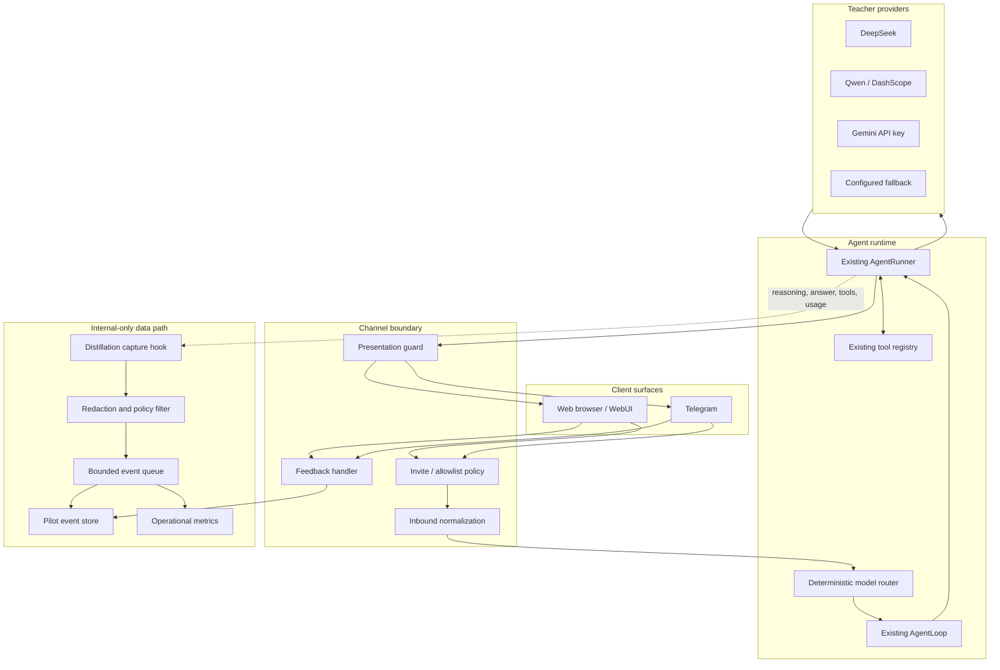

# Product-First Pilot Enhancement Design

**Status:** Approved design

**Date:** 2026-07-30

**Scope:** Closed pilot through WebUI and Telegram
**Future milestones:** Zalo Personal, dataset curation, and SLM distillation

## 1. Objective

Enhance nanobot into a reliable, invite-only assistant that delivers sufficiently strong answers
through the web browser and Telegram to attract and retain pilot users. The runtime may capture
provider-supplied reasoning and interaction outcomes for future dataset curation, but raw reasoning
must never be exposed to clients.

The pilot is product-first. Distillation is a future objective and must not delay the user-facing
quality, reliability, privacy, or operational work required for the pilot.

## 2. Locked Product Decisions

- The pilot is closed and uses invite, pairing, or allowlist access. There is no public signup.
- WebUI and Telegram are the only MVP client surfaces.
- Zalo Personal is deferred to a later experimental channel milestone.
- DeepSeek, Qwen/DashScope, Gemini API key, and an explicitly configured fallback may serve as
  teacher providers.
- Gemini OAuth is outside the MVP.
- Raw reasoning, chain-of-thought, provider thinking blocks, and internal tool arguments are never
  displayed to users.
- User-facing explanations are concise model outputs generated for the user, not replays of stored
  raw reasoning.
- Product-improvement consent and future-training consent are separate. Future-training consent is
  off by default.
- Session persistence remains responsible for conversation continuity. A separate pilot event store
  holds consent-gated capture and operational outcomes.

## 3. Non-Goals

The MVP does not include:

- Zalo Personal or Zalo OA;
- public registration, subscription billing, or per-user paid quotas;
- user-owned provider credentials;
- Google/Gemini OAuth;
- automated judging, reward models, or data-labeling UI;
- training export, fine-tuning, or SLM serving;
- a distributed event store or multi-region deployment.

## 4. Architecture

### 4.1 Architectural Boundaries

The existing `AgentLoop` and `AgentRunner` remain the critical core. Enhancements live at established
extension boundaries:

- channel access and presentation policy at the channel/manager edge;
- model selection at the provider-selection boundary;
- capture through lifecycle hooks;
- feedback through typed channel actions;
- persistence through a capture service separate from sessions.

Provider-specific conditions must not be scattered through the agent loop. Capture failures must not
change model execution, fallback behavior, or the final answer delivered to the user.

## 5. Channel and Access Design

WebUI runs only inside the controlled pilot deployment. Telegram uses existing allowlist or pairing
mechanisms. Telegram groups are disabled by default; an enabled group must be allowlisted and require
a direct mention before producing an agent turn.

Authorization happens before media download, teacher invocation, or content capture. The channel
publishes the existing `InboundMessage` shape after authorization. Capture identities are derived
with a keyed HMAC and do not contain raw Telegram user IDs, usernames, or chat IDs.

The boundary stays channel-neutral so a later `ZaloPersonalChannel` can reuse the same authorization,
presentation, feedback, and capture contracts without changes to the agent core.

## 6. Presentation and Reasoning Policy

`channels.showReasoning` defaults to `false` for the product. A server-side presentation guard is the
authoritative boundary and applies to both streamed and one-shot delivery.

The guard:

- drops reasoning outbound events;
- prevents `reasoning_content` and `thinking_blocks` from entering client payloads or metadata;
- removes `<think>...</think>` content accidentally returned in the answer field;
- sanitizes internal tool arguments, local paths, and raw provider errors;
- permits only neutral progress messages and typing indicators.

WebUI and Telegram do not implement user-visible reasoning renderers in the pilot. A request for more
explanation creates a linked model turn that produces a concise explanation. It never reads or
returns the raw captured chain-of-thought.

## 7. Deterministic Model Routing

The MVP router is rule-based and does not call a classifier model. It considers channel, media type,
request length, task hints, expected tool use, operator configuration, and provider circuit state.

It produces a typed routing decision containing:

- primary provider and model;
- a non-sensitive technical routing reason;
- ordered fallback candidates;
- routing-policy version.

General requests use the configured fast/default teacher. Math, code, logic, and explicit multi-step
analysis use a reasoning teacher. Tool-heavy requests require a provider/model with stable function
calling. Given identical input, configuration, and health state, routing is deterministic.

## 8. Retry, Fallback, and Circuit Breaking

Each provider attempt is recorded separately under one user turn. Transient network failures and
timeouts use bounded retry. Authentication, invalid-request, and policy errors are not retried.

A circuit breaker operates per provider/model. Open circuits remove that candidate from primary
selection until cooldown expires. Fallback occurs only before a final answer is accepted, and at most
one final answer is delivered for a turn. OAuth/subscription providers cannot enter a fallback chain
implicitly.

If all candidates fail, the user receives a short sanitized error. Provider stack traces remain in
restricted diagnostics without prompts, reasoning, credentials, or raw user identifiers.

## 9. Internal Capture

`DistillationCaptureHook` observes prompt/context, provider/model parameters, provider-supplied
reasoning, final answer, sanitized tool trajectory, usage, latency, stop reason, routing decision,
fallback attempts, and application/prompt policy versions.

Content capture requires all three gates:

1. the operator enabled capture;
2. the user has valid consent for the requested use;
3. the provider capture policy permits retention of that field.

When any gate fails, only content-free operational metrics may be retained. The hook cannot publish
messages. Its exceptions are isolated from the agent turn.

## 10. Redaction and Queueing

Before persistence, the capture pipeline:

- redacts API keys, bearer tokens, cookies, and common private credentials;
- pseudonymizes user and session identifiers with HMAC;
- bounds prompt, reasoning, answer, and tool-result sizes;
- removes internal filesystem paths;
- stores media references and metadata, not copied binary media;
- records consent, redaction, and capture-policy versions.

A bounded asynchronous queue decouples capture from response delivery. A single writer preserves
ordering. When full, the queue prioritizes consent, feedback, final outcome, and attempt metadata over
verbose reasoning. Dropped records increment a metric and trigger a health warning. Shutdown performs
a bounded flush and reports any records not persisted.

## 11. Pilot Event Store

The pilot uses SQLite in WAL mode. It is separate from session JSONL and is never replayed into model
context.

Logical entities are:

- `turns`: pseudonymous identity, channel, timestamps, consent, and routing;
- `attempts`: provider/model, latency, usage, error class, retry, and fallback;
- `artifacts`: redacted prompt, reasoning, answer, and tool trajectory;
- `feedback`: append-only user actions linked to a turn;
- `consents`: versioned consent state;
- `deletions`: content-free audit records for completed deletion requests.

Schema migrations are versioned. A migration or writer failure degrades capture health without
disabling chat. Database backup excludes provider credentials.

## 12. Feedback

Every accepted assistant answer has a stable `turn_id`. WebUI and Telegram expose the same actions:

- `helpful`;
- `incorrect`;
- `retry`;
- `explain_more`.

Actions are idempotent by action ID and append-only. `retry` creates a new turn linked by `retry_of`;
`explain_more` creates a new turn linked by `explanation_of`. A user cannot submit feedback for a turn
outside their authorized identity/session scope.

## 13. Consent, Retention, and Deletion

The pilot distinguishes product-improvement consent from future-training consent. Future-training
consent is disabled until explicitly granted. Stored artifacts carry the consent version in effect at
capture time.

Session history, operational telemetry, raw capture, and training-eligible artifacts have independent
retention settings. Revoked training consent removes training eligibility. User/session deletion
removes both session history and related capture artifacts. Only non-reidentifiable aggregate metrics
may remain. Deletion audit records contain no deleted content.

## 14. Observability

The operator can monitor:

- turn success and error rate;
- time to first token and total latency;
- provider/model latency, retry, fallback, and circuit state;
- token usage and estimated cost when usage is available;
- feedback distribution;
- capture queue depth, drops, and writer failures;
- active WebUI/Telegram users and D1/D7 return rate.

Prompt, answer, reasoning, credentials, and raw user identifiers are prohibited from log messages and
metric labels. Health reporting distinguishes agent, provider, channel, and capture-store state.

## 15. Error Semantics

| Condition | Required behavior |
| --- | --- |
| Unauthorized user | Deny or pair without media download or model invocation |
| Transient provider failure | Bounded retry, then configured fallback |
| Authentication failure | Do not retry; open circuit and alert operator |
| All providers unavailable | Return one short sanitized error |
| Tool failure | Give the model a bounded sanitized result |
| Capture failure | Deliver the answer and degrade capture health |
| Duplicate feedback | Treat as an idempotent success |
| Reasoning in answer content | Strip it and increment a leak-prevention metric |
| Missing or stale consent | Do not persist content artifacts |

## 16. Acceptance Criteria

### 16.1 Access and Channels

- A Telegram sender outside the allowlist cannot create an agent turn or invoke a teacher model.
- An unauthorized sender receives only the applicable pairing/invite response.
- WebUI provides no public self-registration path.
- Authorized Telegram DMs support text and currently supported image/file flows.
- Telegram groups are disabled by default; enabled groups require allowlist and mention gating.
- Media download begins only after sender/group authorization succeeds.
- Follow-up messages retain the correct session without cross-user leakage.
- WebUI and Telegram preserve equivalent text-conversation semantics.

### 16.2 Reasoning Confidentiality

- `showReasoning` defaults to `false`.
- `reasoning_content`, `thinking_blocks`, and reasoning events never appear in WebUI/Telegram payloads,
  outbound metadata, application logs, exception responses, or metrics.
- `<think>...</think>` is stripped before outbound delivery.
- Streaming and non-streaming responses pass through the same presentation policy.
- Tool arguments, internal paths, and raw provider errors are sanitized.
- `explain_more` creates a new concise-explanation turn and never replays captured reasoning.
- Canary tests for every supported reasoning shape prove the canary cannot reach a client surface.

### 16.3 Routing and Provider Execution

- Every turn creates one typed, versioned routing decision.
- General, reasoning-intensive, and tool-heavy test cases select their configured model classes.
- Tool-heavy requests cannot select a model without tool support.
- Routing is deterministic for identical input, configuration, and health state.
- Operator configuration can change models and fallbacks without source edits.
- Gemini uses API-key authentication only in the MVP.
- Transient failures retry within configured bounds; authentication, invalid-request, and policy errors
  do not retry.
- An open circuit removes a provider/model from primary selection until cooldown.
- A fallback sequence produces at most one client-visible final answer.
- Exhausted fallbacks produce one sanitized error.
- Capture failure never triggers provider retry or fallback.

### 16.4 Feedback

- Every final answer has a stable `turn_id`.
- Both pilot clients support `helpful`, `incorrect`, `retry`, and `explain_more`.
- Feedback links by `turn_id`, is idempotent by action ID, and never mutates the original answer.
- Retry and explanation turns contain `retry_of` or `explanation_of` respectively.
- A user cannot submit feedback against another user's inaccessible turn.

### 16.5 Consent and Privacy

- Product-improvement and future-training consent are independent.
- Future-training consent defaults to off.
- Content persistence requires operator enablement, valid consent, and provider permission.
- When content capture is denied, only content-free metrics are stored.
- Capture identifiers are HMAC pseudonyms; artifact records contain no raw Telegram identity fields.
- Redaction covers API keys, bearer tokens, cookies, and common private credentials.
- Every artifact records consent, redaction, and capture-policy versions.
- User/session deletion removes session history and related artifacts, which cannot be retrieved by the
  prior pseudonymous identity.

### 16.6 Queue and Store

- The capture hook observes approved fields but cannot publish an outbound message.
- Hook and writer failures do not fail an agent turn.
- Queue capacity and depth are bounded and observable.
- Queue pressure preserves consent, feedback, final outcome, and attempt metadata ahead of verbose
  reasoning.
- A single SQLite writer operates in WAL mode with versioned migrations.
- Committed event IDs are idempotent across restart.
- Shutdown performs a bounded flush and reports unpersisted count.
- Capture artifacts are not replayed into model context.
- Migration/database failures mark capture degraded while chat remains available.
- Operator health reports database size and last successful write.

### 16.7 Retention and Observability

- Session, telemetry, raw capture, and training-eligible retention are independently configurable.
- Cleanup does not delete an in-flight turn and supports dry-run/report mode.
- Revoked consent removes training eligibility and cannot restore deleted artifacts.
- Aggregate metrics remain only when they are non-reidentifiable.
- Required success, latency, provider, usage/cost, feedback, capture, active-user, and retention metrics
  are available without sensitive metric labels.
- Health output distinguishes agent, provider, channel, and capture-store status.

### 16.8 Performance

- Capture adds no more than 50 ms at P95 to the response-delivery path.
- Feedback acknowledgement is at most one second at P95, excluding external channel latency.
- Presentation filtering performs no network call.
- A slow capture writer does not block agent execution or streaming.
- Gateway/channel shutdown leaks no tasks or processes.
- Twenty concurrent active turns complete without mixing session data, streams, or reasoning.

### 16.9 Required Verification

- Unit tests cover routing, redaction, pseudonymization, consent gates, presentation policy, queue
  prioritization, SQLite migrations, and idempotency.
- Integration tests cover WebUI and Telegram successful turns, unauthorized access, provider fallback,
  capture failure isolation, and deletion.
- Concurrency testing covers at least twenty active turns.
- Regression tests prove reasoning absence from WebUI, Telegram, logs, and outbound metadata.
- Existing nanobot tests pass and strict type checking reports no new errors.

## 17. Pilot Exit Gate

The MVP may enter the invite-only pilot only when:

- all authorization, consent, reasoning-confidentiality, and deletion criteria pass;
- no unresolved high-severity issue remains in review;
- WebUI and Telegram run continuously in staging for at least 72 hours;
- fault injection verifies provider fallback and circuit behavior;
- capture backup and restore succeed;
- documented procedures exist for user revocation, API-key rotation, capture disablement, and provider
  or channel shutdown without redeploying;
- privacy notice and consent text are approved;
- a daily cost ceiling and alert are configured;
- the invite list is finite and an operator owns pilot support.

## 18. Future Milestones

After the pilot demonstrates retention and acceptable quality/cost:

1. add `ZaloPersonalChannel` as an explicitly unofficial, experimental, isolated transport;
2. evaluate an official Zalo OA channel independently;
3. consider Gemini CLI OAuth for operator-owned personal deployments, not shared traffic by default;
4. curate and score captured samples;
5. implement governed dataset export;
6. distill selected tasks into self-hosted SLMs;
7. consider public signup, quotas, and billing only after pilot evidence supports expansion.
